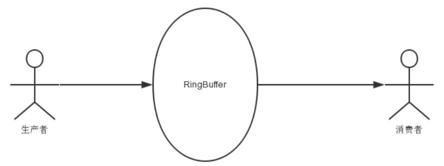

# Disruptor

> [Disruptor](http://ifeve.com/disruptor/)：是一个开源的并发框架，能够在无锁的情况下实现网络的Queue并发操作。

## Disruptor特点

* Disruptor 是一个 Java 的并发编程框架，大大的简化了并发程序开发的难度，在性能上也比 Java 本身提供的一些并发包要好。

* Disruptor 是一个高性能异步处理框架，它实现了观察者模式，或者事件监听模式的实现。

* Disruptor 是无锁的、CPU友好，它不会清除缓存中的数据，只会覆盖，降低了垃圾回收机制启动的频率。

## 获得Disruptor

可以通过[Maven](http://mvnrepository.com/artifact/com.lmax/disruptor)安装Disruptor。查看[Getting-Started](http://ifeve.com/disruptor-getting-started/)快速入门，[更多API](http://lmax-exchange.github.io/disruptor/docs/)

```xml
<dependency>
    <groupId>com.lmax</groupId>
    <artifactId>disruptor</artifactId>
    <version>3.3.7</version>
</dependency>
```

## Disruptor之HelloWorld

我们从一个简单的例子开始学习Disruptor：生产者传递一个long类型的值给消费者，而消费者消费这个数据的方式仅仅是把它打印出来。首先声明一个Event来包含需要传递的数据：

```java
public class LongEvent { 
    private long value;
    public long getValue() { 
        return value; 
    } 
 
    public void setValue(long value) { 
        this.value = value; 
    } 
} 
```

由于需要让Disruptor为我们创建事件，我们同时还声明了一个EventFactory来实例化Event对象。

```java
public class LongEventFactory implements EventFactory {
    @Override
    public Object newInstance() {
        return new LongEvent();
    }
}
```

我们还需要一个事件消费者，也就是一个事件处理器。这个事件处理器简单地把事件中存储的数据打印到终端：

```java
public class LongEventHandler implements EventHandler<LongEvent> { 
    @Override 
    public void onEvent(LongEvent longEvent, long l, boolean b) throws Exception { 
        System.out.println(longEvent.getValue()); 
    } 
}
```

事件都会有一个生成事件的源，可以简单的理解为一个事件生产者。这个例子中假设事件是由于磁盘IO或者network读取数据的时候触发的，事件源使用一个ByteBuffer来模拟它接受到的数据，也就是说，事件源会在IO读取到一部分数据的时候触发事件（触发事件不是自动的，程序员需要在读取到数据的时候自己触发事件并发布）：

```java
public class LongEventProducer {
	private final RingBuffer<LongEvent> ringBuffer;
	public LongEventProducer(RingBuffer<LongEvent> ringBuffer){
		this.ringBuffer = ringBuffer;
	}
	
	/**
	 * onData用来发布事件，每调用一次就发布一次事件
	 * @param ByteBuffer 它的参数会用过事件传递给消费者
	 */
	public void onData(ByteBuffer bb){
		//1.可以把ringBuffer看做一个事件队列，那么next就是得到下面一个事件槽
		long sequence = ringBuffer.next();
		try {
			//2.用上面的索引取出一个空的事件用于填充（获取该序号对应的事件对象）
			LongEvent event = ringBuffer.get(sequence);
			//3.获取要通过事件传递的业务数据
			event.setValue(bb.getLong(0));
		} finally {
			//4.发布事件
			//注意，最后的 ringBuffer.publish 方法必须包含在 finally 中以确保必须得到调用；
			//      如果某个请求的 sequence 未被提交，将会堵塞后续的发布操作或者其它的 producer。
			ringBuffer.publish(sequence);
		}
	}	
}
```

很明显的是：当用一个简单队列来发布事件的时候会牵涉更多的细节，这是因为事件对象还需要预先创建。发布事件最少需要两步：获取下一个事件槽并发布事件（发布事件的时候要使用try/finnally保证事件一定会被发布）。如果我们使用RingBuffer.next()获取一个事件槽，那么一定要发布对应的事件。如果不能发布事件，那么就会引起Disruptor状态的混乱。尤其是在多个事件生产者的情况下会导致事件消费者失速，从而不得不重启应用才能会恢复。

Disruptor 3.0提供了lambda式的API。这样可以把一些复杂的操作放在Ring Buffer，所以在Disruptor3.0以后的版本最好使用Event Publisher或者Event Translator来发布事件。

```java
public class LongEventProducerWithTranslator {
    //一个translator可以看做一个事件初始化器，publicEvent方法会调用它
    private static final EventTranslatorOneArg<LongEvent, ByteBuffer> TRANSLATOR =
            new EventTranslatorOneArg<LongEvent, ByteBuffer>() {
                public void translateTo(LongEvent event, long sequence, ByteBuffer buffer) {
                    event.setValue(buffer.getLong(0));
                }
            };

    private final RingBuffer<LongEvent> ringBuffer;
    public LongEventProducerWithTranslator(RingBuffer<LongEvent> ringBuffer) {
        this.ringBuffer = ringBuffer;
    }
    public void onData(ByteBuffer buffer) {
        ringBuffer.publishEvent(TRANSLATOR, buffer);
    }
}
```

最后一步就是把所有的代码组合起来完成一个完整的事件处理系统。

```java
public class LongEventMain {
	public static void main(String[] args) throws Exception {
		//1. 创建disruptor
		Disruptor<LongEvent> disruptor = new Disruptor<LongEvent>(
	        new LongEventFactory(),     // 创建工厂
	        1024 * 1024,   // RingBuffer大小，必须是2的N次方
	        Executors.defaultThreadFactory() // 创建ThreadFactory
		);

		//2. 连接消费事件方法
		disruptor.handleEventsWith(new LongEventHandler());
		//3. 启动
		disruptor.start();

		//4. 发布事件
		RingBuffer<LongEvent> ringBuffer = disruptor.getRingBuffer();

		//LongEventProducer producer = new LongEventProducer(ringBuffer);
		LongEventProducerWithTranslator producer = new LongEventProducerWithTranslator(ringBuffer);
		ByteBuffer byteBuffer = ByteBuffer.allocate(8);
		for(long l = 0; l<100; l++){
		    byteBuffer.putLong(0, l);
		    producer.onData(byteBuffer);
		    //Thread.sleep(1000);
		}

		disruptor.shutdown();//关闭 disruptor，方法会堵塞，直至所有的事件都得到处理；
	}
}
```

## Disruptor术语说明

* `RingBuffer`: 被看作Disruptor最主要的组件，然而从3.0开始RingBuffer仅仅负责存储和更新在Disruptor中流通的数据。对一些特殊的使用场景能够被用户(使用其他数据结构)完全替代。[更多Ringbuffer](http://ifeve.com/dissecting-disruptor-whats-so-special/)

	

* `Sequence`: Disruptor使用Sequence来表示一个特殊组件处理的序号。和Disruptor一样，每个消费者(EventProcessor)都维持着一个Sequence。大部分的并发代码依赖这些Sequence值的运转，因此Sequence支持多种当前为AtomicLong类的特性。

* `Sequencer`: 这是Disruptor真正的核心。实现了这个接口的两种生产者（单生产者和多生产者）均实现了所有的并发算法，为了在生产者和消费者之间进行准确快速的数据传递。

* `SequenceBarrier`: 由Sequencer生成，并且包含了已经发布的Sequence的引用，这些的Sequence源于Sequencer和一些独立的消费者的Sequence。它包含了决定是否有供消费者来消费的Event的逻辑。

* `WaitStrategy`：决定一个消费者将如何等待生产者将Event置入Disruptor。

* `Event`：从生产者到消费者过程中所处理的数据单元。Disruptor中没有代码表示Event，因为它完全是由用户定义的。

* `EventProcessor`：主要事件循环，处理Disruptor中的Event，并且拥有消费者的Sequence。它有一个实现类是BatchEventProcessor，包含了event loop有效的实现，并且将回调到一个EventHandler接口的实现对象。

* `EventHandler`：由用户实现并且代表了Disruptor中的一个消费者的接口。

* `Producer`：由用户实现，它调用RingBuffer来插入事件(Event)，在Disruptor中没有相应的实现代码，由用户实现。

* `WorkProcessor`：确保每个sequence只被一个processor消费，在同一个WorkPool中的处理多个WorkProcessor不会消费同样的sequence。

* `WorkerPool`：一个WorkProcessor池，其中WorkProcessor将消费Sequence，所以任务可以在实现WorkHandler接口的worker直接移交。

* `LifecycleAware`：当BatchEventProcessor启动和停止时，于实现这个接口用于接收通知。

## RingBuffer使用

在helloWorld的实例中，我们创建Disruptor实例，然后调用getRingBuffer方法去获取RingBuffer，其实在很多时候，我们可以直接使用RingBuffer，以及其他的API操作。我们一起熟悉下示例：

第一步：创建要生产的数据

```java
public class Trade {
	private String id;//ID
	private double price;//金额
	
	public String getId() {
		return id;
	}
	public void setId(String id) {
		this.id = id;
	}
	public void setPrice(double price) {
		this.price = price;
	}
}
```

第二步：创建消息处理器，消费者

```java
public class TradeHandler implements EventHandler<Trade>, WorkHandler<Trade> {  
    @Override  
    public void onEvent(Trade event, long sequence, boolean endOfBatch) throws Exception {  
        this.onEvent(event);  
    }  
    @Override  
    public void onEvent(Trade event) throws Exception {  
        //这里做具体的消费逻辑  
        event.setId(UUID.randomUUID().toString());//简单生成下ID  
        System.out.println(event.getId());  
    }  
}  
```

第三步：测试

```java
public class RingBufferTest {  
	public static void main(String[] args) throws Exception {  
        //1. 创建RingBuffer
        final RingBuffer<Trade> ringBuffer = RingBuffer.createSingleProducer(
                new EventFactory<Trade>() {  // EventFactory 负责生产 Trade 数据填充RingBuffer的区块
                    @Override
                    public Trade newInstance() {
                        return new Trade();
                    }
                },
                1024,             // RingBuffer的大小，2的N次方，提高求模运算效率
                new YieldingWaitStrategy());// 等待策略
        
        //2. 创建线程池
        ExecutorService executors = Executors.newFixedThreadPool(4);
        
        //3. 创建SequenceBarrier
        SequenceBarrier sequenceBarrier = ringBuffer.newBarrier();


        //4. 消息处理，如果存在多个消费者，那就重复执行下面3行代码，把TradeHandler换成其它消费者类
        //4.1. 创建消息处理器
        BatchEventProcessor<Trade> transProcessor = new BatchEventProcessor<Trade>(  // (1)
                ringBuffer, sequenceBarrier, new TradeHandler());
        //4.2. 这一步的目的就是把消费者的位置信息引用注入到生产者    如果只有一个消费者的情况可以省
        ringBuffer.addGatingSequences(transProcessor.getSequence());
        //4.3. 把消息处理器提交到线程池
        executors.submit(transProcessor);

        //5. 生产数据
        for(int i=0;i<8;i++){
            long seq=ringBuffer.next();
            ringBuffer.get(seq).setPrice(Math.random()*9999);
            ringBuffer.publish(seq);
        }

        Thread.sleep(1000);//等上1秒，等消费都处理完成
        transProcessor.halt();//通知事件(或者说消息)处理器 可以结束了（并不是马上结束!!!）  
        executors.shutdown();//终止线程  
    }  
}  
```

1. 消息处理可以使用 WorkHandler/WorkerPool 替代，IgnoreExceptionHandler 为异常处理机制，可以继承该类后重写其业务逻辑

	```java
	WorkHandler<Trade> handler = new TradeHandler();
	WorkerPool<Trade> workerPool = new WorkerPool<Trade>(
		ringBuffer, 
		sequenceBarrier, 
		new IgnoreExceptionHandler(),  
		handler);
	workerPool.start(executor);
	```
## Disruptor场景使用

虽然disruptor模式使用起来很简单，但是建立多个消费者以及它们之间的依赖关系需要的样板代码太多了。为了能快速又简单适用于99%的场景，我为Disruptor模式准备了一个简单的领域特定语言。[更多Disruptor场景使用](http://ifeve.com/disruptor-dsl/)

### 消费者的“四边形模式”


在这种情况下，只要生产者（P1）将元素放到ring buffer上，消费者C1和C2就可以并行处理这些元素。但是消费者C3必须一直等到C1和C2处理完之后，才可以处理。在现实世界中的对应的案例就像：在处理实际的业务逻辑（C3）之前，需要校验数据（C1），以及将数据写入磁盘（C2）。

```java
//1. 使用disruptor创建消费者组C1,C2  
EventHandlerGroup<Trade> handlerGroup = 
		disruptor.handleEventsWith(new Handler1(), new Handler2());
//2. 声明在C1,C2完事之后执行JMS消息发送操作 也就是流程走到C3 
handlerGroup.then(new Handler3());
```

### 消费者的“顺序执行模式”

```java
disruptor.handleEventsWith(new Handler1())
	.handleEventsWith(new Handler2())
	.handleEventsWith(new Handler3());
```

### 消费者的“六边形模式”

我们甚至可以在一个更复杂的六边形模式中构建一个并行消费者链：


```java
disruptor.handleEventsWith(new Handler1(), new Handler2());
disruptor.after(new Handler1()).handleEventsWith(new Handler4());
disruptor.after(new Handler2()).handleEventsWith(new Handler5());
disruptor.after(new Handler4(), new Handler5()).handleEventsWith(new Handler3());
```

Disruptor四边形模式实现案例：

```java
public class Main {  
    public static void main(String[] args) throws InterruptedException {  
        long beginTime=System.currentTimeMillis();

        //1. 创建disruptor
        Disruptor<Trade> disruptor = new Disruptor<Trade>(
                new EventFactory<Trade>() { // 创建工厂
                    @Override
                    public Trade newInstance() {
                        return new Trade();
                    }
                },
                1024 * 1024,         // RingBuffer大小，必须是2的N次方
                Executors.defaultThreadFactory(), // 创建ThreadFactory
                ProducerType.SINGLE,
                new BusySpinWaitStrategy()
        );

        //2. 绑定事件消费
        //2.1 使用disruptor创建消费者组C1,C2
        EventHandlerGroup<Trade> handlerGroup = 
        		disruptor.handleEventsWith(new Handler1(), new Handler2());
        //2.2 声明在C1,C2完事之后执行JMS消息发送操作 也就是流程走到C3
        handlerGroup.then(new Handler3());

        //3. 启动disruptor
        disruptor.start();//启动  
        CountDownLatch latch=new CountDownLatch(1);

        //4. 生产者准备
        ExecutorService executor = Executors.newCachedThreadPool();
        executor.submit(new TradePublisher(latch, disruptor));
        
        latch.await();//等待生产者完事. 
        disruptor.shutdown();
        System.out.println("总耗时:"+(System.currentTimeMillis()-beginTime));
    }
}
```

具体的事件生产方法 TradePublisher

```java
public class TradePublisher implements Runnable {  
    Disruptor<Trade> disruptor;
    private CountDownLatch latch;
    private static int LOOP=10;//模拟百万次交易的发生
  
    public TradePublisher(CountDownLatch latch, Disruptor<Trade> disruptor) {  
        this.disruptor=disruptor;
        this.latch=latch;
    }
    @Override  
    public void run() {  
    	TradeEventTranslator tradeTransloator = new TradeEventTranslator();  
        for(int i=0;i<LOOP;i++){  
            disruptor.publishEvent(tradeTransloator);  
        }  
        latch.countDown();  
    }  
}  
  
class TradeEventTranslator implements EventTranslator<Trade>{  
	private Random random=new Random();  
    
	@Override  
    public void translateTo(Trade event, long sequence) {  
        this.generateTrade(event);  
    }  
	private Trade generateTrade(Trade trade){  
        trade.setPrice(random.nextDouble()*9999);  
        return trade;  
    }  
}  
```
