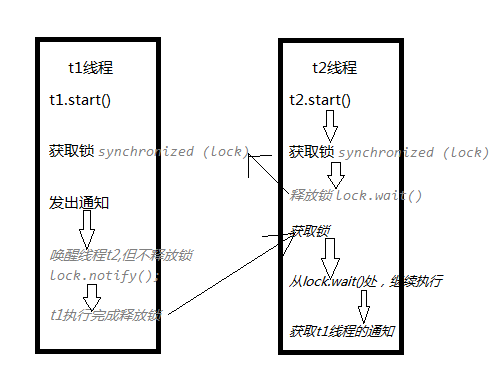

## 2.1.1传统通信

下面案例实现当list数量为5个时通知t2线程 【com.herolei._2_1conn.ListAdd1】

```java
package com.herolei._2_1conn;

import java.util.ArrayList;
import java.util.List;

/**
 * 传统方式实现两个线程之间的通信
 */
public class ListAdd1 {

	//volatile实现两个线程间数据可见性
	private volatile static List list = new ArrayList();	
	
	public void add(){
		list.add("bjsxt");
	}
	public int size(){
		return list.size();
	}
	
	public static void main(String[] args) {

		final ListAdd1 list1 = new ListAdd1();

		Thread t1 = new Thread(new Runnable() {
			public void run() {
				try {
					for(int i = 0; i <10; i++){
						list1.add();
						System.out.println("当前线程：" + Thread.currentThread().getName() + "添加了一个元素..");
						Thread.sleep(500);
					}
				} catch (InterruptedException e) {
					e.printStackTrace();
				}
			}
		}, "t1");

		Thread t2 = new Thread(new Runnable() {
			public void run() {
				while(true){
					if(list1.size() == 5){
						System.out.println("当前线程收到通知：" + Thread.currentThread().getName() + " list size = 5 线程停止..");
						throw new RuntimeException();
					}
				}
			}
		}, "t2");

		t1.start();
		t2.start();
	}
}
```

t2线程开启while循环实现查询，当t1线程list.size()==5时通知t2线程，返回执行结果如下：

```
当前线程：t1添加了一个元素..
当前线程：t1添加了一个元素..
当前线程：t1添加了一个元素..
当前线程：t1添加了一个元素..
当前线程：t1添加了一个元素..
Exception in thread "t2" 当前线程收到通知：t2 list size = 5 线程停止..
java.lang.RuntimeException
	at com.herolei._2_1conn.ListAdd1$2.run(ListAdd1.java:44)
	at java.lang.Thread.run(Thread.java:745)
当前线程：t1添加了一个元素..
当前线程：t1添加了一个元素..
当前线程：t1添加了一个元素..
当前线程：t1添加了一个元素..
当前线程：t1添加了一个元素..
```

## 2.1.2 wait/notify

案例 【com.herolei._2_1conn.ListAdd2】

```java
package com.herolei._2_1conn;

import java.util.ArrayList;
import java.util.List;

/**
 * 使用wait/notify方法实现线程单挑通信(注意这两个方法是Object类的方法)
 *   1. wait和notity必须配合synchronized关键字使用
 *   2. wait方法(关闭线程)释放锁，notify(唤醒线程)方法不释放锁
 * 缺点：通知不实时，使用CountDownLatch实现实时通知
 */
public class ListAdd2 {
	private volatile static List list = new ArrayList();	
	
	public void add(){
		list.add("bjsxt");
	}
	public int size(){
		return list.size();
	}
	
	public static void main(String[] args) {
		
		final ListAdd2 list2 = new ListAdd2();
		final Object lock = new Object();
		Thread t1 = new Thread(new Runnable() {
			public void run() {
				try {
					synchronized (lock) {
						System.out.println("t1启动..");
						for(int i = 0; i <10; i++){
							list2.add();
							System.out.println("当前线程：" + Thread.currentThread().getName() + "添加了一个元素..");
							Thread.sleep(500);
							if(list2.size() == 5){
								System.out.println("已经发出通知..");
								lock.notify();
							}
						}						
					}
				} catch (InterruptedException e) {
					e.printStackTrace();
				}

			}
		}, "t1");

		Thread t2 = new Thread(new Runnable() {
			public void run() {
				synchronized (lock) {
					System.out.println("t2启动..");
					if(list2.size() != 5){
						try {
							lock.wait();
						} catch (InterruptedException e) {
							e.printStackTrace();
						}
					}
					System.out.println("当前线程：" + Thread.currentThread().getName() + "收到通知线程停止..");
					throw new RuntimeException();
				}
			}
		}, "t2");

		//必须先启动t2线程
		t2.start();
		t1.start();
	}
}
```

执行过程如下：



## 2.1.3 CountDownLatch实现实时通信

案例 【com.herolei._2_1conn.ListAdd3】

```java
package com.herolei._2_1conn;

import java.util.ArrayList;
import java.util.List;
import java.util.concurrent.CountDownLatch;

/**
 * CountDownLatch实现实时通信
 */
public class ListAdd3 {
	private volatile static List list = new ArrayList();

	public void add(){
		list.add("bjsxt");
	}
	public int size(){
		return list.size();
	}

	public static void main(String[] args) {

		final ListAdd3 list2 = new ListAdd3();

		//final Object lock = new Object();
		final CountDownLatch countDownLatch = new CountDownLatch(1);
		Thread t1 = new Thread(new Runnable() {
			public void run() {
				try {
					//synchronized (lock) {
						System.out.println("t1启动..");
						for(int i = 0; i <10; i++){
							list2.add();
							System.out.println("当前线程：" + Thread.currentThread().getName() + "添加了一个元素..");
							Thread.sleep(500);
							if(list2.size() == 5){
								System.out.println("已经发出通知..");
								countDownLatch.countDown();
								//lock.notify();
							}
						}
					//}
				} catch (InterruptedException e) {
					e.printStackTrace();
				}

			}
		}, "t1");

		Thread t2 = new Thread(new Runnable() {
			public void run() {
				//synchronized (lock) {
					System.out.println("t2启动..");
					if(list2.size() != 5){
						try {
							countDownLatch.await();
							//lock.wait();
						} catch (InterruptedException e) {
							e.printStackTrace();
						}
					}
					System.out.println("当前线程：" + Thread.currentThread().getName() + "收到通知线程停止..");
					throw new RuntimeException();
				//}
			}
		}, "t2");

		t2.start();
		t1.start();
		/**
		 * t2启动..
		 * t1启动..
		 * 当前线程：t1添加了一个元素..
		 * 当前线程：t1添加了一个元素..
		 * 当前线程：t1添加了一个元素..
		 * 当前线程：t1添加了一个元素..
		 * 当前线程：t1添加了一个元素..
		 * 已经发出通知..
		 * 当前线程：t2收到通知线程停止..
		 * Exception in thread "t2" java.lang.RuntimeException
		 * at com.herolei._2_1conn.ListAdd3$2.run(ListAdd3.java:58)
		 * at java.lang.Thread.run(Thread.java:745)
		 * 当前线程：t1添加了一个元素..
		 * 当前线程：t1添加了一个元素..
		 * 当前线程：t1添加了一个元素..
		 * 当前线程：t1添加了一个元素..
		 * 当前线程：t1添加了一个元素..
		 */
	}	
}
```