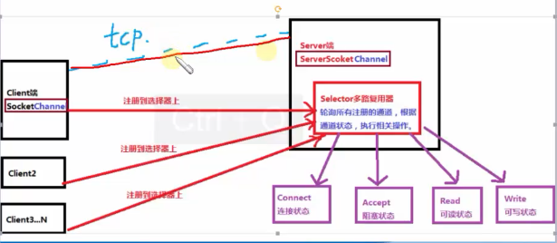
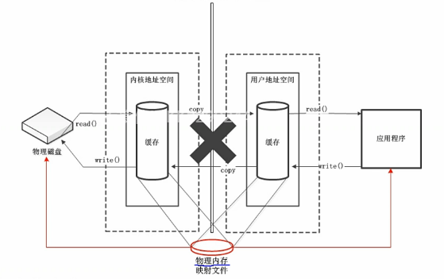

## 1.2 基于NIO的同步非阻塞式编程

> NIO 的本质就是避免原始的 TCP 建立连接使用3次握手操作，减少连接的开销。



* 缓冲区(Buffer) 用于存储数据

* 通道(Channel) 用于传输数据

* 多路复用器(Selector) 用于轮询 Channel 状态，四种状态：Connect(连接)，Accept(阻塞)，Read(读)，Write(写)

### 1.2.1 Buffer(缓冲区)

> 不同于面向流的IO中将数据直接写入或读取到Stream对象中，在NIO中，所有数据都是用缓冲区处理(读写)。缓冲区通常是一个字节数组(ByteBuffer)，这个数组提供了数据的访问读写操作属性，如position、limit、capacity、mark等。

Buffer 类型：ByteBuffer、CharBuffer、ShortBuffer、IntBuffer、LongBuffer、FloatBuffer、DoubleBuffer。

* `capacity`: 容量，表示缓冲区中最大存储数据的容量。一旦声明不能改变。

* `limit`: 界限，表示缓冲区中可以操作数据的大小。(limit后的数据不能读)

* `position`: 位置，表示缓冲区中正在操作数据的位置

* `mark`: 标记，表示记录当前postion的位置。可以通过reset恢复到时mark的位置。

mark <= postion <= limit <= capacity

1. ByteBuffer 常用方法: [com.binarylei.nio.buffer.BufferTest]

```java
package com.binarylei.nio.buffer;

import java.nio.ByteBuffer;

public class BufferTest {

   public static void main(String[] args) {
       //1. 分配一个非直接缓冲区(用户地址空间，即JVM)
       ByteBuffer buf = ByteBuffer.allocate(1024);
       System.out.println(buf);//java.nio.HeapByteBuffer[pos=0 lim=1024 cap=1024] 堆空间

       //2. 向buf中写入数据
       buf.put("abcd".getBytes());
       System.out.println(buf); //[pos=4 lim=1024 cap=1024]

       //3. 切换成读模式
       buf.flip(); //limit = position; position = 0; mark = -1;
       System.out.println(buf); //[pos=0 lim=4 cap=1024]

       //4. buf.get()读数据
       for (int i = 0; i < buf.limit(); i++) {
           System.out.println((char) buf.get());
       }
       System.out.println(buf); //[pos=4 lim=4 cap=1024]

       //5. buf.rewind()再读数据
       buf.rewind(); //position = 0; mark = -1;
       System.out.println(buf); //[pos=0 lim=4 cap=1024]

       //6. buf.get(bytes)读一个字节数组
       byte[] bytes = new byte[buf.limit()];
       buf.get(bytes);
       System.out.println(new String(bytes));  //[pos=4 lim=4 cap=1024]

       //7. buf.reset()复位到上一个标记位
       buf.position(1).mark();
       System.out.println(buf);
       buf.get();
       System.out.println(buf);
       buf.reset();
       System.out.println(buf);

       //8. buf.hasRemaining()
       if (buf.hasRemaining()) {
           System.out.println(buf.remaining());
       }
       
       //9. buf.duplicate()
       ByteBuffer buf2 = buf.duplicate();
      
       //10. buf.clear() 清空缓冲区，但是缓冲区依旧存在，只是处于“遗忘”状态
       buf.clear();
   }
}
```

#### 直接缓冲区和非直接缓冲区



* 非直接缓冲区：将缓冲区开辟在用户地址空间(JVM)。

```java
ByteBuffer.allocate(1024);
```

JDK 源码：

```java
public static ByteBuffer allocate(int capacity) {
    if (capacity < 0)
        throw new IllegalArgumentException();
    //在堆中开辟空间
    return new HeapByteBuffer(capacity, capacity);
}
```

* 直接缓冲区(少用)：将缓冲区直接开辟在内核地址空间(OS)，减少了将数据从内核地址空间复制到用户地址空间的过程，提高了效率。但直接操作内核地址不安全，分配销毁开销大，不易操作。一般情况下，用于本机IO操作影响的大型、持久的缓冲区，并且性能有明显提升的情况。

```java
ByteBuffer.allocateDirect(1024);
```

JDK 源码：

```java
public static ByteBuffer allocateDirect(int capacity) {
    return new DirectByteBuffer(capacity);
}
```
 
### 1.2.2 Channel(通道)

> 通道：IO 中源与目标之前的连接，负责传输数据。缓冲区用于存储数据。

```
java.nio.channels.Channel 接口：
    |--FileChannel
    |--SocketChannel
    |--ServerSocketChannel
    |--DatagramChannel
```

#### 获取通道的有有三种方法

1. Java 针对支持通道的类提供了 getChannel() 方法。

    * 本地IO FileInputStream/FileOutputStream/RandomAccessFile
    
    * 网络IO Socket/ServerSocket/DatagramSocket
    
2. 在 JDK 1.7 中的 NIO.2 针对各个通道提供了静态方法 open()

3. 在 JDK 1.7 中的 NIO.2 的 Files 工具类的 newByteChannel()

[com.binarylei.nio.channel.ChannelTest]

```java
//通过通道传输数据
public void test1() throws Exception {
    FileInputStream fis = new FileInputStream("1.png");
    FileOutputStream fos = new FileOutputStream("2.png");

    //1. 获取通道
    FileChannel inChannel = fis.getChannel();
    FileChannel outChannel = fos.getChannel();

    //2. 分配缓冲区
    ByteBuffer buf = ByteBuffer.allocate(1024);

    //3. 用通道传输数据
    while (inChannel.read(buf) != -1) {
        buf.flip();
        outChannel.write(buf);
        buf.clear();
    }

    //4. 关闭
    outChannel.close();
    inChannel.close();
    fis.close();
    fos.close();
}

//内存映射文件，直接缓冲区
public void test2 () throws IOException {
    FileChannel inChannel = FileChannel.open(Paths.get("1.png"), StandardOpenOption.READ);
    FileChannel outChannel = FileChannel.open(Paths.get("3.png"), StandardOpenOption.WRITE, StandardOpenOption.READ, StandardOpenOption.CREATE);

    //内存映射文件，直接缓冲区
    MappedByteBuffer inMappedBuf = inChannel.map(FileChannel.MapMode.READ_ONLY, 0, inChannel.size());
    MappedByteBuffer outMappedBuf = outChannel.map(FileChannel.MapMode.READ_WRITE, 0, inChannel.size());

    byte[] bytes = new byte[inMappedBuf.limit()];
    inMappedBuf.get(bytes);
    outMappedBuf.put(bytes);

    inChannel.close();
    outChannel.close();
}

//transferTo
public void test3 () throws IOException {
    FileChannel inChannel = FileChannel.open(Paths.get("1.png"), StandardOpenOption.READ);
    FileChannel outChannel = FileChannel.open(Paths.get("4.png"), StandardOpenOption.WRITE, StandardOpenOption.READ, StandardOpenOption.CREATE);

    //内存映射文件，直接缓冲区
    inChannel.transferTo(0, inChannel.size(), outChannel);
    //outChannel.transferFrom(inChannel, 0, inChannel.size());

    inChannel.close();
    outChannel.close();
}
```

#### 分散(Scatter)与聚集(Gather)

* 分散读取(Scatter Read)：按照缓冲区的顺序，从Channel中读取的依次将缓冲区填满

* 聚集写入(Gather Write)：将多个缓冲区的数据依次写入 Channel

[com.binarylei.nio.channel.ScannerAndGatherTest]

```java
public static void main(String[] args) throws IOException {
    RandomAccessFile raf = new RandomAccessFile("1.txt", "rw");
    FileChannel inChannel = raf.getChannel();

    //1. 获取通道
    ByteBuffer buf1 = ByteBuffer.allocate(10);
    ByteBuffer buf2 = ByteBuffer.allocate(20);

    //Gather
    ByteBuffer[] bufs = {buf1, buf2};
    inChannel.read(bufs);

    for (ByteBuffer buf : bufs) {
        buf.flip();
    }

    System.out.println(new String(bufs[0].array(), 0, bufs[0].limit()));
    System.out.println(new String(bufs[1].array(), 0, bufs[1].limit()));

    //Scanner
    RandomAccessFile raf2 = new RandomAccessFile("2.txt", "rw");
    FileChannel outChannel = raf2.getChannel();

    outChannel.write(bufs);

}
```

#### 编码与解码

[com.binarylei.nio.charset.CharsetTest]

```java
//输出有效的字符集
public void test1 () {
    SortedMap<String, Charset> charsets = Charset.availableCharsets();
    for (Map.Entry<String, Charset> me : charsets.entrySet()) {
        System.out.println(me.getKey() + ": " + me.getValue());
    }
}

//编码与解码
public void test2 () throws CharacterCodingException {
    Charset cs = Charset.forName("gbk");

    //编码器和解码器
    CharsetEncoder encoder = cs.newEncoder();
    CharsetDecoder decoder = cs.newDecoder();

    CharBuffer cBuf = CharBuffer.allocate(1024);
    cBuf.put("中华人民共和国");
    cBuf.flip();

    //编码
    ByteBuffer bBuf = encoder.encode(cBuf);

    try {
        System.out.println(new String(bBuf.array(), "gbk"));
    } catch (UnsupportedEncodingException e) {
        ;
    }

    //解码
    CharBuffer cBuf2 = decoder.decode(bBuf);
    System.out.println(cBuf2.limit());
    System.out.println(cBuf2.toString());
}
```

### Selector(多路复用器)


