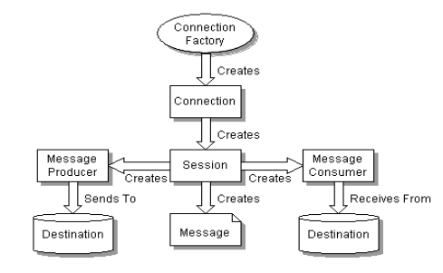

## 1.1 JMS

## 1.1.1 JMS 介绍

JMS 是Java Message Service 的简称，即Java消息服务。什么是消息服务呢，我们来看一下Oracle官方的定义：

    The Java Message Service (JMS) API is a messaging standard that allows application components based on the Java Platform Enterprise Edition (Java EE) to create, send, receive, and read messages. It enables distributed communication that is loosely coupled, reliable, and asynchronous.

    翻译过来就是说，JMS是一个消息标准，这种标准允许基于JavaEE的应用组件可以创建，发送，接受及读取消息。通过JMS可以实现松耦合，可依赖及异步的分布式通信。那么在这一段话中我们应该注意两点，即首先这是一个标准，类似于Servlet标准，并不是一个具体的实现。其次，这是一种分布式的通信机制，并且是异步的。

JMS 只定义了 Java 中访问消息中间件的接口，并没有给予实现，实现 JMS 接口的消息中间件称为 JMS Provideer。如 Apache 的 ActiveMQ、以及阿里巴巴的 RocketMQ。

## 1.1.2 JMS 术语

* 消息中间件(JMS Provider) ： 指提供了对JMS协议的第三方组件，比如ActiveMQ就是一个消息中间件，另外比较知名的还有KFA, Rabbit MQ等。

* 消息模式：分为点对点(Point-to-Point，即P2P)和发布/订阅(Pub/Sub)，对应的数据结构分别是队列(Queue)和主题(Topic)

* 消息(Message): 通信内容的载体，其结构主要分为消息头，属性和消息体，并且根据存储结构的不同分为好几种，后面会详细提到。

* 消息生产者：产生消息的一方，在P2P模式下，指消息发送者(Sender)，在P/S模式下指消息发布者(Publisher)

* 消息消费者：接收消息的一方，对应于两种模式分别是消息接收者(Receiver)和消息订阅者(Subscriber)

## 1.1.3 消息模式

### P2P模式

**涉及到的概念：**

1. 消息队列(Queue)
1. 发送者(Sender)
1. 接收者(Receiver)

每个消息都被发送到一个特定的队列，接收者从队列中获取消息。队列保留着消息，直到他们被消费或超时。

**P2P的特点：**

1. 每个消息只有一个消费者（Consumer）(即一旦被消费，消息就不再在消息队列中)
1. 发送者和接收者之间在时间上没有依赖性，也就是说当发送者发送了消息之后，不管接收者有没有正在运行，它不会影响到消息被发送到队列
1. 接收者在成功接收消息之后需向队列应答成功

总结：如果你希望发送的每个消息都应该被成功处理的话，那么你需要P2P模式。
    
### Pub/Sub模式

**涉及到的概念：**

1. 主题（Topic）
1. 发布者（Publisher）
1. 订阅者（Subscriber） 

客户端将消息发送到主题。多个发布者将消息发送到Topic,系统将这些消息传递给多个订阅者。

**Pub/Sub的特点：**

1. 每个消息可以有多个消费者
1. 发布者和订阅者之间有时间上的依赖性。针对某个主题（Topic）的订阅者，它必须创建一个订阅者之后，才能消费发布者的消息，而且为了消费消息，订阅者必须保持运行的状态。
1. 为了缓和这样严格的时间相关性，JMS允许订阅者创建一个可持久化的订阅。这样，即使订阅者没有被激活（运行），它也能接收到发布者的消息。

总结：如果你希望发送的消息可以不被做任何处理、或者被一个消息者处理、或者可以被多个消费者处理的话，那么可以采用Pub/Sub模型

## 1.1.4 消息的消费 

在JMS中，消息的产生和消息是异步的。对于消费来说，JMS的消息者可以通过两种方式来消费消息。

* 同步 订阅者或接收者调用receive方法来接收消息，receive方法在能够接收到消息之前（或超时之前）将一直阻塞。

* 异步 订阅者或接收者可以注册为一个消息监听器。当消息到达之后，系统自动调用监听器的onMessage方法。

## 1.1.5 JMS编程模型

在 JMS 的标准协议里，有几个重要的接口，先简单罗列如下：

1. ConnectionFactory ：创建Connection的工厂，通过这个对象来创建一个到某个消息服务的连接。

2. Connection: 一个具体的连接，由ConnectionFactory创建

3. Session: 由Connection创建的用于操作消息的接口，本接口可以直接用来创建消息的生产者对象

4. Destination:消息存储的位置，发送者把消息发送到指定位置，消费者从指定位置取消息，那么这个指定位置可能是一个topic也可能是一个queue，由这个来表示。

5. MessageProducer: 消息的生产者，包括QueueSender和TopicPublisher

6. MessageConsumer: 消息的消费者， 包括QueueReceiver和TopicSubscriber

7. MessageListener: 消息监听器，这个是提供给消费者监听消息使用的，在添加了某个监听器之后，一旦消费到达，则会调用其onMessage方法。

