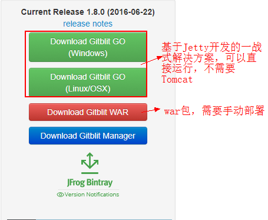
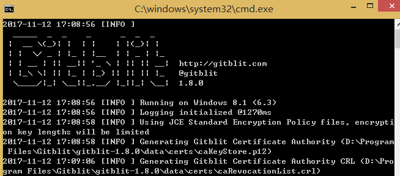
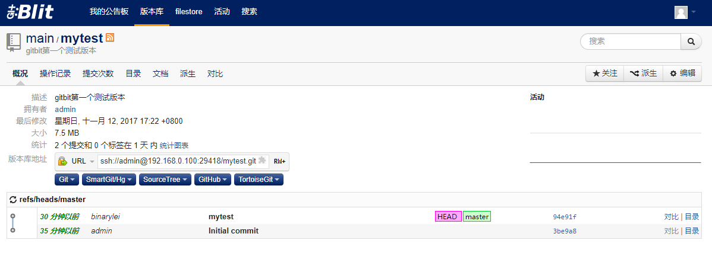

# 1.1 Gitblit

> Gitblit 是一个使用Java来管理Git的软件，其本身有很多特性分支。关于Gitblit 的详细情况可以到官网上查看： http://gitblit.com

## 1.1.1 环境准备

1. 安装 jdk 1.8，详见 [CentOS7 下 jdk 安装]()

2. 下载 `gitblit.war` 。Gitblit 官方网址:  http://gitblit.com/

	

## 1.1.2 Gitblit 安装与配置

下面以 `Download Gitblit GO (Windows)` 来说明 Gitblit 的安装与配置：

1. 将 `gitblit-1.8.0.zip` 解压后就可以直接运行，不过在运行前要修改相关的配置文件。

2. 修改 `%Gitblit-HOME%\data\gitblit.properties` 配置文件。

	- `git.repositoriesFolder` 这个是存放Git库的文件夹

		git.repositoriesFolder = D:\Program Files\Gitblit\GitRepository

	- `server.httpPort` 和 `server.httpsPort` 分别为http协议和https 协议的端口

		server.httpPort = 10101

	- `server.httpBindInterface` 和 `server.httpsBindInterface` 宿主监控的网络接口 ，就是服务器端访问的网址

		server.httpBindInterface = 192.168.0.100

3. 完成后运行 gitblit.cmd 批处理文件，可以看到以下界面：

	

4. 访问 http://192.168.0.100:10101 (httpBindInterface:httpPort)，初始密码 admin/admin

	

5. 如需设置以Windows Service方式启动 Gitblit ，请参考这篇文章：[Windows平台使用Gitblit搭建Git服务器图文教程](https://www.cnblogs.com/jeremylee/p/5626240.html)

