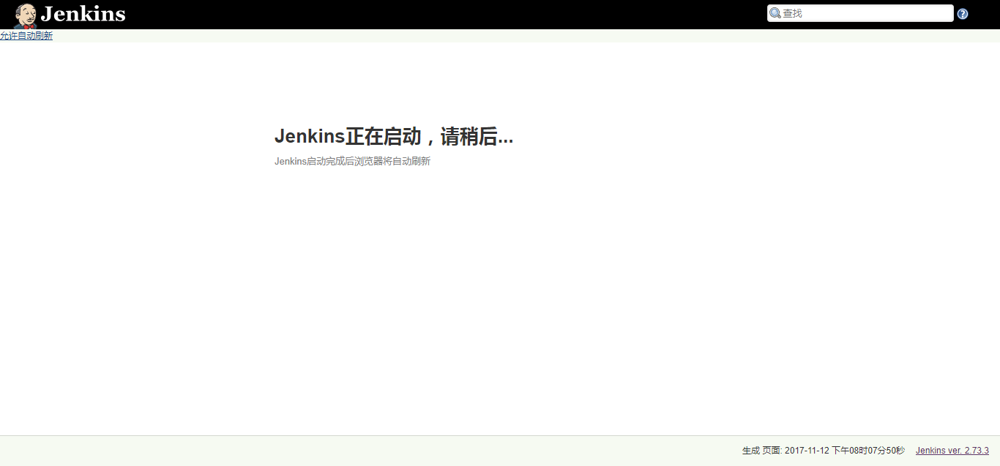
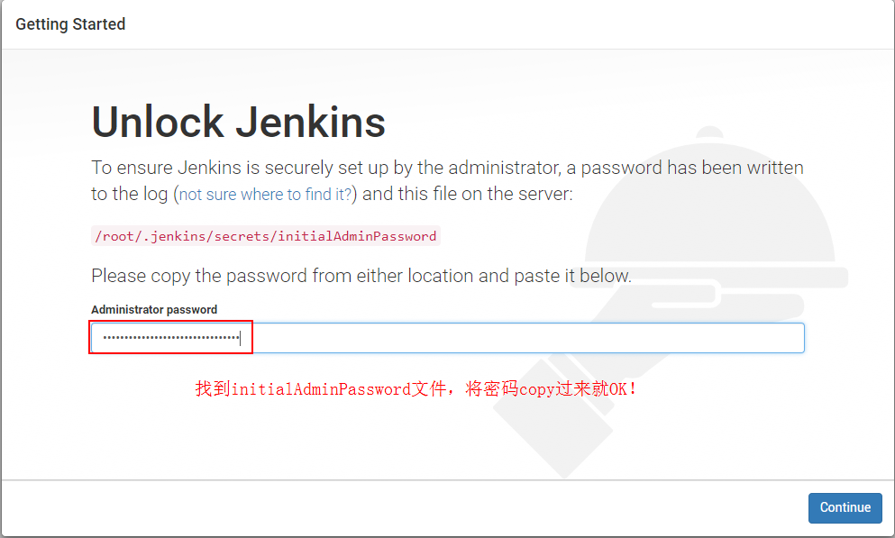
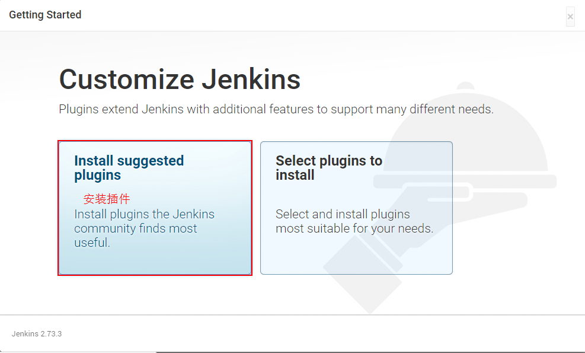
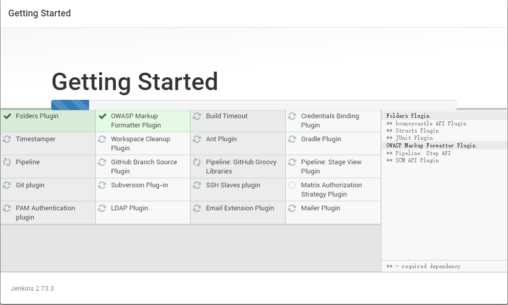
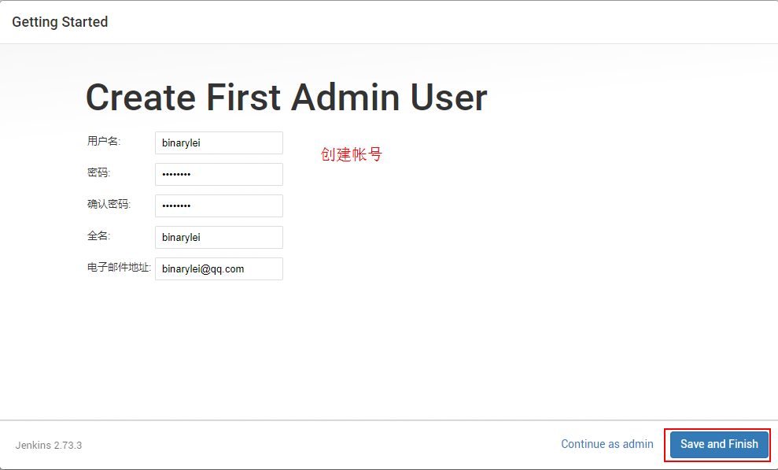
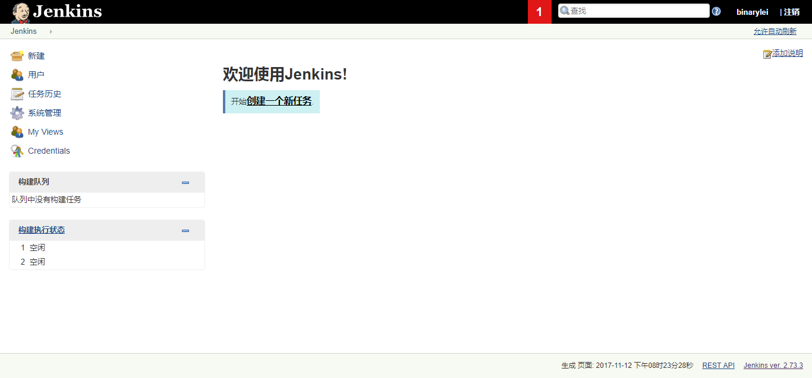

# 1.2 Jenkins

## 1.2.1 环境准备

1. 安装 jdk 1.8，详见 [CentOS7 下 jdk 安装]()

2. 安装 tomcat，详见 [CentOS7 下 Tomcat 安装]()

3. 下载 `jenkins.war` 。Jenkins官方网址:  https://jenkins.io/download/

## 1.2.2 Jenkins 安装

1. 将 `jenkins.war` 扔到 `CATALINA_HOME/webapps` 下，启动 tomcat，访问 http://192.168.1.3:8080/jenkins/ ，按提示安装即可。

	

2. 输入密码

	

	```
	[root@localhost secrets]# less /root/.jenkins/secretsinitialAdminPassword 
	f50548994dba4597a0e0103663b2e738
	```

3. 选择插件安装类型，第一次安装可以选择 `install suggested plugins`

	

4. 安装插件

	

5. 创建帐号

	

6. 安装完成

	

7. Jenkins 首页

	

到此，Jenkins 安装完毕！！

**注意事项：**

1. Jenkins 2.73.3 必须依赖 **JDK 1.8**，这是个大坑，调试了半天。

[gitlab与jenkins协同工作](https://my.oschina.net/u/575122/blog/512989?p=1)


	
