# 第二章 Jenkins

## 2.1 环境准备

1. 安装 jdk 1.8，详见 [CentOS7 下 jdk 安装]()

2. 安装 tomcat，详见 [CentOS7 下 Tomcat 安装]()

3. 下载 `jenkins.war` 。Jenkins官方网址:  https://jenkins.io/download/

## 2.2 Jenkins 安装

1. 将 `jenkins.war` 扔到 `CATALINA_HOME/webapps` 下，启动 tomcat，访问 http://192.168.1.3:8080/jenkins/ ，按提示安装即可。

	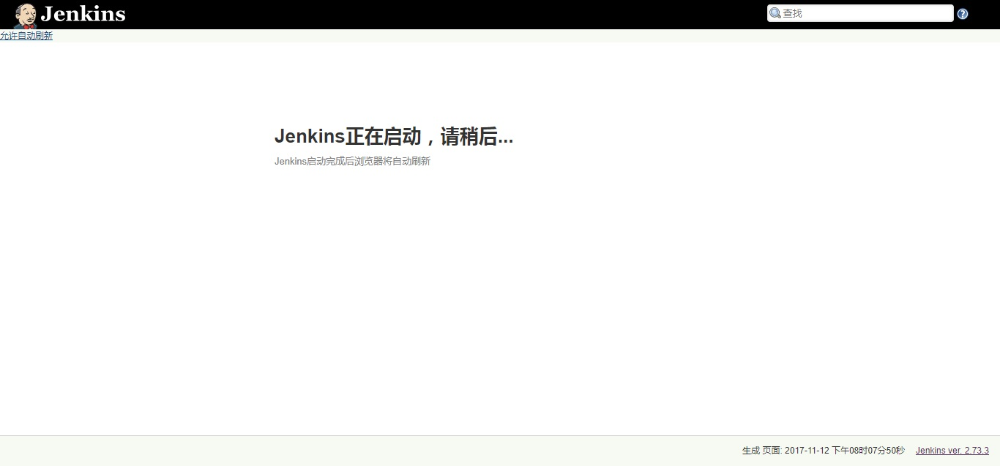

2. 输入密码

	

	```
	[root@localhost secrets]# less /root/.jenkins/secretsinitialAdminPassword 
	f50548994dba4597a0e0103663b2e738
	```

3. 选择插件安装类型，第一次安装可以选择 `install suggested plugins`

	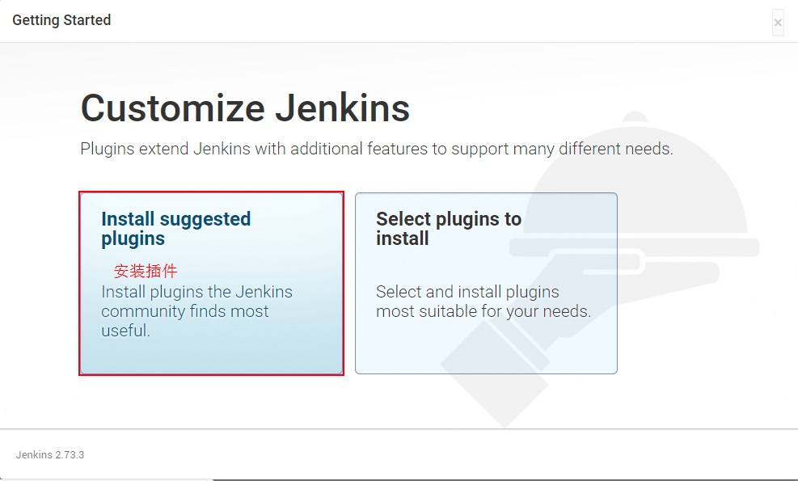

4. 安装插件

	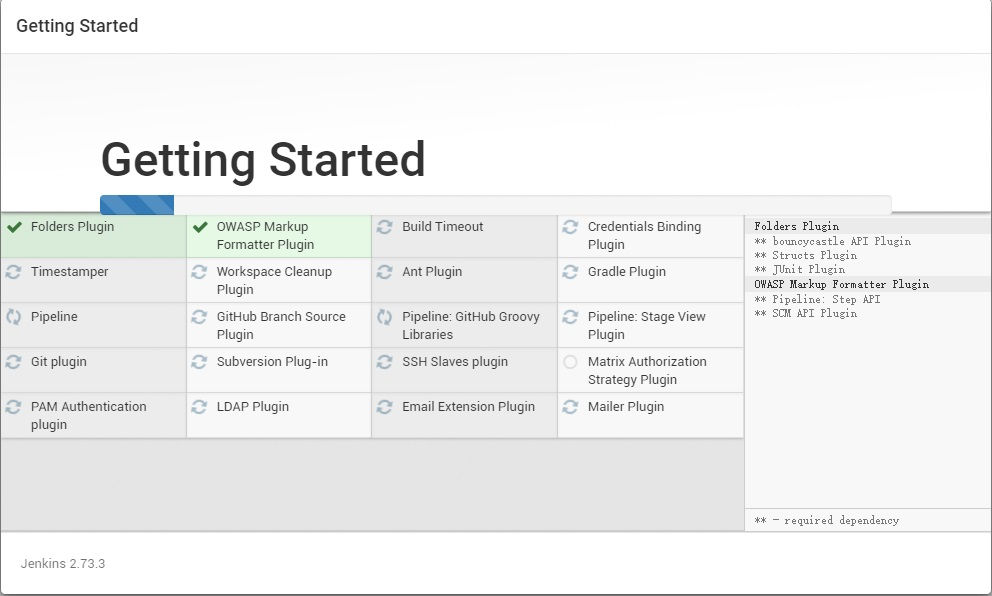

5. 创建帐号

	

6. 安装完成

	

7. Jenkins 首页

	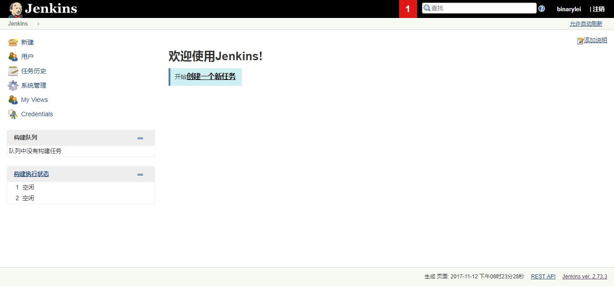

到此，Jenkins 安装完毕！！

**注意事项：**

1. Jenkins 2.73.3 必须依赖 **JDK 1.8**，这是个大坑，调试了半天。

[gitlab与jenkins协同工作](https://my.oschina.net/u/575122/blog/512989?p=1)

[https://www.cnblogs.com/ceshisanren/p/5639869.html](https://www.cnblogs.com/ceshisanren/p/5639869.html)

## 2.3 Jenkins 使用教程之创建job

### 2.3.1 常规设置(general)

1. 点击新建，进入新建项目页面

	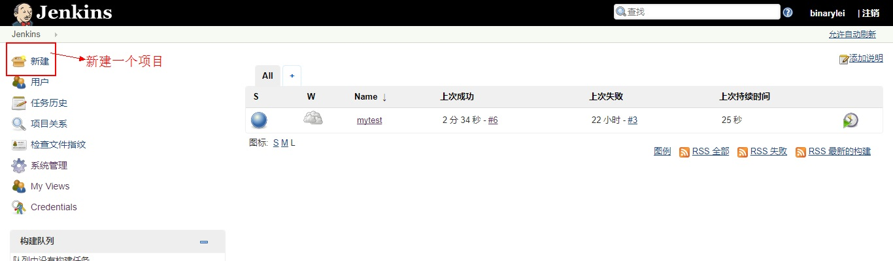

2. 输入项目名称，选择构建一个自由风格的软件项目(里面可以自己自由进行配置，使用更加灵活)，点击ok
	
	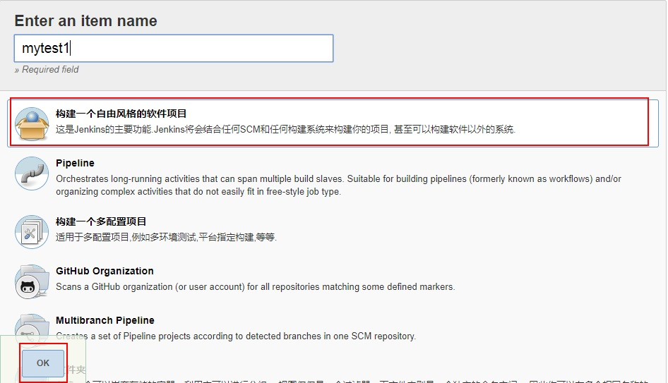

3. 项目名称与描述，一般输入项目名称即可，4-8项不用配制

	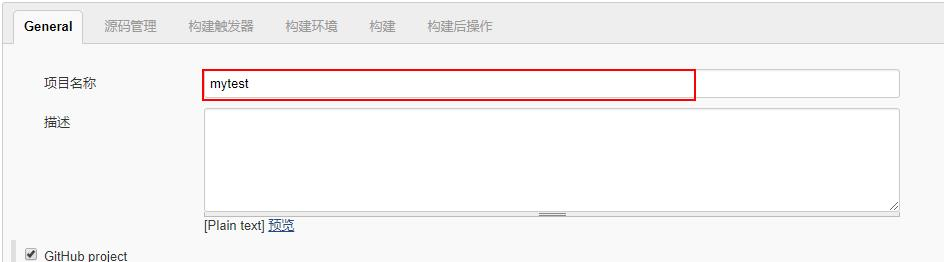

4. Github project：里面配置响应的url和需要显示的名称就可以了

	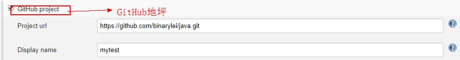

5. Throttle builds：节流构建，通过设置时间段内允许并发的次数来实现构建的控制

	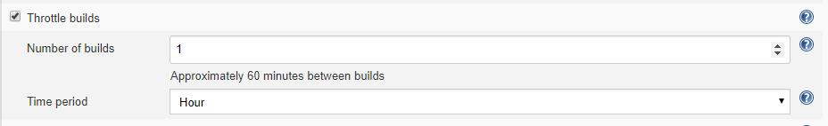

6. 丢弃旧的构建：设置构建历史的保存策略

	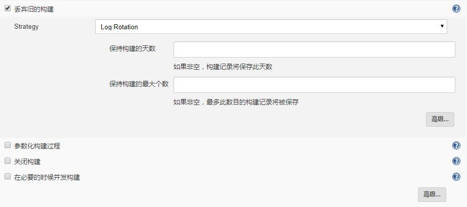

7. 参数化构建过程：里面可以配置不同的参数，便于在构建时引用这些参数

8. 关闭构建：这样项目就没法进行构建了

### 2.3.2 源码管理

以 Git 为例

1. Git 

	

2. 点击Add，添加 Git 用户名和密码

	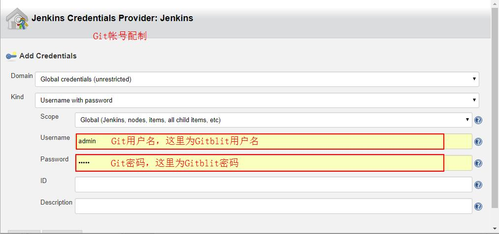
	
### 2.3.3 构建触发器

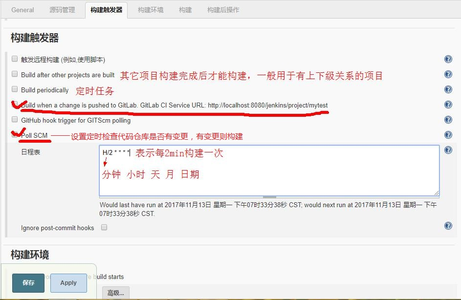

1. 触发远程构建 (例如,使用脚本)：这里使用于自动化构建，拼接url后写入代码中可以实现在脚本或者工具执行构建

2. Build after other projects are built:构建与其他项目构建后，用于上下游项目有关联的时候

3. Build periodically：定时执行构建

4. **Build when a change is pushed to GitLab**：需要安装 `Gitlab Hook Plugin` 和 `GitLab Plugin` 两个插件，详情查看 [gitlab与jenkins协同工作](https://my.oschina.net/u/575122/blog/512989?p=1)

5. **Poll SCM**：设置定时检查代码仓库是否有变更，有变更则构建

**补充：定时任务写法**

* 第一个参数代表的是分钟 minute，取值 0~59；

* 第二个参数代表的是小时 hour，取值 0~23；

* 第三个参数代表的是天 day，取值 1~31；

* 第四个参数代表的是月 month，取值 1~12；

* 最后一个参数代表的是星期 week，取值 0~7，0 和 7 都是表示星期天。

### 2.3.4 构建环境

1. **Delete workspace before build starts**：在构建之前清空工作空间

2. Abort the build if it's stuck：如果构建出现问题则终止构建

3. **Add timestamps to the Console Output**：给控制台输出增加时间戳

4. Use secret text(s) or file(s)：使用加密文件或者文本

### 2.3.5 构建

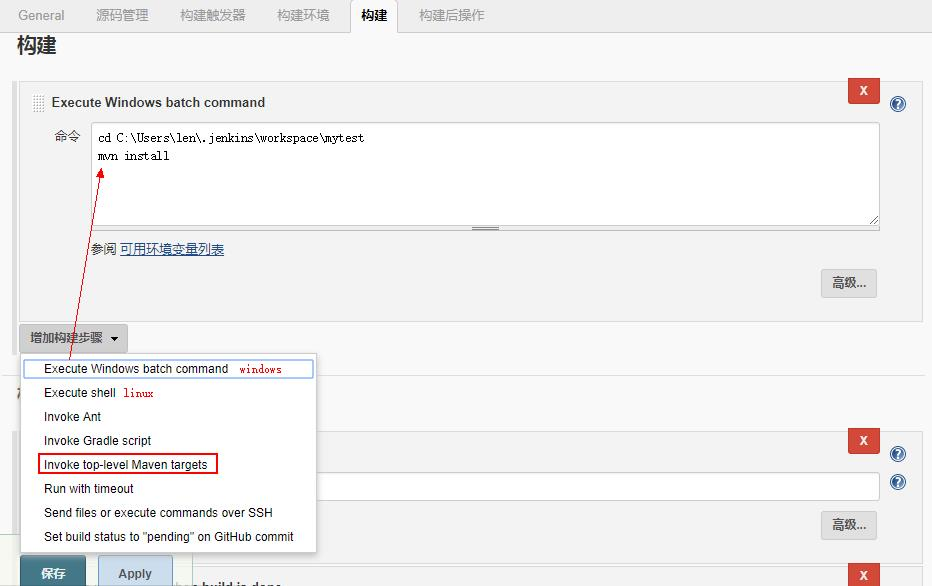

1. execute windows batch command:执行windows的cmd

2. execute shell:执行shell命令

3. invoke ant:调用ant ,调用ant的执行脚本来进行构建

4. invoke gradle script :调用grade脚本，来帮助我们自动打包

### 2.3.6 构建后操作

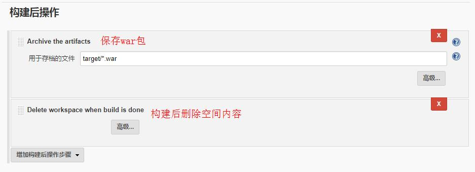

1. build other projects:构建其他项目

2. e-mail notification:发送邮件

3. editable email notification:发送邮件（这是一个插件，以后会单独介绍这个插件）

4. delete workspace when build is done:构建后删除工作空间

到此，Jenkins 就可以工作，下面讲一下 Jenkins 的系统管理。

## 2.4 系统管理

### 2.4.1 系统设置

### 2.4.2 插件管理


[MAVEN集成](http://blog.csdn.net/luzhenyu111/article/details/42194675)

Sonar集成

参考：

1. [jenkins使用教程之创建job](http://www.jianshu.com/p/a154f2a1d0c3)
