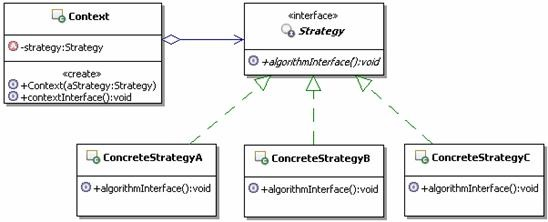

# 17.1 Java 设计模式系列教程（十七）策略模式之原理

[Java 设计模式系列教程目录](https://github.com/binarylei/java/blob/master/%E8%AE%BE%E8%AE%A1%E6%A8%A1%E5%BC%8F/01.%20Java%20%E8%AE%BE%E8%AE%A1%E6%A8%A1%E5%BC%8F%E7%B3%BB%E5%88%97%E6%95%99%E7%A8%8B%EF%BC%88%E4%B8%80%EF%BC%89%E7%9B%AE%E5%BD%95.md)

[17.1 Java 设计模式系列教程（十七）策略模式之原理]()

[17.2 Java 设计模式系列教程（十七）策略模式之场景分析]()

[17.3 Java 设计模式系列教程（十七）策略模式之扩展]()

> 定义一系列的算法，把它们一个个封装起来，并且使它们可相互替换。本模式使得算法可独 立于使用它的客户而变化。[strategy]()

## 17.1.1 策略模式结构



* `Strategy`：策略接口，用来约束一系列具体的策略算法。Context使用这个接口来调用具体的策略实现定义的算法。

* `ConcreteStrategy`：具体的策略实现，也就是具体的算法实现。

* `Context`：上下文，负责和具体的策略类交互，通常上下文会持有一个真正的策略实现，上下文还可以让具体的策略类来获取上下文的数据，甚至让具体的策略类来回调上下文的方法。

## 17.1.2 策略模式参考实现 [demo1]()

（1）首先来看策略，也就是定义算法的接口，示例代码如下：

```java
/**
 * 策略，定义算法的接口
 */
public interface Strategy {
    /**
     * 某个算法的接口，可以有传入参数，也可以有返回值
     */
    public void algorithmInterface();
}
```

（2）该来看看具体的算法实现了，定义了三个，分别是ConcreteStrategyA、ConcreteStrategyB，示例非常简单，由于没有具体算法的实现，三者也就是名称不同，示例代码如下：

```java
/**
 * 实现具体的算法
 */
public class ConcreteStrategyA implements Strategy {

    public void algorithmInterface() {
        //具体的算法实现
    }
}
```

（3）再来看看上下文的实现，示例代码如下：

```java
/**
 * 上下文对象，通常会持有一个具体的策略对象
 */
public class Context {
    /**
     * 持有一个具体的策略对象
     */
    private Strategy strategy;

    /**
     * 构造方法，传入一个具体的策略对象
     * @param aStrategy 具体的策略对象
     */
    public Context(Strategy aStrategy) {
        this.strategy = aStrategy;
    }

    /**
     * 上下文对客户端提供的操作接口，可以有参数和返回值
     */
    public void contextInterface() {
        //通常会转调具体的策略对象进行算法运算
        strategy.algorithmInterface();
    }

}
```

## 17.1.3 进一步认识策略模式

#### （1）策略模式的功能

策略模式的功能是把具体的算法实现，从具体的业务处理里面独立出来，把它们实现成为单独的算法类，从而形成一系列的算法，并让这些算法可以相互替换。
        
策略模式的重心不是如何来实现算法，而是如何组织、调用这些算法，从而让程序结构更灵活、具有更好的维护性和扩展性。

#### （2）策略模式和if-else语句

很多朋友会发现，每个策略算法具体实现的功能，就是原来在if-else结构中的具体实现。

没错，其实多个if-elseif语句表达的就是一个平等的功能结构，你要么执行if，要不你就执行else，或者是elseif，这个时候，if块里面的实现和else块里面的实现从运行地位上来讲就是平等的。

而策略模式就是把各个平等的具体实现封装到单独的策略实现类了，然后通过上下文来与具体的策略类进行交互。
因此多个if-else语句可以考虑使用策略模式。

#### （3）算法的平等性

策略模式一个很大的特点就是各个策略算法的平等性。对于一系列具体的策略算法，大家的地位是完全一样的，正是因为这个平等性，才能实现算法之间可以相互替换。

所有的策略算法在实现上也是相互独立的，相互之间是没有依赖的。

所以可以这样描述这一系列策略算法：**策略算法是相同行为的不同实现。**

#### （4）谁来选择具体的策略算法

在策略模式中，可以在两个地方来进行具体策略的选择。

一个是在客户端，在使用上下文的时候，由客户端来选择具体的策略算法，然后把这个策略算法设置给上下文。前面的示例就是这种情况。

还有一个是客户端不管，由上下文来选择具体的策略算法，这个在后面讲容错恢复的时候给大家演示一下。

#### （5）Strategy的实现方式

在前面的示例中，Strategy都是使用的接口来定义的，这也是常见的实现方式。但是如果多个算法具有公共功能的话，可以把Strategy实现成为抽象类，然后把多个算法的公共功能实现到Strategy里面。

#### （6）运行时策略的唯一性

运行期间，策略模式在每一个时刻只能使用一个具体的策略实现对象，虽然可以动态的在不同的策略实现中切换，但是同时只能使用一个。

#### （7）增加新的策略

添加一个实现要求的策略类，示例代码如下：

```java
public class ConcreteStrategyA implements Strategy {

    public void algorithmInterface() {
        //具体的算法实现
    }
}
```

#### （8）策略模式调用顺序示意图

策略模式的调用顺序，有两种常见的情况，一种如同前面的示例，具体如下：

1. 先是客户端来选择并创建具体的策略对象
2. 然后客户端创建上下文
3. 接下来客户端就可以调用上下文的方法来执行功能了，在调用的时候，从客户端传入算法需要的参数
4. 上下文接到客户的调用请求，会把这个请求转发给它持有的Strategy

这种情况的调用顺序示意图如图17.2所示：


策略模式调用还有一种情况，就是把Context当做参数来传递给Strategy，这种方式的调用顺序图，在讲具体的Context和Strategy的关系时再给出。

## 17.1.4 总结

### 策略模式的本质

策略模式的本质： **分离算法，选择实现** 。

仔细思考策略模式的结构和实现的功能，会发现，如果没有上下文，策略模式就回到了最基本的接口和实现了，只要是面向接口编程的，那么就能够享受到接口的封装隔离带来的好处。也就是通过一个统一的策略接口来封装和隔离具体的策略算法，面向接口编程的话，自然不需要关心具体的策略实现，也可以通过使用不同的实现类来实例化接口，从而实现切换具体的策略。

看起来好像没有上下文什么事情，但是如果没有上下文，那么就需要客户端来直接与具体的策略交互，尤其是当需要提供一些公共功能，或者是相关状态存储的时候，会大大增加客户端使用的难度。因此，引入上下文还是很必要的，有了上下文，这些工作就由上下文来完成了，客户端只需要与上下文交互就可以了，这样会让整个设计模式更独立、更有整体性，也让客户端更简单。

但纵观整个策略模式实现的功能和设计，它的本质还是“分离算法，选择实现”，因为分离并封装了算法，才能够很容易的修改和添加算法；也能很容易的动态切换使用不同的算法，也就是动态选择一个算法来实现需要的功能了。

### 对设计原则的体现

从设计原则上来看，策略模式很好的体现了开-闭原则。策略模式通过把一系列可变的算法进行封装，并定义出合理的使用结构，使得在系统出现新算法的时候，能很容易的把新的算法加入到已有的系统中，而已有的实现不需要做任何修改。这在前面的示例中已经体现出来了，好好体会一下。

从设计原则上来看，策略模式还很好的体现了里氏替换原则。策略模式是一个扁平结构，一系列的实现算法其实是兄弟关系，都是实现同一个接口或者继承的同一个父类。这样只要使用策略的客户保持面向抽象类型编程，就能够使用不同的策略的具体实现对象来配置它，从而实现一系列算法可以相互替换。

### 何时选用策略模式

**建议在如下情况中，选用策略模式：**

出现有许多相关的类，仅仅是行为有差别的情况，可以使用策略模式来使用多个行为中的一个来配置一个类的方法，实现算法动态切换

出现同一个算法，有很多不同的实现的情况，可以使用策略模式来把这些“不同的实现”实现成为一个算法的类层次

需要封装算法中，与算法相关的数据的情况，可以使用策略模式来避免暴露这些跟算法相关的数据结构

出现抽象一个定义了很多行为的类，并且是通过多个if-else语句来选择这些行为的情况，可以使用策略模式来代替这些条件语句

### 策略模式的优缺点

* 定义一系列算法

    策略模式的功能就是定义一系列算法，实现让这些算法可以相互替换。所以会为这一系列算法定义公共的接口，以约束一系列算法要实现的功能。如果这一系列算法具有公共功能，可以把策略接口实现成为抽象类，把这些公共功能实现到父类里面，对于这个问题，前面讲了三种处理方法，这里就不罗嗦了。

* 避免多重条件语句

    根据前面的示例会发现，策略模式的一系列策略算法是平等的，可以互换的，写在一起就是通过if-else结构来组织，如果此时具体的算法实现里面又有条件语句，就构成了多重条件语句，使用策略模式能避免这样的多重条件语句。

    如下示例来演示了不使用策略模式的多重条件语句，示例代码如下：

    ```java
    public class OneClass {
        /**
         * 示范多重条件语句
         * @param type 某个用于判断的类型
         */
        public void oneMethod(int type){
            if(type==1){
                //算法一示范
                //从某个地方获取这个s的值
                String s = "";
                //然后判断进行相应处理
                if(s.indexOf("a") > 0){
                    //处理
                }else{
                    //处理
                }
            }else if(type==2){
                //算法二示范
                //从某个地方获取这个a的值
                int a = 3;
                //然后判断进行相应处理
                if(a > 10){
                    //处理
                }else{
                    //处理
                }
            }
        }
    }
    ```

* 更好的扩展性

    在策略模式中扩展新的策略实现非常容易，只要增加新的策略实现类，然后在选择使用策略的地方选择使用这个新的策略实现就好了。

* 客户必须了解每种策略的不同

    策略模式也有缺点，比如让客户端来选择具体使用哪一个策略，这就可能会让客户需要了解所有的策略，还要了解各种策略的功能和不同，这样才能做出正确的选择，而且这样也暴露了策略的具体实现。

* 增加了对象数目

    由于策略模式把每个具体的策略实现都单独封装成为类，如果备选的策略很多的话，那么对象的数目就会很可观。
只适合扁平的算法结构

    策略模式的一系列算法地位是平等的，是可以相互替换的，事实上构成了一个扁平的算法结构，也就是在一个策略接口下，有多个平等的策略算法，就相当于兄弟算法。而且在运行时刻只有一个算法被使用，这就限制了算法使用的层级，使用的时候不能嵌套使用。

    对于出现需要嵌套使用多个算法的情况，比如折上折、折后返卷等业务的实现，需要组合或者是嵌套使用多个算法的情况，可以考虑使用装饰模式、或是变形的职责链、或是AOP等方式来实现。