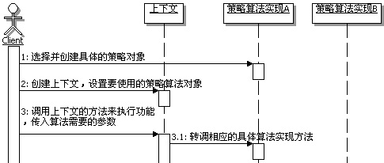

# 17.2 Java 设计模式系列教程（十七）策略模式之场景分析

[Java 设计模式系列教程目录](https://github.com/binarylei/java/blob/master/%E8%AE%BE%E8%AE%A1%E6%A8%A1%E5%BC%8F/01.%20Java%20%E8%AE%BE%E8%AE%A1%E6%A8%A1%E5%BC%8F%E7%B3%BB%E5%88%97%E6%95%99%E7%A8%8B%EF%BC%88%E4%B8%80%EF%BC%89%E7%9B%AE%E5%BD%95.md)

[17.1 Java 设计模式系列教程（十七）策略模式之原理]()

[17.2 Java 设计模式系列教程（十七）策略模式之场景分析]()

[17.3 Java 设计模式系列教程（十七）策略模式之扩展]()

## 17.2.1 使用场景

向客户报价，对于销售部门的人来讲，这是一个非常重大、非常复杂的问题，对不同的客户要报不同的价格，比如：

1. 对普通客户或者是新客户报的是全价
2. 对老客户报的价格，根据客户年限，给予一定的折扣
3. 对大客户报的价格，根据大客户的累计消费金额，给予一定的折扣
4. 还要考虑客户购买的数量和金额，比如：虽然是新用户，但是一次购买的数量非常大，或者是总金额非常高，也会有一定的折扣
5. 还有，报价人员的职务高低，也决定了他是否有权限对价格进行一定的浮动折扣
6. 甚至在不同的阶段，对客户的报价也不同，一般情况是刚开始比较高，越接近成交阶段，报价越趋于合理。 
        
总之，向客户报价是非常复杂的，因此在一些CRM（客户关系管理）的系统中，会有一个单独的报价管理模块，来处理复杂的报价功能。 

为了演示的简洁性，假定现在需要实现一个简化的报价管理，实现如下的功能：

（1）对普通客户或者是新客户报全价 

（2）对老客户报的价格，统一折扣5% 

（3）对大客户报的价格，统一折扣10% 

该怎么实现呢？

## 17.2.2 不用模式的实现

### 代码实现 [demo2]()

要实现对不同的人员报不同的价格的功能，无外乎就是判断起来麻烦点，也不多难，很快就有朋友能写出如下的实现代码，示例代码如下：

```java
/**
 * 价格管理，主要完成计算向客户所报价格的功能
 */
public class Price {
    /**
     * 报价，对不同类型的，计算不同的价格
     * @param goodsPrice 商品销售原价
     * @param customerType 客户类型
     * @return 计算出来的，应该给客户报的价格
     */
    public double quote(double goodsPrice,String customerType){
        if("普通客户".equals(customerType)){
            System.out.println("对于新客户或者是普通客户，没有折扣");
            return goodsPrice;
        }else if("老客户".equals(customerType)){
            System.out.println("对于老客户，统一折扣5%");
            return goodsPrice*(1-0.05);
        }else if("大客户".equals(customerType)){
            System.out.println("对于大客户，统一折扣10%");
            return goodsPrice*(1-0.1);
        }
        //其余人员都是报原价
        return goodsPrice;
    }
}
```

### 问题出来了

上面的写法是很简单的，也很容易想，但是仔细想想，这样实现，问题可不小，比如：

#### 第一个问题：价格类包含了所有计算报价的算法，使得价格类，尤其是报价这个方法比较庞杂，难以维护。

有朋友可能会想，这很简单嘛，把这些算法从报价方法里面拿出去，形成独立的方法不就可以解决这个问题了吗？据此写出如下的实现代码，示例代码如下：

```java
/**
 * 价格管理，主要完成计算向客户所报价格的功能
 */
public class Price2 {
    /**
     * 报价，对不同类型的，计算不同的价格
     * @param goodsPrice 商品销售原价
     * @param customerType 客户类型
     * @return 计算出来的，应该给客户报的价格
     */
    public double quote(double goodsPrice,String customerType){
        if("普通客户".equals(customerType)){
            return this.calcPriceForNormal(goodsPrice);
        }else if("老客户".equals(customerType)){
            return this.calcPriceForOld(goodsPrice);
        }else if("大客户".equals(customerType)){
            return this.calcPriceForLarge(goodsPrice);
        }
        //其余人员都是报原价
        return goodsPrice;
    }

    /**
     * 为新客户或者是普通客户计算应报的价格
     * @param goodsPrice 商品销售原价
     * @return 计算出来的，应该给客户报的价格
     */
    private double calcPriceForNormal(double goodsPrice){
        System.out.println("对于新客户或者是普通客户，没有折扣");
        return goodsPrice;
    }

    /**
     * 为老客户计算应报的价格
     * @param goodsPrice 商品销售原价
     * @return 计算出来的，应该给客户报的价格
     */
    private double calcPriceForOld(double goodsPrice){
        System.out.println("对于老客户，统一折扣5%");
        return goodsPrice*(1-0.05);
    }

    /**
     * 为大客户计算应报的价格
     * @param goodsPrice 商品销售原价
     * @return 计算出来的，应该给客户报的价格
     */
    private double calcPriceForLarge(double goodsPrice){
        System.out.println("对于大客户，统一折扣10%");
        return goodsPrice*(1-0.1);
    }
}
```

这样看起来，比刚开始稍稍好点，计算报价的方法会稍稍简单一点，这样维护起来也稍好一些，某个算法发生了变化，直接修改相应的私有方法就可以了。扩展起来也容易一点，比如要增加一个“战略合作客户”的类型，报价为直接8折，就只需要在价格类里面新增加一个私有的方法来计算新的价格，然后在计算报价的方法里面新添一个else-if即可。看起来似乎很不错了。 

真的很不错了吗？ 

再想想，问题还是存在，只不过从计算报价的方法挪动到价格类里面了，假如有100个或者更多这样的计算方式，这会让这个价格类非常庞大，难以维护。而且，维护和扩展都需要去修改已有的代码，这是很不好的，违反了开-闭原则。
 
#### 第二个问题：经常会有这样的需要，在不同的时候，要使用不同的计算方式。
        
比如：在公司周年庆的时候，所有的客户额外增加3%的折扣；在换季促销的时候，普通客户是额外增加折扣2%，老客户是额外增加折扣3%，大客户是额外增加折扣5%。这意味着计算报价的方式会经常被修改，或者被切换。 

通常情况下应该是被切换，因为过了促销时间，又还回到正常的价格体系上来了。而现在的价格类中计算报价的方法，是固定调用各种计算方式，这使得切换调用不同的计算方式很麻烦，每次都需要修改if-else里面的调用代码。 

看到这里，可能有朋友会想， 那么到底应该如何实现，才能够让价格类中的计算报价的算法，能很容易的实现可维护、可扩展，又能动态的切换变化呢？

## 17.2.3 解决方案

### 应用策略模式的解决思路

要使用策略模式来重写前面报价的示例，大致有如下改变：

1. 首先需要定义出算法的接口。
2. 然后把各种报价的计算方式单独出来，形成算法类。
3. 对于Price这个类，把它当做上下文，在计算报价的时候，不再需要判断，直接使用持有的具体算法进行运算即可。选择使用哪一个算法的功能挪出去，放到外部使用的客户端去。

这个时候，程序的结构如图17.2所示：



### 代码实现 [demo3]()

（1）先看策略接口，示例代码如下：

```java
/**
 * 策略，定义计算报价算法的接口
 */
public interface Strategy {
    /**
     * 计算应报的价格
     * @param goodsPrice 商品销售原价
     * @return 计算出来的，应该给客户报的价格
     */
    public double calcPrice(double goodsPrice);
}
```

（2）接下来看看具体的算法实现，不同的算法，实现也不一样，先看为新客户或者是普通客户计算应报的价格的实现，示例代码如下：

```java
/**
 * 具体算法实现，为新客户或者是普通客户计算应报的价格
 */
public class NormalCustomerStrategy implements Strategy{
    public double calcPrice(double goodsPrice) {
        System.out.println("对于新客户或者是普通客户，没有折扣");
        return goodsPrice;
    }
}
```

```java
/**
 * 具体算法实现，为大客户计算应报的价格
 */
public class LargeCustomerStrategy implements Strategy{
    public double calcPrice(double goodsPrice) {
        System.out.println("对于大客户，统一折扣10%");
        return goodsPrice*(1-0.1);
    }
}
```

```java
/**
 * 具体算法实现，为战略合作客户客户计算应报的价格
 */
public class CooperateCustomerStrategy implements Strategy{
    public double calcPrice(double goodsPrice) {
        System.out.println("对于战略合作客户，统一8折");
        return goodsPrice*0.8;
    }
}
```

```java
/**
 * 具体算法实现，为老客户计算应报的价格
 */
public class OldCustomerStrategy implements Strategy{
    public double calcPrice(double goodsPrice) {
        System.out.println("对于老客户，统一折扣5%");
        return goodsPrice*(1-0.05);
    }
}
```

（3）接下来看看上下文的实现，也就是原来的价格类，它的变化比较大，主要有：

1. 原来那些私有的，用来做不同计算的方法，已经去掉了，独立出去做成了算法类
2. 原来报价方法里面，对具体计算方式的判断，去掉了，让客户端来完成选择具体算法的功能
3. 新添加持有一个具体的算法实现，通过构造方法传入
4. 原来报价方法的实现，变化成了转调具体算法来实现

示例代码如下：

```java
/**
 * 价格管理，主要完成计算向客户所报价格的功能
 */
public class Price {
    /**
     * 持有一个具体的策略对象
     */
    private Strategy strategy = null;

    /**
     * 构造方法，传入一个具体的策略对象
     * @param aStrategy 具体的策略对象
     */
    public Price(Strategy aStrategy){
        this.strategy = aStrategy;
    }

    /**
     * 报价，计算对客户的报价
     * @param goodsPrice 商品销售原价
     * @return 计算出来的，应该给客户报的价格
     */
    public double quote(double goodsPrice){
        return this.strategy.calcPrice(goodsPrice);
    }
}
```

（4）写个客户端来测试运行一下，好加深体会，示例代码如下：

```java
public class Client {
    public static void main(String[] args) {
        //1：选择并创建需要使用的策略对象
        Strategy strategy = new LargeCustomerStrategy();
        //2：创建上下文
        Price ctx = new Price(strategy);

        //3：计算报价
        double quote = ctx.quote(1000);
        System.out.println("向客户报价："+quote);
    }
}
```

运行一下，看看效果。

你可以修改使用不同的策略算法具体实现，现在用的是LargeCustomerStrategy，你可以尝试修改成其它两种实现，试试看，体会一下切换算法的容易性。