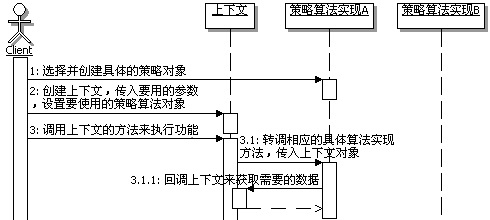
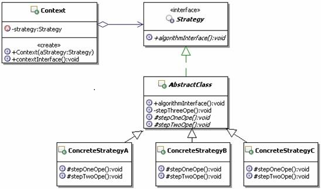

# 17.3 Java 设计模式系列教程（十七）策略模式之扩展

[Java 设计模式系列教程目录](https://github.com/binarylei/java/blob/master/%E8%AE%BE%E8%AE%A1%E6%A8%A1%E5%BC%8F/01.%20Java%20%E8%AE%BE%E8%AE%A1%E6%A8%A1%E5%BC%8F%E7%B3%BB%E5%88%97%E6%95%99%E7%A8%8B%EF%BC%88%E4%B8%80%EF%BC%89%E7%9B%AE%E5%BD%95.md)

[17.1 Java 设计模式系列教程（十七）策略模式之原理]()

[17.2 Java 设计模式系列教程（十七）策略模式之场景分析]()

[17.3 Java 设计模式系列教程（十七）策略模式之扩展]()

## 17.3.1 容错恢复机制 [demo4]()

容错恢复机制是应用程序开发中非常常见的功能。那么什么是容错恢复呢？简单点说就是：程序运行的时候，正常情况下应该按照某种方式来做，如果按照某种方式来做发生错误的话，系统并不会崩溃，也不会就此不能继续向下运行了，而是有容忍出错的能力，不但能容忍程序运行出现错误，还提供出现错误后的备用方案，也就是恢复机制，来代替正常执行的功能，使程序继续向下运行。

举个实际点的例子吧，比如在一个系统中，所有对系统的操作都要有日志记录，而且这个日志还需要有管理界面，这种情况下通常会把日志记录在数据库里面，方便后续的管理，但是在记录日志到数据库的时候，可能会发生错误，比如暂时连不上数据库了，那就先记录在文件里面，然后在合适的时候把文件中的记录再转录到数据库中。

对于这样的功能的设计，就可以采用策略模式，把日志记录到数据库和日志记录到文件当作两种记录日志的策略，然后在运行期间根据需要进行动态的切换。

在这个例子的实现中，要示范由上下文来选择具体的策略算法，前面的例子都是由客户端选择好具体的算法，然后设置到上下文中。

下面还是通过代码来示例一下。

（1）先定义日志策略接口，很简单，就是一个记录日志的方法，示例代码如下：

```java
/**
 * 日志记录策略的接口
 */
public interface LogStrategy {
    /**
     * 记录日志
     * @param msg 需记录的日志信息
     */
    public void log(String msg);
}
```

（2）实现日志策略接口，先实现默认的数据库实现，假设如果日志的长度超过长度就出错，制造错误的是一个最常见的运行期错误，示例代码如下：

```java
/**
 * 把日志记录到数据库
 */
public class DbLog implements LogStrategy{
    public void log(String msg) {
        //制造错误
        if(msg!=null && msg.trim().length()>5){
            int a = 5/0;
        }
        System.out.println("现在把 '"+msg+"' 记录到数据库中");
    }
}
```

接下来实现记录日志到文件中去，示例代码如下：

```java
/**
 * 把日志记录到文件
 */
public class FileLog implements LogStrategy{
    public void log(String msg) {
        System.out.println("现在把 '"+msg+"' 记录到文件中");
    }
}
```

（3）接下来定义使用这些策略的上下文，注意这次是在上下文里面实现具体策略算法的选择，所以不需要客户端来指定具体的策略算法了，示例代码如下：

```java
/**
 * 日志记录的上下文
 */
public class LogContext {
    /**
     * 记录日志的方法，提供给客户端使用
     * @param msg 需记录的日志信息
     */
    public void log(String msg){
        //在上下文里面，自行实现对具体策略的选择
        //优先选用策略：记录到数据库
        LogStrategy strategy = new DbLog();
        try{
            strategy.log(msg);
        }catch(Exception err){
            //出错了，那就记录到文件中
            strategy = new FileLog();
            strategy.log(msg);
        }
    }
}
```

（4）看看现在的客户端，没有了选择具体实现策略算法的工作，变得非常简单，故意多调用一次，可以看出不同的效果，示例代码如下：

```java
public class Client {
    public static void main(String[] args) {
        LogContext log = new LogContext();
        log.log("记录日志");
        log.log("再次记录日志");
    }
}
```

运行结果如下：

```
现在把 '记录日志' 记录到数据库中
现在把 '再次记录日志' 记录到文件中
```

## 17.3.2 Context和Strategy的关系 [demo5]()

在策略模式中，通常是上下文使用具体的策略实现对象，反过来，策略实现对象也可以从上下文获取所需要的数据，因此可以将上下文当参数传递给策略实现对象，这种情况下上下文和策略实现对象是紧密耦合的。

在这种情况下，上下文封装着具体策略对象进行算法运算所需要的数据，具体策略对象通过回调上下文的方法来获取这些数据。

甚至在某些情况下，策略实现对象还可以回调上下文的方法来实现一定的功能，这种使用场景下，上下文变相充当了多个策略算法实现的公共接口，在上下文定义的方法可以当做是所有或者是部分策略算法使用的公共功能。

但是请注意，由于所有的策略实现对象都实现同一个策略接口，传入同一个上下文，可能会造成传入的上下文数据的浪费，因为有的算法会使用这些数据，而有的算法不会使用，但是上下文和策略对象之间交互的开销是存在的了。

把Context当做参数来传递给Strategy，也就是本例示范的这种方式，这个时候策略模式的调用顺序如图17.4所示：

 

还是通过例子来说明。

### 工资支付场景

考虑这样一个功能：工资支付方式的问题，很多企业的工资支付方式是很灵活的，可支付方式是比较多的，比如：人民币现金支付、美元现金支付、银行转账到工资帐户、银行转账到工资卡；一些创业型的企业为了留住骨干员工，还可能有：工资转股权等等方式。总之一句话，工资支付方式很多。

随着公司的发展，会不断有新的工资支付方式出现，这就要求能方便的扩展；另外工资支付方式不是固定的，是由公司和员工协商确定的，也就是说可能不同的员工采用的是不同的支付方式，甚至同一个员工，不同时间采用的支付方式也可能会不同，这就要求能很方便的切换具体的支付方式。

要实现这样的功能，策略模式是一个很好的选择。在实现这个功能的时候，不同的策略算法需要的数据是不一样，比如：现金支付就不需要银行帐号，而银行转账就需要帐号。这就导致在设计策略接口中的方法时，不太好确定参数的个数，而且，就算现在把所有的参数都列上了，今后扩展呢？难道再来修改策略接口吗？如果这样做，那无异于一场灾难，加入一个新策略，就需要修改接口，然后修改所有已有的实现，不疯掉才怪！那么到底如何实现，在今后扩展的时候才最方便呢？

解决方案之一，就是把上下文当做参数传递给策略对象，这样一来，如果要扩展新的策略实现，只需要扩展上下文就可以了，已有的实现不需要做任何的修改。

这样是不是能很好的实现功能，并具有很好的扩展性呢？还是通过代码示例来具体的看。假设先实现人民币现金支付和美元现金支付这两种支付方式，然后就进行使用测试，然后再来添加银行转账到工资卡的支付方式，看看是不是能很容易的与已有的实现结合上。

### 实现代码示例 []()

（1）先定义工资支付的策略接口，就是定义一个支付工资的方法，示例代码如下：

```java
/**
 * 支付工资的策略的接口，公司有多种支付工资的算法
 * 比如：现金、银行卡、现金加股票、现金加期权、美元支付等等
 */
public interface PaymentStrategy {
    /**
     * 公司给某人真正支付工资
     * @param ctx 支付工资的上下文，里面包含算法需要的数据
     */
    public void pay(PaymentContext ctx);
}
```

（2）定义好了工资支付的策略接口，该来考虑如何实现这多种支付策略了。

为了演示的简单，这里先简单实现人民币现金支付和美元现金支付方式，当然并不真的去实现跟银行的交互，只是示意一下。

人民币现金支付的策略实现，示例代码如下：

```java
/**
 * 人民币现金支付
 */
public class RMBCash implements PaymentStrategy{

    public void pay(PaymentContext ctx) {
        System.out.println("现在给"+ctx.getUserName()+"人民币现金支付"+ctx.getMoney()+"元");
    }

}

/**
 * 美元现金支付
 */
public class DollarCash implements PaymentStrategy{

    public void pay(PaymentContext ctx) {
        System.out.println("现在给"+ctx.getUserName()+"美元现金支付"+ctx.getMoney()+"元");
    }
}
```

（3）该来看支付上下文的实现了，当然这个使用支付策略的上下文，是需要知道具体使用哪一个支付策略的，一般由客户端来确定具体使用哪一个具体的策略，然后上下文负责去真正执行。因此，这个上下文需要持有一个支付策略，而且是由客户端来配置它。示例代码如下：

```java
/**
 * 支付工资的上下文，每个人的工资不同，支付方式也不同
 */
public class PaymentContext {
    /**
     * 应被支付工资的人员，简单点，用姓名来代替
     */
    private String userName = null;

    /**
     * 应被支付的工资的金额
     */
    private double money = 0.0;

    /**
     * 支付工资的方式策略的接口
     */
    private PaymentStrategy strategy = null;

    /**
     * 构造方法，传入被支付工资的人员，应支付的金额和具体的支付策略
     * @param userName 被支付工资的人员
     * @param money 应支付的金额
     * @param strategy 具体的支付策略
     */
    public PaymentContext(String userName,double money,PaymentStrategy strategy){
        this.userName = userName;
        this.money = money;
        this.strategy = strategy;
    }

    /**
     * 立即支付工资
     */
    public void payNow(){
        //使用客户希望的支付策略来支付工资
        this.strategy.pay(this);
    }
    public String getUserName() {
        return userName;
    }

    public double getMoney() {
        return money;
    }
}
```

（4）准备好了支付工资的各种策略，下面看看如何使用这些策略来真正支付工资，很简单，客户端是使用上下文来使用具体的策略的，而且是客户端来确定具体的策略，就是客户端创建哪个策略，最终就运行哪一个策略，各个策略之间是可以动态切换的，示例代码如下：

```java
public class Client {
    public static void main(String[] args) {
        //创建相应的支付策略
        PaymentStrategy strategyRMB = new RMBCash();
        PaymentStrategy strategyDollar = new DollarCash();

        //准备小李的支付工资上下文
        PaymentContext ctx1 = new PaymentContext("小李",5000,strategyRMB);
        //向小李支付工资
        ctx1.payNow();

        //切换一个人，给petter支付工资
        PaymentContext ctx2 = new PaymentContext("Petter",8000,strategyDollar);
        ctx2.payNow();
    }
}
```

运行一下，看看效果，运行结果如下：

```
现在给小李人民币现金支付5000.0元
现在给Petter美元现金支付8000.0元
```

### 扩展示例，实现方式一 

 经过上面的测试可以看出，通过使用策略模式，已经实现好了两种支付方式了。如果现在要增加一种支付方式，要求能支付到银行卡，该怎么扩展最简单呢？ 
        
应该新增加一种支付到银行卡的策略实现，然后通过继承来扩展支付上下文，在里面添加新的支付方式需要的新的数据，比如银行卡账户，然后在客户端使用新的上下文和新的策略实现就可以了，这样已有的实现都不需要改变，完全遵循开-闭原则。 

先看看扩展的支付上下文对象的实现，示例代码如下：

```java
/**
 * 扩展的支付上下文对象
 */
public class PaymentContext2 extends PaymentContext {
    /**
     * 银行帐号
     */
    private String account = null;
    /**
     * 构造方法，传入被支付工资的人员，应支付的金额和具体的支付策略
     * @param userName 被支付工资的人员
     * @param money 应支付的金额
     * @param account 支付到的银行帐号
     * @param strategy 具体的支付策略
     */
    public PaymentContext2(String userName,double money,String account,PaymentStrategy strategy){
        super(userName,money,strategy);
        this.account = account;
    }
    public String getAccount() {
        return account;
    }
}
```

然后看看新的策略算法的实现，示例代码如下：

```java
/**
 * 支付到银行卡
 */
public class Card implements PaymentStrategy{

    public void pay(PaymentContext ctx) {
        //这个新的算法自己知道要使用扩展的支付上下文，所以强制造型一下
        PaymentContext2 ctx2 = (PaymentContext2)ctx;
        System.out.println("现在给"+ctx2.getUserName()+"的"+ctx2.getAccount()+"帐号支付了"+ctx2.getMoney()+"元");
        //连接银行，进行转帐，就不去管了
    }
}
```

最后看看客户端怎么使用这个新的策略呢？原有的代码不变，直接添加新的测试就可以了，示例代码如下：

```java
public class Client {
    public static void main(String[] args) {
        //测试新添加的支付方式
        PaymentStrategy strategyCard = new Card();
        PaymentContext ctx3 = new PaymentContext2("小王",9000,"010998877656",strategyCard);
        ctx3.payNow();
    }
}
```

再次测试，体会一下，运行结果如下：

```
现在给小王的010998877656帐号支付了9000.0元
```

### 扩展示例，实现方式二

同样还是实现上面这个功能：现在要增加一种支付方式，要求能支付到银行卡。

（1）上面这种实现方式，是通过扩展上下文对象来准备新的算法需要的数据。还有另外一种方式，那就是通过策略的构造方法来传入新算法需要的数据。这样实现的话，就不需要扩展上下文了，直接添加新的策略算法实现就好了。示例代码如下：

```java
/**
 * 支付到银行卡
 */
public class Card2 implements PaymentStrategy{
    /**
     * 帐号信息
     */
    private String account = "";
    /**
     * 构造方法，传入帐号信息
     * @param account 帐号信息
     */
    public Card2(String account){
        this.account = account;
    }
    public void pay(PaymentContext ctx) {
        System.out.println("现在给"+ctx.getUserName()+"的"+this.account+"帐号支付了"+ctx.getMoney()+"元");
        //连接银行，进行转帐，就不去管了
    }
}
```

（2）直接在客户端测试就可以了，测试示例代码如下：

```java
public class Client {
    public static void main(String[] args) {
        //测试新添加的支付方式
        PaymentStrategy strategyCard = new Card();
        PaymentContext ctx3 = new PaymentContext2("小王",9000,"010998877656",strategyCard);
        ctx3.payNow();
    }
}
```

### 两种扩展比较

现在有这么两种扩展的实现方式，到底使用哪一种呢？或者是哪种实现更好呢？下面来比较一下： 

对于扩展上下文的方式：这样实现，所有策略的实现风格更统一，策略需要的数据都统一从上下文来获取，这样在使用方法上也很统一；另外，在上下文中添加新的数据，别的相应算法也可以用得上，可以视为公共的数据。但缺点也很明显，如果这些数据只有一个特定的算法来使用，那么这些数据有些浪费；另外每次添加新的算法都去扩展上下文，容易形成复杂的上下文对象层次，也未见得有必要。 

对于在策略算法的实现上添加自己需要的数据的方式：这样实现，比较好想，实现简单。但是缺点也很明显，跟其它策略实现的风格不一致，其它策略都是从上下文中来获取数据，而这个策略的实现一部分数据来自上下文，一部分数据来自自己，有些不统一；另外，这样一来，外部使用这些策略算法的时候也不一样了，不太好以一个统一的方式来动态切换策略算法。 

两种实现各有优劣，至于如何选择，那就具体问题，具体的分析了。

## 17.3.3  策略模式结合模板方法模式

在实际应用策略模式的过程中，经常会出现这样一种情况，就是发现这一系列算法的实现上存在公共功能，甚至这一系列算法的实现步骤都是一样的，只是在某些局部步骤上有所不同，这个时候，就需要对策略模式进行些许的变化使用了。
对于一系列算法的实现上存在公共功能的情况，策略模式可以有如下三种实现方式：

1. 一个是在上下文当中实现公共功能，让所有具体的策略算法回调这些方法。
2. 另外一种情况就是把策略的接口改成抽象类，然后在里面实现具体算法的公共功能。
3. 还有一种情况是给所有的策略算法定义一个抽象的父类，让这个父类去实现策略的接口，然后在这个父类里面去实现公共的功能。

更进一步，如果这个时候发现“一系列算法的实现步骤都是一样的，只是在某些局部步骤上有所不同”的情况，那就可以在这个抽象类里面定义算法实现的骨架，然后让具体的策略算法去实现变化的部分。这样的一个结构自然就变成了策略模式来结合模板方法模式了，那个抽象类就成了模板方法模式的模板类。

在上一章我们讨论过模板方法模式来结合策略模式的方式，也就是主要的结构是模板方法模式，局部采用策略模式。而这里讨论的是策略模式来结合模板方法模式，也就是主要的结构是策略模式，局部实现上采用模板方法模式。通过这个示例也可以看出来，模式之间的结合是没有定势的，要具体问题具体分析。

此时策略模式结合模板方法模式的系统结构如下图5所示：




### 代码实现  [demo7]()

还是用实际的例子来说吧，比如上面那个记录日志的例子，如果现在需要在所有的消息前面都添加上日志时间，也就是说现在记录日志的步骤变成了：第一步为日志消息添加日志时间；第二步具体记录日志。

那么该怎么实现呢？

（1）记录日志的策略接口没有变化。

（2）增加一个实现这个策略接口的抽象类，在里面定义记录日志的算法骨架，相当于模板方法模式的模板，示例代码如下：

```java
/**
 * 实现日志策略的抽象模板，实现给消息添加时间
 */
public abstract class LogStrategyTemplate implements LogStrategy{

    public final void log(String msg) {
        //第一步：给消息添加记录日志的时间
        DateFormat df = new SimpleDateFormat("yyyy-MM-dd HH:mm:ss SSS");
        msg = df.format(new java.util.Date())+" 内容是："+ msg;
        //第二步：真正执行日志记录
        doLog(msg);
    }

    /**
     * 真正执行日志记录，让子类去具体实现
     * @param msg 需记录的日志信息
     */
    protected abstract void doLog(String msg);
}
```

（3）这个时候那两个具体的日志算法实现也需要做些改变，不再直接实现策略接口了，而是继承模板，实现模板方法了。这个时候记录日志到数据和文件中，示例代码如下：

```java
/**
 * 把日志记录到数据库
 */
public class DbLog extends LogStrategyTemplate{
    public void doLog(String msg) {
        //制造错误
        if(msg!=null && msg.trim().length()>5){
            int a = 5/0;
        }
        System.out.println("现在把 '"+msg+"' 记录到数据库中");
    }
}

/**
 * 把日志记录到文件中
 */
public class FileLog extends LogStrategyTemplate{
    public void doLog(String msg) {
        System.out.println("现在把 '"+msg+"' 记录到文件中");
    }
}
```

（4）算法实现的改变不影响使用算法的上下文，上下文跟前面一样。

（5）客户端跟以前也一样。
