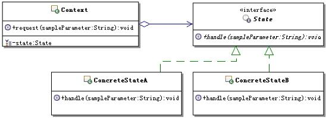
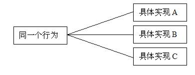
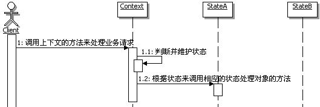

# 18.1 Java 设计模式系列教程（十八）状态模式之原理

[Java 设计模式系列教程目录](https://github.com/binarylei/java/blob/master/%E8%AE%BE%E8%AE%A1%E6%A8%A1%E5%BC%8F/01.%20Java%20%E8%AE%BE%E8%AE%A1%E6%A8%A1%E5%BC%8F%E7%B3%BB%E5%88%97%E6%95%99%E7%A8%8B%EF%BC%88%E4%B8%80%EF%BC%89%E7%9B%AE%E5%BD%95.md)

[18.1 Java 设计模式系列教程（十八）状态模式之原理](18.1%20Java%20设计模式系列教程（十八）状态模式之原理.md)

[18.2 Java 设计模式系列教程（十八）状态模式之场景分析](18.2%20Java%20设计模式系列教程（十八）状态模式之场景分析.md)

[18.3 Java 设计模式系列教程（十八）状态模式之扩展](18.3%20Java%20设计模式系列教程（十八）状态模式之扩展.md)

> 允许一个对象在其内部状态改变时改变它的行为。对象看起来似乎修改了它的类。[state](https://github.com/binarylei/demo/tree/master/demo-design/src/main/java/com/github/binarylei/design/state)

## 18.1.1 状态模式结构



* `Context`：环境，也称上下文，通常用来定义客户感兴趣的接口，同时维护一个来具体处理当前状态的实例对象。

* `State`：状态接口，用来封装与上下文的一个特定状态所对应的行为。

* `ConcreteState`：具体实现状态处理的类，每个类实现一个跟上下文相关的状态的具体处理。

## 18.1.2 状态模式参考实现 [demo1](https://github.com/binarylei/demo/tree/master/demo-design/src/main/java/com/github/binarylei/design/state/demo1)

（1）首先来看状态接口，示例代码如下：

```java
/**
 * 封装与Context的一个特定状态相关的行为
 */
public interface State {
    /**
     * 状态对应的处理
     * @param sampleParameter 示例参数，说明可以传入参数，具体传入
     *             什么样的参数，传入几个参数，由具体应用来具体分析
     */
    public void handle(String sampleParameter);
}
```

（2）再来看看具体的状态实现，目前具体的实现ConcreteStateA和ConcreteStateB示范的是一样的，只是名称不同，示例代码如下：

```java
/**
 * 实现一个与Context的一个特定状态相关的行为
 */
public class ConcreteStateA implements State {
    public void handle(String sampleParameter) {
        //实现具体的处理
    }
}

/**
 * 实现一个与Context的一个特定状态相关的行为
 */
public class ConcreteStateB implements State {
    public void handle(String sampleParameter) {
        //实现具体的处理
    }
}
```

（3）再来看看上下文的具体实现，上下文通常用来定义客户感兴趣的接口，同时维护一个具体的处理当前状态的实例对象。示例代码如下：

```java
/**
 * 定义客户感兴趣的接口，通常会维护一个State类型的对象实例
 */
public class Context {
    /**
     * 持有一个State类型的对象实例
     */
    private State state;

    /**
     * 设置实现State的对象的实例
     * @param state 实现State的对象的实例
     */
    public void setState(State state) {
        this.state = state;
    }

    /**
     * 用户感兴趣的接口方法
     * @param sampleParameter 示意参数
     */
    public void request(String sampleParameter) {
        //在处理中，会转调state来处理
        state.handle(sampleParameter);
    }
}
```

## 18.1.3 进一步认识状态模式

#### （1）状态和行为

所谓对象的状态，通常指的就是对象实例的属性的值；而行为指的就是对象的功能，再具体点说，行为多半可以对应到方法上。

状态模式的功能就是分离状态的行为，通过维护状态的变化，来调用不同的状态对应的不同的功能。

也就是说，状态和行为是相关联的，它们的关系可以描述为：状态决定行为。

由于状态是在运行期被改变的，因此行为也会在运行期，根据状态的改变而改变，看起来，同一个对象，在不同的运行时刻，行为是不一样的，就像是类被修改了一样。

#### （2）行为的平行性

注意是平行性而不是平等性。所谓平行性指的是各个状态的行为所处的层次是一样的，相互是独立的、没有关联的，是根据不同的状态来决定到底走平行线的那一条，行为是不同的，当然对应的实现也是不同的，相互之间是不可替换的。如图18.3所示：



而平等性强调的是可替换性，大家是同一行为的不同描述或实现，因此在同一个行为发生的时候，可以根据条件来挑选任意一个实现来进行相应的处理。如图18.4所示：



大家可能会发现状态模式的结构和策略模式的结构完全一样，但是，它们的目的、实现、本质都是完全不一样的。这个行为之间的特性也是状态模式和策略模式一个很重要的区别，状态模式的行为是平行性的，不可相互替换的；而策略模式的行为是平等性的，是可以相互替换的。

#### （3）上下文和状态处理对象

在状态模式中，上下文是持有状态的对象，但是上下文自身并不处理跟状态相关的行为，而是把处理状态的功能委托给了状态对应的状态处理类来处理。

在具体的状态处理类里面经常需要获取上下文自身的数据，甚至在必要的时候会回调上下文的方法，因此，通常将上下文自身当作一个参数传递给具体的状态处理类。

客户端一般只和上下文交互，客户端可以用状态对象来配置一个上下文，一旦配置完毕，就不再需要和状态对象打交道了，客户端通常不负责运行期间状态的维护，也不负责决定到底后续使用哪一个具体的状态处理对象。

#### （4）创建和销毁状态对象

在应用状态模式的时候，有一个常见的考虑，那就是：究竟何时创建和销毁状态对象。常见的有几个选择：

1. 一个是当需要使用状态对象的时候创建，使用完后就销毁它们
2. 另一个是提前创建它们并且始终不销毁
3. 还有一种是采用延迟加载和缓存合用的方式，就是当第一次需要使用状态对象的时候创建，使用完后并不销毁对象，而是把这个对象缓存起来，等待下一次使用，而且在合适的时候，会由缓存框架销毁状态对象

怎么选择呢？下面给出选择建议：

1. 如果要进入的状态在运行时是不可知的，而且上下文是比较稳定的，不会经常改变状态，而且使用也不频繁，这个时候建议选第一种方案。

2. 如果状态改变很频繁，也就是需要频繁的创建状态对象，而且状态对象还存储着大量的信息数据，这种情况建议选第二种方案。

3. 如果无法确定状态改变是否频繁，而且有些状态对象的状态数据量大，有些比较小，一切都是未知的，建议选第三种方案。

事实上，在实际工程开发中，第三种方案是首选，因为它兼顾了前面两种方案的优点，而又避免了它们的缺点，几乎能适应各种情况的需要。只是这个方案在实现的时候，要实现一个合理的缓存框架，而且要考虑多线程并发的问题，因为需要由缓存框架来在合适的时候销毁状态对象，因此实现上难度稍高点。另外在实现中还可以考虑结合享元模式，通过享元模式来共享状态对象。

#### （5）状态模式的调用顺序示意图

状态模式在实现上，对于状态的维护有不同的实现方式，前面的示例中，采用的是在Context中进行状态的维护和转换，这里就先画出这种方式的调用顺序示意图，其它的方式在后面讲到了再画。

在Context进行状态维护和转换的调用顺序示意图如图18.4所示：


## 18.1.4 总结

### 状态模式的本质

状态模式的本质： **根据状态来分离和选择行为** 。

仔细分析状态模式的结构，如果没有上下文，那么就退化回到只有接口和实现了，正是通过接口，把状态和状态对应的行为分开，才使得通过状态模式设计的程序易于扩展和维护。

而上下文主要负责的是公共的状态驱动，每当状态发生改变的时候，通常都是回调上下文来执行状态对应的功能。当然，上下文自身也可以维护状态的变化，另外，上下文通常还会作为多个状态处理类之间的数据载体，在多个状态处理类之间传递数据。

### 何时选用状态模式

**建议在如下情况中，选用状态模式：**

1. 如果一个对象的行为取决于它的状态，而且它必须在运行时刻根据状态来改变它的行为。可以使用状态模式，来把状态和行为分离开，虽然分离开了，但状态和行为是有对应关系的，可以在运行期间，通过改变状态，就能够调用到该状态对应的状态处理对象上去，从而改变对象的行为。

2. 如果一个操作中含有庞大的多分支语句，而且这些分支依赖于该对象的状态。可以使用状态模式，把各个分支的处理分散包装到单独的对象处理类里面，这样，这些分支对应的对象就可以不依赖于其它对象而独立变化了。

### 状态模式的优缺点

* 简化应用逻辑控制

    状态模式使用单独的类来封装一个状态的处理。如果把一个大的程序控制分成很多小块，每块定义一个状态来代表，那么就可以把这些逻辑控制的代码分散到很多单独的状态类当中去，这样就把着眼点从执行状态提高到整个对象的状态，使得代码结构化和意图更清晰，从而简化应用的逻辑控制。
    对于依赖于状态的if-else，理论上来讲，也可以改变成应用状态模式来实现，把每个if或else块定义一个状态来代表，那么就可以把块内的功能代码移动到状态处理类去了，从而减少if-else，避免出现巨大的条件语句。

* 更好的分离状态和行为

    状态模式通过设置所有状态类的公共接口，把状态和状态对应的行为分离开来，把所有与一个特定的状态相关的行为都放入一个对象中，使得应用程序在控制的时候，只需要关心状态的切换，而不用关心这个状态对应的真正处理。

* 更好的扩展性

    引入了状态处理的公共接口后，使得扩展新的状态变得非常容易，只需要新增加一个实现状态处理的公共接口的实现类，然后在进行状态维护的地方，设置状态变化到这个新的状态即可。

* 显式化进行状态转换

    状态模式为不同的状态引入独立的对象，使得状态的转换变得更加明确。而且状态对象可以保证上下文不会发生内部状态不一致的情况，因为上下文中只有一个变量来记录状态对象，只要为这一个变量赋值就可以了。

* 引入太多的状态类

    状态模式也有一个很明显的缺点，一个状态对应一个状态处理类，会使得程序引入太多的状态类，使程序变得杂乱。