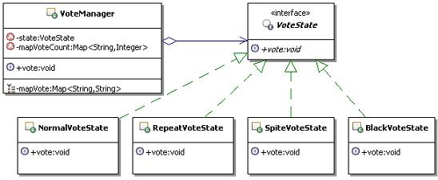

# 18.2 Java 设计模式系列教程（十八）状态模式之场景分析

[Java 设计模式系列教程目录](https://github.com/binarylei/java/blob/master/%E8%AE%BE%E8%AE%A1%E6%A8%A1%E5%BC%8F/01.%20Java%20%E8%AE%BE%E8%AE%A1%E6%A8%A1%E5%BC%8F%E7%B3%BB%E5%88%97%E6%95%99%E7%A8%8B%EF%BC%88%E4%B8%80%EF%BC%89%E7%9B%AE%E5%BD%95.md)

[18.1 Java 设计模式系列教程（十八）状态模式之原理](18.1%20Java%20设计模式系列教程（十八）状态模式之原理.md)

[18.2 Java 设计模式系列教程（十八）状态模式之场景分析](18.2%20Java%20设计模式系列教程（十八）状态模式之场景分析.md)

[18.3 Java 设计模式系列教程（十八）状态模式之扩展](18.3%20Java%20设计模式系列教程（十八）状态模式之扩展.md)

## 18.2.1 使用场景

考虑一个 **在线投票** 的应用，要实现控制同一个用户只能投一票，如果一个用户反复投票，而且投票次数超过5次，则判定为恶意刷票，要取消该用户投票的资格，当然同时也要取消他所投的票。如果一个用户的投票次数超过8次，将进入黑名单，禁止再登录和使用系统。

该怎么实现这样的功能呢？

## 18.2.2 不用模式的实现

### 代码实现 [demo2](https://github.com/binarylei/demo/tree/master/demo-design/src/main/java/com/github/binarylei/design/state/demo2)

分析上面的功能，为了控制用户投票，需要记录用户所投票的记录，同时还要记录用户投票的次数，为了简单，直接使用两个Map来记录。

在投票的过程中，又有四种情况：

1. 一是用户是正常投票
2. 二是用户正常投票过后，有意或者无意的重复投票
3. 三是用户恶意投票
4. 四是黑名单用户

这几种情况下对应的处理是不一样的。看看代码吧，示例代码如下：

```java
/**
 * 投票管理
 */
public class VoteManager {
    /**
     * 记录用户投票的结果, Map<String, String>对应Map<用户名称, 投票的选项>
     */
    private Map<String, String> mapVote = new HashMap<String, String>();

    /**
     * 记录用户投票次数, Map<String, Integer>对应Map<用户名称, 投票的次数>
     */
    private Map<String, Integer> mapVoteCount = new HashMap<String, Integer>();

    /**
     * 投票
     * @param user 投票人，为了简单，就是用户名称
     * @param voteItem 投票的选项
     */
    public void vote(String user, String voteItem){
        //1：先为该用户增加投票的次数
        //先从记录中取出已有的投票次数
        Integer oldVoteCount = mapVoteCount.get(user);
        if(oldVoteCount==null){
            oldVoteCount = 0;
        }
        oldVoteCount = oldVoteCount + 1;
        mapVoteCount.put(user, oldVoteCount);

        //2：判断该用户投票的类型，到底是正常投票、重复投票、恶意投票还是上黑名单
        //然后根据投票类型来进行相应的操作
        if(oldVoteCount == 1){
            //正常投票
            //记录到投票记录中
            mapVote.put(user, voteItem);
            System.out.println("恭喜你投票成功");
        }else if(oldVoteCount > 1 && oldVoteCount < 5){
            //重复投票
            //暂时不做处理
            System.out.println("请不要重复投票");
        }else if(oldVoteCount >= 5 && oldVoteCount < 8){
            //恶意投票
            //取消用户的投票资格，并取消投票记录
            String s = mapVote.get(user);
            if(s != null){
                mapVote.remove(user);
            }
            System.out.println("你有恶意刷票行为，取消投票资格");
        }else if(oldVoteCount >= 8){
            //黑名单
            //记入黑名单中，禁止登录系统了
            System.out.println("进入黑名单，将禁止登录和使用本系统");
        }
    }
}
```

写个客户端来测试看看，是否能满足功能要求，示例代码如下：

```java
public class Client {
    public static void main(String[] args) {
        VoteManager vm = new VoteManager();
        for(int i = 0; i < 8; i++){
            vm.vote("u1", "A");
        }
    }
}
```

运行结果如下：

```
恭喜你投票成功
请不要重复投票
请不要重复投票
请不要重复投票
你有恶意刷票行为，取消投票资格
你有恶意刷票行为，取消投票资格
你有恶意刷票行为，取消投票资格
进入黑名单，将禁止登录和使用本系统
```

### 问题出来了

看起来很简单，是不是？幸亏这里只是示意，否则，你想想，在vote()方法中那么多判断，还有每个判断对应的功能处理都放在一起，是不是有点太杂乱了，那简直就是个大杂烩，如果把每个功能都完整的实现出来，那vote()方法会很长的。

1. 问题1：如果现在要修改某种投票情况所对应的具体功能处理，那就需要在那个大杂烩里面，找到相应的代码块，然后进行改动。

2. 问题2：如果要添加新的功能，比如投票超过8次但不足10次的，给个机会，只是禁止登录和使用系统3天，如果再犯，才永久封掉账号，该怎么办呢？那就需要改动投票管理的源代码，在上面的if-else结构中再添加一个else if块进行处理。

不管哪一种情况，都是在一大堆的控制代码里面找出需要的部分，然后进行修改，这从来都不是好方法，那么该如何实现才能做到：既能够很容易的给vote()方法添加新的功能，又能够很方便的修改已有的功能处理呢？

## 18.2.3 解决方案

### 应用状态模式的解决思路

看完了上面的状态模式的知识，有些朋友跃跃欲试，打算使用状态模式来重写前面的示例，要使用状态模式，首先就需要把投票过程的各种状态定义出来，然后把这些状态对应的处理从原来大杂烩的实现中分离出来，形成独立的状态处理对象。而原来的投票管理的对象就相当于Context了。

**把状态对应的行为分离出去过后，怎么调用呢？**

按照状态模式的示例，是在Context中，处理客户请求的时候，转调相应的状态对应的具体的状态处理类来进行处理。

**那就引出下一个问题：那么这些状态怎么变化呢？**

看原来的实现，就是在投票方法里面，根据投票的次数进行判断，并维护投票类型的变化。那好，也依葫芦画瓢，就在投票方法里面来维护状态变化。

这个时候，程序的结构如图18.5所示：



### 代码实现 [demo3](https://github.com/binarylei/demo/tree/master/demo-design/src/main/java/com/github/binarylei/design/state/demo3)

（1）先来看状态接口的代码实现，示例代码如下：

```java
/**
 * 封装一个投票状态相关的行为
 */
public interface VoteState {
    /**
     * 处理状态对应的行为
     * @param user 投票人
     * @param voteItem 投票项
     * @param voteManager 投票上下文，用来在实现状态对应的功能处理的时候，
     *                    可以回调上下文的数据
     */
    public void vote(String user, String voteItem, VoteManager voteManager);
}
```

（2）定义了状态接口，那就该来看看如何实现各个状态对应的处理了，现在的实现很简单，就是把原来的实现从投票管理类里面分离出来就可以了。示例代码如下：

```java
/**
 * 正常投票
 */
public class NormalVoteState implements VoteState{
    public void vote(String user, String voteItem, VoteManager voteManager) {
        //正常投票
        //记录到投票记录中
        voteManager.getMapVote().put(user, voteItem);
        System.out.println("恭喜你投票成功");
    }
}

/**
 * 重复投票
 */
public class RepeatVoteState implements VoteState{
    public void vote(String user, String voteItem, VoteManager voteManager) {
        //重复投票
        //暂时不做处理
        System.out.println("请不要重复投票");
    }
}

/**
 * 恶意刷票
 */
public class SpiteVoteState implements VoteState{
    public void vote(String user, String voteItem, VoteManager voteManager) {
        //恶意投票
        //取消用户的投票资格，并取消投票记录
        String s = voteManager.getMapVote().get(user);
        if(s!=null){
            voteManager.getMapVote().remove(user);
        }
        System.out.println("你有恶意刷票行为，取消投票资格");
    }
}

/**
 * 进入黑名单，将禁止登录和使用本系统
 */
public class BlackVoteState implements VoteState{
    public void vote(String user, String voteItem, VoteManager voteManager) {
        //黑名单
        //记入黑名单中，禁止登录系统了
        System.out.println("进入黑名单，将禁止登录和使用本系统");
    }
}
```
（3）定义好了状态接口和状态实现，看看现在的投票管理，相当于状态模式中的上下文，相对而言，它的改变如下：

1. 添加持有状态处理对象
2. 添加能获取记录用户投票结果的Map的方法，各个状态处理对象，在进行状态对应的处理的时候，需要获取上下文中的记录用户投票结果的Map数据
3. 在vote()方法实现里面，原来判断投票类型就变成了判断投票的状态，而原来每种投票类型对应的处理，现在已经封装到对应的状态对象里面去了，因此直接转调对应的状态对象的方法即可

示例代码如下：

```java
/**
 * 投票管理
 */
public class VoteManager {
    /**
     * 持有状态处理对象
     */
    private VoteState state = null;

    /**
     * 记录用户投票的结果,Map<String,String>对应Map<用户名称,投票的选项>
     */
    private Map<String,String> mapVote = new HashMap<String,String>();

    /**
     * 记录用户投票次数,Map<String,Integer>对应Map<用户名称,投票的次数>
     */
    private Map<String,Integer> mapVoteCount = new HashMap<String,Integer>();

    /**
     * 获取记录用户投票结果的Map
     * @return 记录用户投票结果的Map
     */
    public Map<String, String> getMapVote() {
        return mapVote;
    }

    /**
     * 投票
     * @param user 投票人，为了简单，就是用户名称
     * @param voteItem 投票的选项
     */
    public void vote(String user, String voteItem){
        //1：先为该用户增加投票的次数
        //先从记录中取出已有的投票次数
        Integer oldVoteCount = mapVoteCount.get(user);
        if(oldVoteCount==null){
            oldVoteCount = 0;
        }
        oldVoteCount = oldVoteCount + 1;
        mapVoteCount.put(user, oldVoteCount);

        //2：判断该用户投票的类型，就相当于是判断对应的状态
        //到底是正常投票、重复投票、恶意投票还是上黑名单的状态
        if(oldVoteCount == 1){
            state = new NormalVoteState();
        }else if(oldVoteCount > 1 && oldVoteCount < 5){
            state = new RepeatVoteState();
        }else if(oldVoteCount >= 5 && oldVoteCount<8){
            state = new SpiteVoteState();
        }else if(oldVoteCount>=8){
            state = new BlackVoteState();
        }
        //然后转调状态对象来进行相应的操作
        state.vote(user, voteItem, this);
    }
}
```

（4）该写个客户端来测试一下了，经过这么修改过后，好用吗？试试看就知道了。客户端没有任何的改变，跟前面实现的一样，示例代码如下：

```java
public class Client {
    public static void main(String[] args) {
        VoteManager vm = new VoteManager();
        for(int i=0;i<8;i++){
            vm.vote("u1", "A");
        }
    }
}
```

运行一下试试吧，结果应该是跟前面一样的，也就是说都是实现一样的功能，只是采用了状态模式来实现。测试结果如下：

```
恭喜你投票成功
请不要重复投票
请不要重复投票
请不要重复投票
你有恶意刷票行为，取消投票资格
你有恶意刷票行为，取消投票资格
你有恶意刷票行为，取消投票资格
进入黑名单，将禁止登录和使用本系统
```

从上面的示例可以看出，状态的转换基本上都是内部行为，主要在状态模式内部来维护。比如对于投票的人员，任何时候他的操作都是投票，但是投票管理对象的处理却不一定一样，会根据投票的次数来判断状态，然后根据状态去选择不同的处理。

## 18.2.3 状态模式的维护 -- 不完美的OCP体验

好了，已经使用状态模式来重写了前面的示例，那么到底能不能解决前面提出的问题呢？也就是修改和扩展方不方便呢？一起来看一下。

先看修改已有的功能吧，由于现在每个状态对应的处理已经封装到对应的状态类里面了，要修改已有的某个状态的功能，直接扩展某个类进行修改就好了，对其它的程序没有影响。比如：现在要修改正常投票状态对应的功能，对于正常投票的用户给予积分奖励，那么只需要扩展正常投票状态对应的类，然后进行修改，示例代码如下：

```java
public class NormalVoteState2 extends NormalVoteState{
    public void vote(String user, String voteItem, VoteManager voteManager) {
        //先调用已有的功能
        super.vote(user, voteItem, voteManager);
        //给予积分奖励，示意一下
        System.out.println("奖励积分10分");
    }
}
```

一切良好，对吧，可是怎么让VoteManager能使用这个新的实现类呢？按照目前的实现，没有办法，只好去修改VoteManager的vote()方法中对状态的维护代码了，把使用NormalVoteState的地方换成使用NormalVoteState2。

```java
state = new NormalVoteState2();
```

再看看如何添加新的功能，比如投票超过8次但不足10次的，给个机会，只是禁止登录和使用系统3天，如果再犯，才进入黑名单。要实现这个功能，先要对原来的投票超过8次进入黑名单的功能进行修改，修改成投票超过10次才进入黑名单；然后新加入一个功能，实现超过8次但不足10次的，只是禁止登录和使用系统3天的功能。把这个新功能实现出来，示例代码如下：

```java
public class BlackWarnVoteState implements VoteState{
    public void vote(String user, String voteItem, VoteManager voteManager) {
        //待进黑名单警告状态
        System.out.println("禁止登录和使用系统3天");
    }
}
```

实现好了这个类，该怎样加入到已有的系统呢？

同样需要去修改上下文的vote()方法中对于状态判断和维护的代码，示例代码如下：

```java
if(oldVoteCount==1){
    state = new NormalVoteState2();
}else if(oldVoteCount>1 && oldVoteCount<5){
    state = new RepeatVoteState();
}else if(oldVoteCount >= 5 && oldVoteCount<8){
    state = new SpiteVoteState();
}else if(oldVoteCount>=8 && oldVoteCount<10){
    state = new BlackWarnVoteState();
}else if(oldVoteCount>10){
    state = new BlackVoteState();
}
```

好像也实现了功能是不是，而且改动起来确实也变得简单点了，但是仔细想想，是不是没有完全遵循OCP原则？结论是很显然的，明显没有完全遵循OCP原则(开闭原则)。

这里要说明一点，设计原则是大家在设计和开发中尽量去遵守的，但不是一定要遵守，尤其是完全遵守，在实际开发中，完全遵守那些设计原则几乎是不可能完成的任务。

就像状态模式的实际实现中，由于状态的维护和转换在状态模式结构里面，不管你是扩展了状态实现类，还是新添加了状态实现类，都需要修改状态维护和转换的地方，以使用新的实现。

虽然可以有好几个地方来维护状态的变化，这个后面会讲到，但是都是在状态模式结构里面的，所以都有这个问题，算是不完美的OCP体验吧。