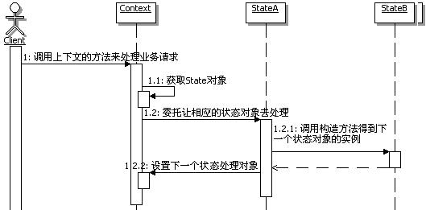
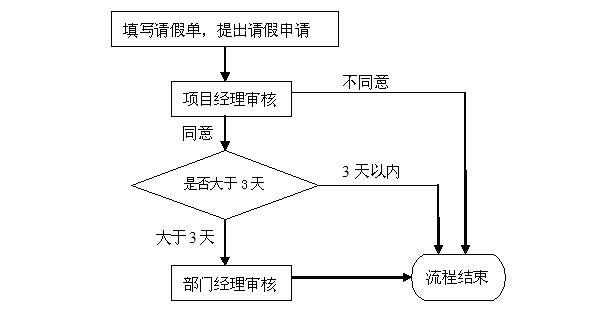

# 18.3 Java 设计模式系列教程（十八）状态模式之扩展

[Java 设计模式系列教程目录](https://github.com/binarylei/java/blob/master/%E8%AE%BE%E8%AE%A1%E6%A8%A1%E5%BC%8F/01.%20Java%20%E8%AE%BE%E8%AE%A1%E6%A8%A1%E5%BC%8F%E7%B3%BB%E5%88%97%E6%95%99%E7%A8%8B%EF%BC%88%E4%B8%80%EF%BC%89%E7%9B%AE%E5%BD%95.md)

[18.1 Java 设计模式系列教程（十八）状态模式之原理](18.1%20Java%20设计模式系列教程（十八）状态模式之原理.md)

[18.2 Java 设计模式系列教程（十八）状态模式之场景分析](18.2%20Java%20设计模式系列教程（十八）状态模式之场景分析.md)

[18.3 Java 设计模式系列教程（十八）状态模式之扩展](18.3%20Java%20设计模式系列教程（十八）状态模式之扩展.md)

## 18.3.1 状态的维护和转换控制 [demo4](https://github.com/binarylei/demo/tree/master/demo-design/src/main/java/com/github/binarylei/design/state/demo4)

所谓状态的维护，指的就是维护状态的数据，就是给状态设置不同的状态值；而状态的转换，指的就是根据状态的变化来选择不同的状态处理对象。在状态模式中，通常有两个地方可以进行状态的维护和转换控制。

一个就是在上下文当中，因为状态本身通常被实现为上下文对象的状态，因此可以在上下文里面进行状态维护，当然也就可以控制状态的转换了。前面投票的示例就是采用的这种方式。

另外一个地方就是在状态的处理类里面，当每个状态处理对象处理完自身状态所对应的功能后，可以根据需要指定后继的状态，以便让应用能正确处理后续的请求。

先看看示例，为了对比学习，就来看看如何把前面投票的例子修改成：在状态处理类里面进行后续状态的维护和转换。

（1）同样先来看投票状态的接口，没有变化。

（2）对于各个具体的状态实现对象，主要的变化在于：在处理完自己状态对应的功能后，还需要维护和转换状态对象。

一个一个来看吧，示例代码如下：

```java
/**
 * 正常投票
 */
public class NormalVoteState implements VoteState{
    public void vote(String user, String voteItem, VoteManager voteManager) {
        //正常投票
        //记录到投票记录中
        voteManager.getMapVote().put(user, voteItem);
        System.out.println("恭喜你投票成功");

        //正常投票完成，维护下一个状态，同一个人再投票就重复了
        voteManager.getMapState().put(user, new RepeatVoteState());
    }
}

/**
 * 重复投票
 */
public class RepeatVoteState implements VoteState{
    public void vote(String user, String voteItem, VoteManager voteManager) {
        //重复投票
        //暂时不做处理
        System.out.println("请不要重复投票");

        //重复投票完成，维护下一个状态，重复投票到5次，就算恶意投票了
        //注意这里是判断大于等于4，因为这里设置的是下一个状态
        //下一个操作次数就是5了，就应该算是恶意投票了
        if(voteManager.getMapVoteCount().get(user) >= 4){
            voteManager.getMapState().put(user, new SpiteVoteState());
            //直接把下一个状态的编码记录入数据库就好了
        }
    }
}

/**
 * 恶意刷票
 */
public class SpiteVoteState implements VoteState{
    public void vote(String user, String voteItem, VoteManager voteManager) {
        //恶意投票
        //取消用户的投票资格，并取消投票记录
        String s = voteManager.getMapVote().get(user);
        if(s!=null){
            voteManager.getMapVote().remove(user);
        }
        System.out.println("你有恶意刷票行为，取消投票资格");

        //恶意投票完成，维护下一个状态，投票到8次，就进黑名单了
        //注意这里是判断大于等于7，因为这里设置的是下一个状态
        //下一个操作次数就是8了，就应该算是进黑名单了
        if(voteManager.getMapVoteCount().get(user) >= 7){
            voteManager.getMapState().put(user, new BlackVoteState());
        }
    }
}

/**
 * 进入黑名单，将禁止登录和使用本系统
 */
public class BlackVoteState implements VoteState {
    public void vote(String user, String voteItem, VoteManager voteManager) {
        //黑名单
        //记入黑名单中，禁止登录系统了
        System.out.println("进入黑名单，将禁止登录和使用本系统");
    }
}
```

（3）该来看看现在的投票管理类该如何实现了，跟在上下文中维护和转换状态相比，大致有如下的变化：

1. 需要按照每个用户来记录他们对应的投票状态，不同的用户，对应的投票状态是不同的，因此使用一个Map来记录，而不再是原来的一个单一的投票状态对象。

    可能有些朋友会问，那为什么前面的实现可以呢？那是因为投票状态是由投票管理对象集中控制的，不同的人员在进入投票方法的时候，是重新判断该人员具体的状态对象的，而现在是要把状态维护分散到各个状态类里面去，因此需要记录各个状态类判断过后的结果。

2. 需要把记录投票状态的数据，还有记录投票次数的数据，提供相应的getter方法，各个状态在处理的时候需要通过这些方法来访问数据。

3. 原来在vote()方法里面进行的状态控制和转换去掉，变成直接根据人员来从状态记录的Map中获取对应的状态对象了。
看看实现代码吧，示例代码如下：

```java
/**
 * 投票管理
 */
public class VoteManager {
    /**
     * 记录当前每个用户对应的状态处理对象，每个用户当前的状态是不同的
     * Map<String,VoteState>对应Map<用户名称,当前对应的状态处理对象>
     */
    private Map<String,VoteState> mapState = new HashMap<String,VoteState>();

    /**
     * 记录用户投票的结果,Map<String,String>对应Map<用户名称,投票的选项>
     */
    private Map<String,String> mapVote = new HashMap<String,String>();

    /**
     * 记录用户投票次数,Map<String,Integer>对应Map<用户名称,投票的次数>
     */
    private Map<String,Integer> mapVoteCount = new HashMap<String,Integer>();


    /**
     * 获取记录用户投票结果的Map
     * @return 记录用户投票结果的Map
     */
    public Map<String, String> getMapVote() {
        return mapVote;
    }

    /**
     * 获取记录每个用户对应的状态处理对象的Map
     * @return 记录每个用户对应的状态处理对象的Map
     */
    public Map<String, VoteState> getMapState() {
        return mapState;
    }

    /**
     * 获取记录每个用户对应的投票次数的Map
     * @return 记录每个用户对应的投票次数的Map
     */
    public Map<String, Integer> getMapVoteCount() {
        return mapVoteCount;
    }

    /**
     * 投票
     * @param user 投票人，为了简单，就是用户名称
     * @param voteItem 投票的选项
     */
    public void vote(String user, String voteItem){
        //1：先为该用户增加投票的次数
        //先从记录中取出已有的投票次数
        Integer oldVoteCount = mapVoteCount.get(user);
        if(oldVoteCount==null){
            oldVoteCount = 0;
        }
        oldVoteCount = oldVoteCount + 1;
        mapVoteCount.put(user, oldVoteCount);

        //2：获取该用户的投票状态
        VoteState state = mapState.get(user);
        //如果没有投票状态，说明还没有投过票，就初始化一个正常投票状态
        if(state==null){
            state = new NormalVoteState();
        }

        //然后转调状态对象来进行相应的操作
        state.vote(user, voteItem, this);
    }
}
```

（4）实现得差不多了，该来测试了，客户端没有变化，去运行一下，看看效果，看看两种维护状态变化的方式实现的结果一样吗？答案应该是一样的。

那么到底如何选择这两种方式呢？

1. 一般情况下，如果状态转换的规则是一定的，一般不需要进行什么扩展规则，那么就适合在上下文中统一进行状态的维护。

2. 如果状态的转换取决于前一个状态动态处理的结果，或者是依赖于外部数据，为了增强灵活性，这种情况下，一般是在状态处理类里面进行状态的维护。

（5）采用让状态对象来维护和转换状态的调用顺序示意图如图18.6所示：



## 18.3.2 模拟工作流

### 场景分析

做企业应用的朋友，大多数都接触过工作流，至少处理过业务流程。当然对于工作流，复杂的应用可能会使用工作流中间件，用工作流引擎来负责流程处理，这个会比较复杂，其实工作流引擎的实现也可以应用上状态模式，这里不去讨论。

简单点的，把流程数据存放在数据库里面，然后在程序里面自己来进行流程控制。对于简单点的业务流程控制，可以使用状态模式来辅助进行流程控制，因为大部分这种流程都是状态驱动的。

举个例子来说明吧，举个最常见的“请假流程”，流程是这样的：当某人提出请假申请过后，先由项目经理来审批，如果项目经理不同意，审批就直接结束；如果项目经理同意了，再看请假的天数是否超过3天，项目经理的审批权限只有3天以内，如果请假天数在3天以内，那么审批也直接结束，否则就提交给部门经理；部门经理审核过后，无论是否同意，审批都直接结束。流程图如图18.7所示：



### 实现思路

仔细分析上面的流程图和运行过程，把请假单在流程中的各个阶段的状态分析出来，会发现，整个流程完全可以看成是状态驱动的。

在上面的流程中，请假单大致有如下状态：等待项目经理审核、等待部门经理审核、审核结束。如果用状态驱动来描述上述流程：

1. 当请假人填写请假单，提出请假申请后，请假单的状态是等待项目经理审核状态
2. 当项目经理完成审核工作，提交保存后，如果项目经理不同意，请假单的状态是审核结束状态；如果项目经理同意，请假天数又在3天以内，请假单的状态是审核结束状态；如果项目经理同意，请假天数大于3天，请假单的状态是等待部门经理审核状态
3. 当部门经理完成审核工作，提交保存后，无论是否同意，请假单的状态都是审核结束状态

既然可以把流程看成是状态驱动的，那么就可以自然的使用上状态模式，每次当相应的工作人员完成工作，请求流程响应的时候，流程处理的对象会根据当前所处的状态，把流程处理委托给相应的状态对象去处理。

先来看看此时用状态模式实现的这个流程的程序结构示意图，如图18.8所示：


### 实现代码 [demo6](https://github.com/binarylei/demo/tree/master/demo-design/src/main/java/com/github/binarylei/design/state/demo6)


考虑到在一个系统中会有很多流程，虽然不像通用工作流那么复杂的设计，但还是稍稍提炼一下，至少把各个不同的业务流程，在应用状态模式时的公共功能，或者是架子给搭出来，以便复用这些功能。

（1）首先提供一个公共的状态处理机

```java
/**
 * 公共状态处理机，相当于状态模式的Context
 * 包含所有流程使用状态模式时的公共功能
 */
public  class StateMachine {
    /**
     * 持有一个状态对象
     */
    private State state = null;

    /**
     * 包含流程处理需要的业务数据对象，不知道具体类型,
     * 用Object，反正只是传递到具体的状态对象里面
     */
    private Object businessVO = null;

    /**
     * 执行工作，客户端处理流程的接口方法。
     * 在客户完成自己的业务工作后调用
     */
    public void doWork(){
        //转调相应的状态对象真正完成功能处理
        this.state.doWork(this);
    }

    public State getState() {
        return state;
    }
    public void setState(State state) {
        this.state = state;
    }
    public Object getBusinessVO() {
        return businessVO;
    }
    public void setBusinessVO(Object businessVO) {
        this.businessVO = businessVO;
    }
}
```

（2）来提供公共的状态接口，各个状态对象在处理流程的时候，可以使用统一的接口，那么它们需要的业务数据从何而来呢？那就通过上下文传递过来。示例代码如下：

```java
/**
 * 公共状态接口
 */
public interface State {
    /**
     * 执行状态对应的功能处理
     * @param ctx 上下文的实例对象
     */
    public void doWork(StateMachine ctx);
}
```

（3）定义请假单的业务数据模型，示例代码如下：

```java
/**
 * 请假单对象
 */
public class LeaveRequestModel {
    /**
     * 请假人
     */
    private String user;
    /**
     * 请假开始时间
     */
    private String beginDate;
    /**
     * 请假天数
     */
    private int leaveDays;
    /**
     * 审核结果
     */
    private String result;

    public String getResult() {
        return result;
    }

    public void setResult(String result) {
        this.result = result;
    }

    public String getUser() {
        return user;
    }

    public String getBeginDate() {
        return beginDate;
    }

    public int getLeaveDays() {
        return leaveDays;
    }
    public void setUser(String user) {
        this.user = user;
    }

    public void setBeginDate(String beginDate) {
        this.beginDate = beginDate;
    }

    public void setLeaveDays(int leaveDays) {
        this.leaveDays = leaveDays;
    }
}
```

（4）定义处理客户端请求的上下文和状态接口，虽然这里并不需要扩展功能，但还是继承一下状态机，表示可以添加自己的处理。示例代码如下：

```java
public class LeaveRequestContext extends StateMachine{
    //这里可以扩展跟自己流程相关的处理
}

public interface LeaveRequestState extends State{
    //这里可以扩展跟自己流程相关的处理
}
```

（5）接下来该来实现各个状态具体的处理对象了，先看看处理项目经理审核的状态类的实现，示例代码如下：

```java
/**
 * 处理项目经理的审核，处理后可能对应部门经理审核、审核结束之中的一种
 */
public class ProjectManagerState implements LeaveRequestState{
    public void doWork(StateMachine request) {
        //先把业务对象造型回来
        LeaveRequestModel lrm = (LeaveRequestModel)request.getBusinessVO();

        System.out.println("项目经理审核中，请稍候......");

        //模拟用户处理界面，通过控制台来读取数据
        System.out.println(lrm.getUser() + "申请从" + lrm.getBeginDate()+
                "开始请假" + lrm.getLeaveDays() + "天,请项目经理审核(1为同意，2为不同意)：");
        //读取从控制台输入的数据
        Scanner scanner = new Scanner(System.in);
        if(scanner.hasNext()){
            int a = scanner.nextInt();
            //设置回到上下文中
            String result = "不同意";
            if(a == 1){
                result = "同意";
            }
            lrm.setResult("项目经理审核结果：" + result);
            //根据选择的结果和条件来设置下一步
            if(a == 1){
                if(lrm.getLeaveDays() > 3){
                    //如果请假天数大于3天，而且项目经理同意了，就提交给部门经理
                    request.setState(new DepManagerState());
                    //继续执行下一步工作
                    request.doWork();
                }else{
                    //3天以内的请假，由项目经理做主,就不用提交给部门经理了，转向审核结束状态
                    request.setState(new  AuditOverState());
                    //继续执行下一步工作
                    request.doWork();
                }
            } else {
                //项目经理要是不同意的话，也就不用提交给部门经理了，转向审核结束状态
                request.setState(new  AuditOverState());
                //继续执行下一步工作
                request.doWork();
            }
        }
    }
}
```

接下来看看处理项目经理审核的状态类的实现，示例代码如下：

```java
/**
 * 处理部门经理的审核，处理后对应审核结束状态
 */
public class DepManagerState implements LeaveRequestState{
    public void doWork(StateMachine request) {
        //先把业务对象造型回来
        LeaveRequestModel lrm = (LeaveRequestModel)request.getBusinessVO();
        System.out.println("部门经理审核中，请稍候......");

        //模拟用户处理界面，通过控制台来读取数据
        System.out.println(lrm.getUser() + "申请从" + lrm.getBeginDate()+
                "开始请假" + lrm.getLeaveDays() + "天,请部门经理审核(1为同意，2为不同意)：");
        //读取从控制台输入的数据
        Scanner scanner = new Scanner(System.in);
        if(scanner.hasNext()){
            int a = scanner.nextInt();
            //设置回到上下文中
            String result = "不同意";
            if(a == 1){
                result = "同意";
            }
            lrm.setResult("部门经理审核结果：" + result);
            //部门经理审核过后，直接转向审核结束状态了
            request.setState(new AuditOverState());
            //继续执行下一步工作
            request.doWork();
        }
    }
}
```

再来看看处理审核结束的状态类的实现，示例代码如下：

```java
/**
 * 处理审核结束的类
 */
public class AuditOverState implements LeaveRequestState{
    public void doWork(StateMachine request) {
        //先把业务对象造型回来
        LeaveRequestModel lrm = (LeaveRequestModel)request.getBusinessVO();
        System.out.println(lrm.getUser()+"，你的请假申请已经审核结束，结果是：" + lrm.getResult());
    }
}
```

（6）万事俱备，可以写个客户端，来开始我们的流程之旅了。示例代码如下：

```java
public class Client {
    public static void main(String[] args) {
        //创建业务对象，并设置业务数据
        LeaveRequestModel lrm = new LeaveRequestModel();
        lrm.setUser("小李");
        lrm.setBeginDate("2010-02-08");
        lrm.setLeaveDays(5);

        //创建上下文对象
        LeaveRequestContext request = new LeaveRequestContext();
        //为上下文对象设置业务数据对象
        request.setBusinessVO(lrm);
        //配置上下文，作为开始的状态，以后就不管了
        request.setState(new ProjectManagerState());

        //请求上下文，让上下文开始处理工作
        request.doWork();
    }
}
```