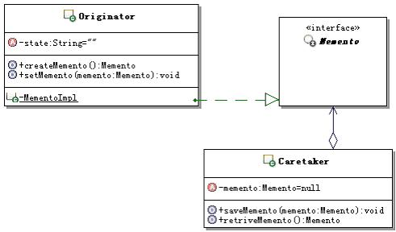

# 19.1 Java 设计模式系列教程（十九）备忘录模式之原理

[Java 设计模式系列教程目录](https://github.com/binarylei/java/blob/master/%E8%AE%BE%E8%AE%A1%E6%A8%A1%E5%BC%8F/01.%20Java%20%E8%AE%BE%E8%AE%A1%E6%A8%A1%E5%BC%8F%E7%B3%BB%E5%88%97%E6%95%99%E7%A8%8B%EF%BC%88%E4%B8%80%EF%BC%89%E7%9B%AE%E5%BD%95.md)

[19.1 Java 设计模式系列教程（十九）备忘录模式之原理](19.1%20Java%20%E8%AE%BE%E8%AE%A1%E6%A8%A1%E5%BC%8F%E7%B3%BB%E5%88%97%E6%95%99%E7%A8%8B%EF%BC%88%E5%8D%81%E4%B9%9D%EF%BC%89%E5%A4%87%E5%BF%98%E5%BD%95%E6%A8%A1%E5%BC%8F%E4%B9%8B%E5%8E%9F%E7%90%86.md)

[19.2 Java 设计模式系列教程（十九）备忘录模式之场景分析](19.2%20Java%20%E8%AE%BE%E8%AE%A1%E6%A8%A1%E5%BC%8F%E7%B3%BB%E5%88%97%E6%95%99%E7%A8%8B%EF%BC%88%E5%8D%81%E4%B9%9D%EF%BC%89%E5%A4%87%E5%BF%98%E5%BD%95%E6%A8%A1%E5%BC%8F%E4%B9%8B%E5%9C%BA%E6%99%AF%E5%88%86%E6%9E%90.md)

[19.3 Java 设计模式系列教程（十九）备忘录模式之扩展](19.3%20Java%20%E8%AE%BE%E8%AE%A1%E6%A8%A1%E5%BC%8F%E7%B3%BB%E5%88%97%E6%95%99%E7%A8%8B%EF%BC%88%E5%8D%81%E4%B9%9D%EF%BC%89%E5%A4%87%E5%BF%98%E5%BD%95%E6%A8%A1%E5%BC%8F%E4%B9%8B%E6%89%A9%E5%B1%95.md)

> 在不破坏封装性的前提下，捕获一个对象的内部状态，并在对象之外保存这个状态。这样以后就可以将对象恢复到原先保存的状态。[memento](https://github.com/binarylei/demo/tree/master/demo-design/src/main/java/com/github/binarylei/design/memento)

## 19.1.1 备忘录模式结构



一个备忘录是一个对象，它存储另一个对象在某个瞬间的内部状态，后者被称为备忘录的原发器。

* `Memento`：备忘录。主要用来存储原发器对象的内部状态，但是具体需要存储哪些数据是由原发器对象来决定的。另外备忘录应该只能由原发器对象来访问它内部的数据，原发器外部的对象不应该能访问到备忘录对象的内部数据。

* `Originator`：原发器。使用备忘录来保存某个时刻原发器自身的状态，也可以使用备忘录来恢复内部状态。

* `Caretaker`：备忘录管理者，或者称为备忘录负责人。主要负责保存备忘录对象，但是不能对备忘录对象的内容进行操作或检查。

## 19.1.2 备忘录模式参考实现 [demo1](https://github.com/binarylei/demo/tree/master/demo-design/src/main/java/com/github/binarylei/design/memento/demo1)

（1）首先来看状态接口，示例代码如下：

```java

```

（2）再来看看具体的状态实现，目前具体的实现ConcreteStateA和ConcreteStateB示范的是一样的，只是名称不同，示例代码如下：

```java

```

（3）再来看看上下文的具体实现，上下文通常用来定义客户感兴趣的接口，同时维护一个具体的处理当前状态的实例对象。示例代码如下：

```java

```

## 19.1.3 进一步认识备忘录模式

#### （1）备忘录模式的功能

备忘录模式的功能，首先是 **在不破坏封装性的前提下，捕获一个对象的内部状态** 。这里要注意两点，一个是不破坏封装性，也就是对象不能暴露它不应该暴露的细节；另外一个是捕获的是对象的内部状态，而且通常还是运行期间某个时刻，对象的内部状态。

为什么要捕获这个对象的内部状态呢？捕获这个内部状态有什么用呢？

是要在以后的某个时候，将该对象的状态恢复到备忘录所保存的状态，这才是备忘录真正的目的，前面保存状态就是为了后面恢复，虽然不是一定要恢复，但是目的是为了恢复。这也是很多人理解备忘录模式的时候，忽视掉的地方，他们太关注备忘，而忽视了恢复，这是不全面的理解。

捕获的状态存放在哪里呢？

备忘录模式中，捕获的内部状态，存储在备忘录对象中；而备忘录对象，通常会被存储在原发器对象之外，也就是被保存状态的对象的外部，通常是存放在管理者对象哪里。

#### （2）备忘录对象

在备忘录模式中，备忘录对象，通常就是用来记录原发器需要保存的状态的对象，简单点的实现，也就是个封装数据的对象。

但是这个备忘录对象和普通的封装数据的对象还是有区别的，主要就是这个备忘录对象，一般只让原发器对象来操作，而不是像普通的封装数据的对象那样，谁都可以使用。为了保证这一点，通常会把备忘录对象作为原发器对象的内部类来实现，而且会实现成私有的，这就断绝了外部来访问这个备忘录对象的途径。

但是备忘录对象需要保存在原发器对象之外，为了与外部交互，通常备忘录对象都会实现一个窄接口，来标识对象的类型。

#### （3）原发器对象

原发器对象，就是需要被保存状态的对象，也是有可能需要恢复状态的对象。

1. 原发器一般会包含备忘录对象的实现。

2. 通常原发器对象应该提供捕获某个时刻对象内部状态的方法，在这个方法里面，原发器对象会创建备忘录对象，把需要保存的状态数据设置到备忘录对象中，然后把备忘录对象提供给管理者对象来保存。

3. 当然，原发器对象也应该提供这样的方法：按照外部要求来恢复内部状态到某个备忘录对象记录的状态。

#### （4）管理者对象

在备忘录模式中，管理者对象，主要是负责保存备忘录对象，这里有几点要讲一下。

1. 并不一定要特别的做出一个管理者对象来，广义地说，调用原发器获得备忘录对象后，备忘录对象放在哪里，哪个对象就可以算是管理者对象。

2. 管理者对象并不是只能管理一个备忘录对象，一个管理者对象可以管理很多的备忘录对象，虽然前面的示例中是保存一个备忘录对象，别忘了那只是个示意，并不是只能实现成那样。

3. 狭义的管理者对象，是只管理同一类的备忘录对象，但是广义管理者对象是可以管理不同类型的备忘录对象的。

4. 管理者对象需要实现的基本功能主要就是：存入备忘录对象、保存备忘录对象、获取备忘录对象，如果从功能上看，就是一个缓存功能的实现，或者是一个简单的对象实例池的实现。

5. 管理者虽然能存取备忘录对象，但是不能访问备忘录对象内部的数据。

#### （5）窄接口和宽接口

在备忘录模式中，为了控制对备忘录对象的访问，出现了窄接口和宽接口的概念。

**窄接口** ：管理者只能看到备忘录的窄接口，窄接口的实现里面通常没有任何的方法，只是一个类型标识，窄接口使得管理者只能将备忘录传递给其它对象。

**宽接口** ：原发器能够看到一个宽接口，允许它访问所需的所有数据，来返回到先前的状态。理想状况是：只允许生成备忘录的原发器来访问该备忘录的内部状态，通常实现成为原发器内的一个私有内部类。

在前面的示例中，定义了一个名称为FlowAMockMemento的接口，里面没有定义任何方法，然后让备忘录来实现这个接口，从而标识备忘录就是这么一个FlowAMockMemento的类型，这个接口就是窄接口。

在前面的实现中，备忘录对象是实现在原发器内的一个私有内部类，只有原发器对象能访问它，原发器可以访问到备忘录对象所有的内部状态，这就是宽接口。

这也算是备忘录模式的标准实现方式，那就是窄接口没有任何的方法，把备忘录对象实现成为原发器对象的私有内部类。

那么能不能在窄接口里面提供备忘录对象对外的方法，变相对外提供一个“宽”点的接口呢？

通常情况是不会这么做的，因为这样一来，所有能拿到这个接口的对象就可以通过这个接口来访问备忘录内部的数据或是功能，这违反了备忘录模式的初衷，备忘录模式要求“在不破坏封装性的前提下”，如果这么做，那就等于是暴露了内部细节，因此，备忘录模式在实现的时候，对外多是采用窄接口，而且通常不会定义任何方法。

#### （6）使用备忘录的潜在代价

标准的备忘录模式的实现机制是依靠缓存来实现的，因此，当需要备忘的数据量较大时，或者是存储的备忘录对象数据量不大但是数量很多的时候，或者是用户很频繁的创建备忘录对象的时候，这些都会导致非常大的开销。

因此在使用备忘录模式的时候，一定要好好思考应用的环境，如果使用的代价太高，就不要选用备忘录模式，可以采用其它的替代方案。

#### （7）增量存储

如果需要频繁的创建备忘录对象，而且创建和应用备忘录对象来恢复状态的顺序是可控的，那么可以让备忘录进行增量存储，也就是备忘录可以仅仅存储原发器内部相对于上一次存储状态后的增量改变。

比如：在命令模式实现可撤销命令的实现中，就可以使用备忘录来保存每个命令对应的状态，然后在撤销命令的时候，使用备忘录来恢复这些状态。由于命令的历史列表是按照命令操作的顺序来存放的，也是按照这个历史列表来进行取消和重做的，因此顺序是可控的。那么这种情况，还可以让备忘录对象只存储一个命令所产生的增量改变而不是它所影响的每一个对象的完整状态。

#### （8）备忘录模式调用顺序示意图：

在使用备忘录模式的时候，分成了两个阶段，第一个阶段是创建备忘录对象的阶段，第二个阶段是使用备忘录对象来恢复原发器对象的状态的阶段。它们的调用顺序是不一样的，下面分开用图来示意一下。

先看创建备忘录对象的阶段，调用顺序如图19.2所示：


再看看使用备忘录对象来恢复原发器对象的状态的阶段，调用顺序如图19.3所示：


## 19.1.4 总结

### 备忘录模式的本质

备忘录模式的本质： **保存和恢复内部状态** 。

保存是手段，恢复才是目的，备忘录模式备忘些什么东西呢？

就是原发器对象的内部状态，备忘录模式备忘的就是这些内部状态，这些内部状态是不对外的，只有原发器对象才能够进行操作。

标准的备忘录模式保存数据的手段是：通过内存缓存，广义的备忘录模式实现的时候，可以采用离线存储的方式，把这些数据保存到文件或者数据库等地方。

备忘录模式为何要保存数据呢，目的就是为了在有需要的时候，恢复原发器对象的内部状态，所以恢复是备忘录模式的目的。

根据备忘录模式的本质，从广义上讲，进行数据库存取操作；或者是web应用中的request、session、servletContext等的attribute数据存取；更进一步，大多数基于缓存功能的数据操作都可以视为广义的备忘录模式。不过广义到这个地步，还提备忘录模式已经没有什么意义了，所以对于备忘录模式还是多从狭义上来说。

事实上，对于备忘录模式最主要的一个点，就是封装状态的备忘录对象，不应该被除了原发器对象之外的对象访问，至于如何存储那都是小事情。因为备忘录模式要解决的主要问题就是：在不破坏对象封装性的前提下，来保存和恢复对象的内部状态。这是一个很主要的判断点，如果备忘录对象可以让原发器对象外的对象访问的话，那就算是广义的备忘录模式了，其实提不提备忘录模式已经没有太大的意义了。

### 何时选用备忘录模式

**建议在如下情况中，选用备忘录模式：**

1. 如果必须保存一个对象在某一个时刻的全部或者部分状态，这样在以后需要的时候，可以把该对象恢复到先前的状态。可以使用备忘录模式，使用备忘录对象来封装和保存需要保存的内部状态，然后把备忘录对象保存到管理者对象里面，在需要的时候，再从管理者对象里面获取备忘录对象，来恢复对象的状态。

2. 如果需要保存一个对象的内部状态，但是如果用接口来让其它对象直接得到这些需要保存的状态，将会暴露对象的实现细节并破坏对象的封装性。可以使用备忘录模式，把备忘录对象实现成为原发器对象的内部类，而且还是私有的，从而保证只有原发器对象才能访问该备忘录对象。这样既保存了需要保存的状态，又不会暴露原发器对象的内部实现细节。
### 备忘录模式的优缺点

* 更好的封装性

    备忘录模式通过使用备忘录对象，来封装原发器对象的内部状态，虽然这个对象是保存在原发器对象的外部，但是由于备忘录对象的窄接口并不提供任何方法，这样有效的保证了对原发器对象内部状态的封装，不把原发器对象的内部实现细节暴露给外部。

* 简化了原发器

    备忘录模式中，备忘录对象被保存到原发器对象之外，让客户来管理他们请求的状态，从而让原发器对象得到简化。

* 窄接口和宽接口

    备忘录模式，通过引入窄接口和宽接口，使得不同的地方，对备忘录对象的访问是不一样的。窄接口保证了只有原发器才可以访问备忘录对象的状态。

* 可能会导致高开销

    备忘录模式基本的功能，就是对备忘录对象的存储和恢复，它的基本实现方式就是缓存备忘录对象。这样一来，如果需要缓存的数据量很大，或者是特别频繁的创建备忘录对象，开销是很大的。