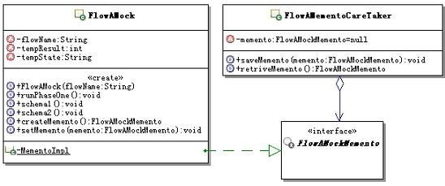

# 19.2 Java 设计模式系列教程（十九）备忘录模式之场景分析

[Java 设计模式系列教程目录](https://github.com/binarylei/java/blob/master/%E8%AE%BE%E8%AE%A1%E6%A8%A1%E5%BC%8F/01.%20Java%20%E8%AE%BE%E8%AE%A1%E6%A8%A1%E5%BC%8F%E7%B3%BB%E5%88%97%E6%95%99%E7%A8%8B%EF%BC%88%E4%B8%80%EF%BC%89%E7%9B%AE%E5%BD%95.md)

[19.1 Java 设计模式系列教程（十九）备忘录模式之原理](19.1%20Java%20%E8%AE%BE%E8%AE%A1%E6%A8%A1%E5%BC%8F%E7%B3%BB%E5%88%97%E6%95%99%E7%A8%8B%EF%BC%88%E5%8D%81%E4%B9%9D%EF%BC%89%E5%A4%87%E5%BF%98%E5%BD%95%E6%A8%A1%E5%BC%8F%E4%B9%8B%E5%8E%9F%E7%90%86.md)

[19.2 Java 设计模式系列教程（十九）备忘录模式之场景分析](19.2%20Java%20%E8%AE%BE%E8%AE%A1%E6%A8%A1%E5%BC%8F%E7%B3%BB%E5%88%97%E6%95%99%E7%A8%8B%EF%BC%88%E5%8D%81%E4%B9%9D%EF%BC%89%E5%A4%87%E5%BF%98%E5%BD%95%E6%A8%A1%E5%BC%8F%E4%B9%8B%E5%9C%BA%E6%99%AF%E5%88%86%E6%9E%90.md)

[19.3 Java 设计模式系列教程（十九）备忘录模式之扩展](19.3%20Java%20%E8%AE%BE%E8%AE%A1%E6%A8%A1%E5%BC%8F%E7%B3%BB%E5%88%97%E6%95%99%E7%A8%8B%EF%BC%88%E5%8D%81%E4%B9%9D%EF%BC%89%E5%A4%87%E5%BF%98%E5%BD%95%E6%A8%A1%E5%BC%8F%E4%B9%8B%E6%89%A9%E5%B1%95.md)

## 19.2.1 使用场景

考虑这样一个仿真应用，功能是：模拟运行针对某个具体问题的多个解决方案，记录运行过程的各种数据，在模拟运行完成过后，好对这多个解决方案进行比较和评价，从而选定最优的解决方案。

这种仿真系统，在很多领域都有应用，比如：工作流系统，对同一问题制定多个流程，然后通过仿真运行，最后来确定最优的流程做为解决方案；在工业设计和制造领域，仿真系统的应用就更广泛了。

由于都是解决同一个具体的问题，这多个解决方案并不是完全不一样的，假定它们的前半部分运行是完全一样的，只是在后半部分采用了不同的解决方案，后半部分需要使用前半部分运行所产生的数据。

由于要模拟运行多个解决方案，而且最后要根据运行结果来进行评价，这就意味着每个方案的后半部分的初始数据应该是一样，也就是说在运行每个方案后半部分之前，要保证数据都是由前半部分运行所产生的数据，当然，咱们这里并不具体的去深入到底有哪些解决方案，也不去深入到底有哪些状态数据，这里只是示意一下。

那么，这样的系统该如何实现呢？尤其是每个方案运行需要的初始数据应该一样，要如何来保证呢？

## 19.2.2 不用模式的实现

### 代码实现 [demo2](https://github.com/binarylei/demo/tree/master/demo-design/src/main/java/com/github/binarylei/design/memento/demo2)

要保证初始数据的一致，实现思路也很简单：

1. 首先模拟运行流程第一个阶段，得到后阶段各个方案运行需要的数据，并把数据保存下来，以备后用
2. 每次在模拟运行某一个方案之前，用保存的数据去重新设置模拟运行流程的对象，这样运行后面不同的方案时，对于这些方案，初始数据就是一样的了

（1）根据上面的思路，来写出仿真运行的示意代码，示例代码如下：

```java
/**
 * 模拟运行流程A，只是一个示意，代指某个具体流程
 */
public class FlowAMock {
    /**
     * 流程名称，不需要外部存储的状态数据
     */
    private String flowName;
    /**
     * 示意，代指某个中间结果，需要外部存储的状态数据
     */
    private int tempResult;
    /**
     * 示意，代指某个中间结果，需要外部存储的状态数据
     */
    private String tempState;
    /**
     * 构造方法，传入流程名称
     * @param flowName 流程名称
     */
    public FlowAMock(String flowName){
        this.flowName = flowName;
    }

    public String getTempState() {
        return tempState;
    }
    public void setTempState(String tempState) {
        this.tempState = tempState;
    }
    public int getTempResult() {
        return tempResult;
    }
    public void setTempResult(int tempResult) {
        this.tempResult = tempResult;
    }

    /**
     * 示意，运行流程的第一个阶段
     */
    public void runPhaseOne(){
        //在这个阶段，可能产生了中间结果，示意一下
        tempResult = 3;
        tempState = "PhaseOne";
    }
    /**
     * 示意，按照方案一来运行流程后半部分
     */
    public void schema1(){
        //示意，需要使用第一个阶段产生的数据
        this.tempState += ",Schema1";
        System.out.println(this.tempState + " : now run " + tempResult);
        this.tempResult += 11;
    }
    /**
     * 示意，按照方案二来运行流程后半部分
     */
    public void schema2(){
        //示意，需要使用第一个阶段产生的数据
        this.tempState += ",Schema2";
        System.out.println(this.tempState + " : now run " + tempResult);
        this.tempResult += 22;
    }
}
```

（2）看看如何使用这个模拟流程的对象，写个客户端来测试一下。示例代码如下：

```java
public class Client {
    public static void main(String[] args) {
        // 创建模拟运行流程的对象
        FlowAMock mock = new FlowAMock("TestFlow");
        //运行流程的第一个阶段
        mock.runPhaseOne();
        //得到第一个阶段运行所产生的数据，后面要用
        int tempResult = mock.getTempResult();
        String tempState = mock.getTempState();

        //按照方案一来运行流程后半部分
        mock.schema1();

        //把第一个阶段运行所产生的数据重新设置回去
        mock.setTempResult(tempResult);
        mock.setTempState(tempState);

        //按照方案二来运行流程后半部分
        mock.schema2();
    }
}
```

运行结果如下：

```
PhaseOne,Schema1 : now run 3
PhaseOne,Schema2 : now run 3
```

### 问题出来了

看起来实现很简单，是吧，想一想有没有什么问题呢？

1. 问题1：数据是一个一个零散着在外部存放的，如果需要外部存放的数据多了，会显得很杂乱。这个好解决，只需要定义一个数据对象来封装这些需要外部存放的数据就可以了，上面那样做是故意的，好提醒大家这个问题。这个就不去示例了。

2. 问题2：：为了把运行期间的数据放到外部存储起来，模拟流程的对象被迫把内部数据结构开放出来，这暴露了对象的实现细节，而且也破坏了对象的封装性。本来这些数据只是模拟流程的对象内部数据，应该是不对外的。

那么究竟如何实现这样的功能会比较好呢？

## 19.2.3 解决方案

### 应用备忘录模式的解决思路

学习了备忘录模式的基本知识过后，来尝试一下，使用备忘录模式把前面的示例重写一下，好看看如何使用备忘录模式。

1. 首先，那个模拟流程运行的对象，就相当于备忘录模式中的原发器；
2. 而它要保存的数据，原来是零散的，现在做一个备忘录对象来存储这些数据，并且把这个备忘录对象实现成为内部类；
3. 当然为了保存这个备忘录对象，还是需要提供管理者对象的；
4. 为了和管理者对象交互，管理者需要知道保存对象的类型，那就提供一个备忘录对象的窄接口来供管理者使用，相当于标识了类型。

这个时候，程序的结构如图19.2所示：



### 代码实现 [demo3](https://github.com/binarylei/demo/tree/master/demo-design/src/main/java/com/github/binarylei/design/state/demo3)

（1）先来看看备忘录对象的窄接口吧，示例代码如下：

```java
/**
 * 模拟运行流程A的对象的备忘录接口，是个窄接口
 */
public interface FlowAMockMemento extends Serializable {
    //空的
}
```

（2）再来看看新的模拟运行流程A的对象，相当于原发器对象了，它的变化比较多，大致有如下变化：

1. 首先这个对象原来暴露出去的内部状态，不用再暴露出去了，也就是内部状态不用再对外提供getter/setter方法了
2. 在这个对象里面提供一个私有的备忘录对象，里面封装想要保存的内部状态，同时让这个备忘录对象实现备忘录对象的窄接口
3. 在这个对象里面提供创建备忘录对象，和根据备忘录对象恢复内部状态的方法
具体的示例代码如下：

```java
/**
 * 模拟运行流程A，只是一个示意，代指某个具体流程
 */
public class FlowAMock implements Serializable {
    /**
     * 流程名称，不需要外部存储的状态数据
     */
    private String flowName;
    /**
     * 示意，代指某个中间结果，需要外部存储的状态数据
     */
    private int tempResult;
    /**
     * 示意，代指某个中间结果，需要外部存储的状态数据
     */
    private String tempState;
    /**
     * 构造方法，传入流程名称
     * @param flowName 流程名称
     */
    public FlowAMock(String flowName){
        this.flowName = flowName;
    }
    /**
     * 示意，运行流程的第一个阶段
     */
    public void runPhaseOne(){
        //在这个阶段，可能产生了中间结果，示意一下
        tempResult = 3;
        tempState = "PhaseOne";
    }
    /**
     * 示意，按照方案一来运行流程后半部分
     */
    public void schema1(){
        //示意，需要使用第一个阶段产生的数据
        this.tempState += ",Schema1";
        System.out.println(this.tempState + " : now run "+tempResult);
        this.tempResult += 11;
    }
    /**
     * 示意，按照方案二来运行流程后半部分
     */
    public void schema2(){
        //示意，需要使用第一个阶段产生的数据
        this.tempState += ",Schema2";
        System.out.println(this.tempState + " : now run "+tempResult);
        this.tempResult += 22;
    }
    /**
     * 创建保存原发器对象的状态的备忘录对象
     * @return 创建好的备忘录对象
     */
    public FlowAMockMemento createMemento() {
        return new MementoImpl(this.tempResult,this.tempState);
    }
    /**
     * 重新设置原发器对象的状态，让其回到备忘录对象记录的状态
     * @param memento 记录有原发器状态的备忘录对象
     */
    public void setMemento(FlowAMockMemento memento) {
        MementoImpl mementoImpl = (MementoImpl)memento;
        this.tempResult = mementoImpl.getTempResult();
        this.tempState = mementoImpl.getTempState();
    }
    /**
     * 真正的备忘录对象，实现备忘录窄接口
     * 实现成私有的内部类，不让外部访问
     */
    private static class MementoImpl implements FlowAMockMemento{
        /**
         * 示意，保存某个中间结果
         */
        private int tempResult;
        /**
         * 示意，保存某个中间结果
         */
        private String tempState;
        public MementoImpl(int tempResult,String tempState){
            this.tempResult = tempResult;
            this.tempState = tempState;
        }
        public int getTempResult() {
            return tempResult;
        }
        public String getTempState() {
            return tempState;
        }
    }
}
```
（3）接下来要来实现提供保存备忘录对象的管理者了，示例代码如下：

```java
/**
 * 负责保存模拟运行流程A的对象的备忘录对象
 */
public class FlowAMementoCareTaker {
    /**
     * 记录被保存的备忘录对象
     */
    private FlowAMockMemento memento = null;
    /**
     * 保存备忘录对象
     * @param memento 被保存的备忘录对象
     */
    public void saveMemento(FlowAMockMemento memento){
        this.memento = memento;
    }
    /**
     * 获取被保存的备忘录对象
     * @return 被保存的备忘录对象
     */
    public FlowAMockMemento retriveMemento(){
        return this.memento;
    }
}
```

（4）最后来看看，如何使用上面按照备忘录模式实现的这些对象呢，写个新的客户端来测试一下，示例代码如下：

```java
public class Client {
    public static void main(String[] args) {
        // 创建模拟运行流程的对象
        FlowAMock mock = new FlowAMock("TestFlow");
        //运行流程的第一个阶段
        mock.runPhaseOne();

        //创建一个管理者
        FlowAMementoCareTaker careTaker = new FlowAMementoCareTaker();
        //创建此时对象的备忘录对象，并保存到管理者对象那里，后面要用
        FlowAMockMemento memento = mock.createMemento();
        careTaker.saveMemento(memento);

        //按照方案一来运行流程后半部分
        mock.schema1();

        //从管理者获取备忘录对象，然后设置回去，
        //让模拟运行流程的对象自己恢复自己的内部状态
        mock.setMemento(careTaker.retriveMemento());

        //按照方案二来运行流程后半部分
        mock.schema2();
    }
}
```

运行结果跟前面的示例是一样的，结果如下：

```
PhaseOne,Schema1 : now run 3
PhaseOne,Schema2 : now run 3
```

好好体会一下上面的示例，由于备忘录对象是一个私有的内部类，外面只能通过备忘录对象的窄接口来获取备忘录对象，而这个接口没有任何方法，仅仅起到了一个标识对象类型的作用，从而保证内部的数据不会被外部获取或是操作，保证了原发器对象的封装性，也就不再暴露原发器对象的内部结构了。

