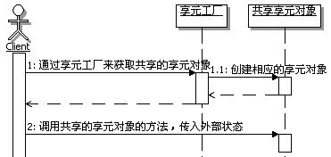

# 20.2 Java 设计模式系列教程（二十）享元模式之场景分析

[Java 设计模式系列教程目录](https://github.com/binarylei/java/blob/master/%E8%AE%BE%E8%AE%A1%E6%A8%A1%E5%BC%8F/01.%20Java%20%E8%AE%BE%E8%AE%A1%E6%A8%A1%E5%BC%8F%E7%B3%BB%E5%88%97%E6%95%99%E7%A8%8B%EF%BC%88%E4%B8%80%EF%BC%89%E7%9B%AE%E5%BD%95.md)

[20.1 Java 设计模式系列教程（二十）享元模式之原理](20.1%20Java%20%E8%AE%BE%E8%AE%A1%E6%A8%A1%E5%BC%8F%E7%B3%BB%E5%88%97%E6%95%99%E7%A8%8B%EF%BC%88%E5%8D%81%E4%B9%9D%EF%BC%89%E5%A4%87%E5%BF%98%E5%BD%95%E6%A8%A1%E5%BC%8F%E4%B9%8B%E5%8E%9F%E7%90%86.md)

[20.2 Java 设计模式系列教程（二十）享元模式之场景分析](20.2%20Java%20%E8%AE%BE%E8%AE%A1%E6%A8%A1%E5%BC%8F%E7%B3%BB%E5%88%97%E6%95%99%E7%A8%8B%EF%BC%88%E5%8D%81%E4%B9%9D%EF%BC%89%E5%A4%87%E5%BF%98%E5%BD%95%E6%A8%A1%E5%BC%8F%E4%B9%8B%E5%9C%BA%E6%99%AF%E5%88%86%E6%9E%90.md)

[20.3 Java 设计模式系列教程（二十）享元模式之扩展](20.3%20Java%20%E8%AE%BE%E8%AE%A1%E6%A8%A1%E5%BC%8F%E7%B3%BB%E5%88%97%E6%95%99%E7%A8%8B%EF%BC%88%E5%8D%81%E4%B9%9D%EF%BC%89%E5%A4%87%E5%BF%98%E5%BD%95%E6%A8%A1%E5%BC%8F%E4%B9%8B%E6%89%A9%E5%B1%95.md)

## 20.2.1 使用场景

考虑这样一个问题，给系统加入权限控制，这基本上是所有的应用系统都有的功能了。

对于应用系统而言，一般先要登录系统，才可以使用系统的功能，登录过后，用户的每次操作都需要经过权限系统的控制，确保该用户有操作该功能的权限，同时还要控制该用户对数据的访问权限、修改权限等等。总之一句话，一个安全的系统，需要对用户的每一次操作都要做权限检测，包括功能和数据，以确保只有获得相应授权的人，才能执行相应的功能，操作相应的数据。

举个例子来说吧：普通人员都有能查看到本部门人员列表的权限，但是在人员列表中每个人员的薪资数据，普通人员是不可以看到的；而部门经理在查看本部门人员列表的时候，就可以看到每个人员相应的薪资数据。

现在就要来实现为系统加入权限控制的功能，该怎么实现呢？

为了让大家更好的理解后面讲述的知识，先介绍一点权限系统的基础知识。几乎所有的权限系统都分成两个部分，一个是授权部分，一个是验证部分，为了理解它们，首先解释两个基本的名词：安全实体和权限。

**安全实体** ：就是被权限系统检测的对象，比如工资数据。

**权限** ：就是需要被校验的权限对象，比如查看、修改等。

安全实体和权限通常要一起描述才有意义，比如有这么个描述：“现在要检测登录人员对工资数据是否有查看的权限”， “工资数据”这个安全实体和“查看”这个权限一定要一起描述。如果只出现安全实体描述，那就变成这样：“现在要检测登录人员对工资数据”，对工资数据干什么呀，没有后半截，一看就知道不完整；当然只有权限描述也不行，那就变成：“现在要检测登录人员是否有查看的权限”，对谁的查看权限啊，也不完整。所以安全实体和权限通常要一起描述。

了解了上面两个名词，来看看什么是授权和验证：

**所谓授权是指** ：把对某些安全实体的某些权限分配给某些人员的过程。

**所谓验证是指** ：判断某个人员对某个安全实体是否拥有某个或某些权限的过程。

也就是说， **授权过程即是权限的分配过程，而验证过程则是权限的匹配过程** 。在目前应用系统的开发中，多数是利用数据库来存放授权过程产生的数据，也就是说：授权是向数据库里面添加数据、或是维护数据的过程，而匹配过程就变成了从数据库中获取相应数据进行匹配的过程了。

## 20.2.2 不用模式的实现

### 代码实现 [demo2](https://github.com/binarylei/demo/tree/master/demo-design/src/main/java/com/github/binarylei/design/flyweight/demo2)

要保证初始数据的一致，实现思路也很简单：

1. 首先模拟运行流程第一个阶段，得到后阶段各个方案运行需要的数据，并把数据保存下来，以备后用
2. 每次在模拟运行某一个方案之前，用保存的数据去重新设置模拟运行流程的对象，这样运行后面不同的方案时，对于这些方案，初始数据就是一样的了

（1）首先定义描述授权数据的数据对象，示例代码如下：

```java
/**
 * 描述授权数据的数据model
 */
public class AuthorizationModel {
    /**
     * 人员
     */
    private String user;
    /**
     * 安全实体
     */
    private String securityEntity;
    /**
     * 权限
     */
    private String permit;
    
    public String getUser() {
        return user;
    }
    public void setUser(String user) {
        this.user = user;
    }
    public String getSecurityEntity() {
        return securityEntity;
    }
    public void setSecurityEntity(String securityEntity) {
        this.securityEntity = securityEntity;
    }
    public String getPermit() {
        return permit;
    }
    public void setPermit(String permit) {
        this.permit = permit;
    }
    
}
```

（2）为了测试方便，做一个模拟的内存数据库，把授权数据存储在里面，用最简单的字符串存储的方式。示例代码如下：

```java
/**
 * 供测试用，在内存中模拟数据库中的值
 */
public class TestDB {
    /**
     * 用来存放授权数据的值
     */
    public static Collection<String> colDB = new ArrayList<String>();
    
    static{
        //通过静态块来填充模拟的数据     
        colDB.add("张三, 人员列表, 查看");
        colDB.add("李四, 人员列表, 查看");
        colDB.add("李四, 薪资数据, 查看");
        colDB.add("李四, 薪资数据, 修改");
        //增加更多的授权数据
        for(int i=0;i<3;i++){
            colDB.add("张三" +  i + ", 人员列表, 查看");
        }
    }   
}
```

（3）接下来实现登录和权限控制的业务，示例代码如下：

```java
/**
 * 安全管理，实现成单例
 */
public class SecurityMgr {
    private static SecurityMgr securityMgr = new SecurityMgr();
    private SecurityMgr(){      
    }
    public static SecurityMgr getInstance(){
        return securityMgr;
    }
    
    /**
     * 在运行期间，用来存放登录人员对应的权限，
     * 在Web应用中，这些数据通常会存放到session中
     */
    private Map<String,Collection<AuthorizationModel>> map = 
        new HashMap<String,Collection<AuthorizationModel>>();
    
    /**
     * 模拟登录的功能
     * @param user 登录的用户
     */
    public void login(String user){
        //登录的时候就需要把该用户所拥有的权限，从数据库中取出来，放到缓存中去
        Collection<AuthorizationModel> col = queryByUser(user);
        map.put(user, col);
    }

    /**
     * 判断某用户对某个安全实体是否拥有某权限
     * @param user 被检测权限的用户 
     * @param securityEntity 安全实体
     * @param permit 权限
     * @return true表示拥有相应权限，false表示没有相应权限
     */
    public boolean hasPermit(String user,String securityEntity,String permit){
        Collection<AuthorizationModel> col = map.get(user);
        if(col == null || col.size() == 0){
            System.out.println(user + "没有登录或是没有被分配任何权限");
            return false;
        }
        for(AuthorizationModel am : col){
            //输出当前实例，看看是否同一个实例对象
            System.out.println("am == " + am);
            if(am.getSecurityEntity().equals(securityEntity) 
                    && am.getPermit().equals(permit)){
                return true;
            }
        }
        return false;
    }

    /**
     * 从数据库中获取某人所拥有的权限
     * @param user 需要获取所拥有的权限的人员
     * @return 某人所拥有的权限
     */
    private Collection<AuthorizationModel> queryByUser(String user){
        Collection<AuthorizationModel> col = new ArrayList<AuthorizationModel>();
        
        for(String s : TestDB.colDB){
            String ss[] = s.split(",\\s*");
            if(ss[0].equals(user)){
                AuthorizationModel am = new AuthorizationModel();
                am.setUser(ss[0]);
                am.setSecurityEntity(ss[1]);
                am.setPermit(ss[2]);
                
                col.add(am);
            }
        }
        return col;
    }
}
```

（4）好不好用呢，写个客户端来测试一下，示例代码如下：

```java
public class Client {
    public static void main(String[] args) {
        //需要先登录，然后再判断是否有权限
        SecurityMgr mgr = SecurityMgr.getInstance();
        mgr.login("张三");
        mgr.login("李四");        
        boolean f1 = mgr.hasPermit("张三", "薪资数据", "查看");
        boolean f2 = mgr.hasPermit("李四", "薪资数据", "查看");
        
        System.out.println("f1 == " + f1);
        System.out.println("f2 == " + f2);
        
        for(int i=0;i<3;i++){
            mgr.login("张三" + i);
            mgr.hasPermit("张三" + i, "薪资数据", "查看");
        }
    }
}

```

运行结果如下：

```
am == com.github.binarylei.design.flyweight.demo2.AuthorizationModel@1453f44
am == com.github.binarylei.design.flyweight.demo2.AuthorizationModel@ad8086
am == com.github.binarylei.design.flyweight.demo2.AuthorizationModel@be858
f1 == false
f2 == true
am == com.github.binarylei.design.flyweight.demo2.AuthorizationModel@1bbe9ba
am == com.github.binarylei.design.flyweight.demo2.AuthorizationModel@10455d6
am == com.github.binarylei.design.flyweight.demo2.AuthorizationModel@11d50c0
```

 输出结果中的f1为false，表示张三对薪资数据没有查看的权限；而f2为true，表示李四对对薪资数据有查看的权限，是正确的，基本完成了功能。

### 问题出来了

看了上面的实现，很简单，而且还考虑了性能的问题，在内存中缓存了每个人相应的权限数据，使得每次判断权限的时候，速度大大加快，实现得挺不错，难道有什么问题吗？

仔细想想，问题就来了，既有缓存这种方式固有的问题，也有我们自己实现上的问题。先说说缓存固有的问题吧，这个不在本次讨论之列，大家了解一下。

1. **缓存时间长度的问题** ：就是这些数据应该被缓存多久，如果是Web应用，这种跟登录人员相关的权限数据，多是放在session中进行缓存，这样session超时的时候，就会被清除掉。如果不是Web应用呢？就得自己来控制了，另外就算是在Web应用中，也不一定非要缓存到session超时才清除。总之，控制缓存数据应该被缓存多长时间，是实现高效缓存的一个问题点。

2. **缓存数据和真实数据的同步问题** ：这里的同步是指的数据同步，不是多线程的同步。比如：上面的授权数据是存放在数据库里的，运行的时候缓存到内存里面，如果真实的授权数据在运行期间发生了改变，那么缓存里的数据就应该和数据库的数据同步，以保持一致，否则数据就错了。如何合理的同步数据，也是实现高效缓存的一个问题点。

3. **缓存的多线程并发控制** ：对于缓存的数据，有些操作从里面取值，有些操作向缓存里面添加值，有些操作在清除过期的缓存数据，有些操作在进行缓存和真实数据的同步，在一个多线程的环境下，如何合理的对缓存进行并发控制，也是实现高效缓存的一个问题点。

先简单提这么几个，事实上，实现合理、高效的缓存也不是一件很轻松的事情，好在这些问题，都不在我们这次的讨论之列，这里的重心还是来讲述模式，而不是缓存实现。

再来看看前面实现上的问题，仔细观察在上面输出结果中框住的部分，这些值是输出对象实例得到的，默认输出的是对象的hashCode值，而默认的hashCode值可以用来判断是不是同一对象实例。在Java中，默认的equals方法比较的是内存地址，而equals方法和hashCode方法的关系是：equals方法返回true的话，那么这两个对象实例的hashCode必须相同；而hashCode相同，equals方法并不一定返回true，也就是说两个对象实例不一定是同一对象实例。换句话说，如果hashCode不同的话，铁定不是同一个对象实例。

仔细看看上面输出结果，框住部分的值是不同的，表明这些对象实例肯定不是同一个对象实例，而是多个对象实例。这就引出一个问题了，就是对象实例数目太多，为什么这么说呢？看看就描述这么几条数据，数数看有多少个对象实例呢？目前是一条数据就有一个对象实例，这很恐怖，数据库的数据量是很大的，如果有几万条，几十万条，岂不是需要几万个，甚至几十万个对象实例，这会耗费掉大量的内存。

另外，这些对象的粒度都很小，都是简单的描述某一个方面的对象，而且很多数据是重复的，在这些大量重复的数据上耗费掉了很多的内存。比如在前面示例的数据中就会发现有重复的部分，见下面框住的部分：

```
张三  对  人员列表   拥有    查看的权限
李四  对  人员列表   拥有    查看的权限
李四  对  薪资数据   拥有    查看的权限
李四  对  薪资数据   拥有    修改的权限
```

前面讲过，对于安全实体和权限一般要联合描述，因此对于“人员列表 这个安全实体 的 查看权限 限制”，就算是授权给不同的人员，这个描述是一样的。假设在某极端情况下，要把“人员列表 这个安全实体 的 查看权限 限制”授权给一万个人，那么数据库里面会有一万条记录，按照前面的实现方式，会有一万个对象实例，而这些实例里面，有大部分的数据是重复的，而且会重复一万次，你觉得这是不是个很大的问题呢？

把上面的问题描述出来就是：在系统当中，存在大量的细粒度对象，而且存在大量的重复数据，严重耗费内存，如何解决？

## 20.2.3 解决方案

### 应用享元模式的解决思路

再次分析上面的授权信息，实际上重复出现的数据主要是对安全实体和权限的描述，又考虑到安全实体和权限的描述一般是不分开的，那么找出这些重复的描述，比如：人员列表的查看权限。而且这些重复的数据是可以重用的，比如给它们配上不同的人员，就可以组合成为不同的授权描述，如图20.2所示：



很明显，可以把安全实体和权限的描述定义成为享元，而和它们结合的人员数据，就可以做为享元的外部数据。为了演示简单，就把安全实体对象和权限对象简化成了字符串，描述一下它们的名字。

### 代码实现 [demo3](https://github.com/binarylei/demo/tree/master/demo-design/src/main/java/com/github/binarylei/design/state/demo3)

（1）按照享元模式，也为了系统的扩展性和灵活性，给享元定义一个接口，外部使用享元还是面向接口来编程，示例代码如下：

```java
/***
 * 描述授权数据的享元接口
 */
public interface Flyweight {
    /**
     * 判断传入的安全实体和权限，是否和享元对象内部状态匹配
     * @param securityEntity 安全实体
     * @param permit 权限
     * @return true表示匹配，false表示不匹配
     */
    public boolean match(String securityEntity, String permit);
}
```

（2）定义了享元接口，该来实现享元对象了，这个对象需要封装授权数据中重复出现部分的数据，示例代码如下：

```java
/**
 * 封装授权数据中重复出现部分的享元对象
 */
public class AuthorizationFlyweight implements Flyweight{
    /**
     * 内部状态，安全实体
     */
    private String securityEntity;
    /**
     * 内部状态，权限
     */
    private String permit;

    /**
     * 构造方法，传入状态数据
     * @param state 状态数据，包含安全实体和权限的数据，用","分隔
     */
    public AuthorizationFlyweight(String state){
        String ss[] = state.split(",");
        securityEntity = ss[0];
        permit = ss[1];
    }
    
    public String getSecurityEntity() {
        return securityEntity;
    }
    public String getPermit() {
        return permit;
    }

    public boolean match(String securityEntity, String permit) {
        if(this.securityEntity.equals(securityEntity) 
                && this.permit.equals(permit)){
            return true;
        }
        return false;
    }   
}
```
（3）定义好了享元，来看看如何管理这些享元，提供享元工厂来负责享元对象的共享管理和对外提供访问享元的接口。

享元工厂一般不需要很多个，实现成为单例即可。享元工厂负责享元对象的创建和管理，基本的思路就是在享元工厂里面缓存享元对象。在Java中最常用的缓存实现方式，就是定义一个Map来存放缓存的数据，而享元工厂对外提供的访问享元的接口，基本上就是根据key值到缓存的Map中获取相应的数据，这样只要有了共享，同一份数据就可以重复使用了，示例代码如下：

```java
/**
 * 享元工厂，通常实现成为单例
 */
public class FlyweightFactory {
    private static FlyweightFactory factory = new FlyweightFactory();
    private FlyweightFactory(){
        
    }
    public static FlyweightFactory getInstance(){
        return factory;
    }

    /**
     * 缓存多个flyweight对象
     */
    private Map<String,Flyweight> fsMap = new HashMap<String,Flyweight>();

    /**
     * 获取key对应的享元对象
     * @param key 获取享元对象的key
     * @return key对应的享元对象
     */
    public Flyweight getFlyweight(String key) {
        Flyweight f = fsMap.get(key);
        //换一个更简单点的写法
        if(f == null){
            f = new AuthorizationFlyweight(key);
            fsMap.put(key, f);
        }
        return f;
    }
}
```

（4）使用享元对象

实现完享元工厂，该来看看如何使用享元对象了。按照前面的实现，需要一个对象来提供安全管理的业务功能，就是前面的那个SecurityMgr类，这个类现在在享元模式中，就充当了Client的角色，注意这个Client角色和我们平时说的测试客户端是两个概念，这个Client角色是使用享元的对象。

SecurityMgr的实现方式基本上模仿前面的实现，也会有相应的改变，变化大致如下：

1. 缓存的每个人员的权限数据，类型变成了Flyweight的了
2. 在原来queryByUser方法里面，通过new来创建授权对象的地方，修改成了通过享元工厂来获取享元对象，这是使用享元模式最重要的一点改变，也就是不是直接去创建对象实例，而是通过享元工厂来获取享元对象实例

示例代码如下：
```java
/**
 * 安全管理，实现成单例
 */
public class SecurityMgr {
    private static SecurityMgr securityMgr = new SecurityMgr();
    private SecurityMgr(){      
    }
    public static SecurityMgr getInstance(){
        return securityMgr;
    }
    
    /**
     * 在运行期间，用来存放登录人员对应的权限，
     * 在Web应用中，这些数据通常会存放到session中
     */
    private Map<String,Collection<Flyweight>> map = 
        new HashMap<String,Collection<Flyweight>>();
    
    /**
     * 模拟登录的功能
     * @param user 登录的用户
     */
    public void login(String user){
        //登录的时候就需要把该用户所拥有的权限，从数据库中取出来，放到缓存中去
        Collection<Flyweight> col = queryByUser(user);
        map.put(user, col);
    }
    
    /**
     * 判断某用户对某个安全实体是否拥有某权限
     * @param user 被检测权限的用户 
     * @param securityEntity 安全实体
     * @param permit 权限
     * @return true表示拥有相应权限，false表示没有相应权限
     */
    public boolean hasPermit(String user,String securityEntity,String permit){
        Collection<Flyweight> col = map.get(user);
        if(col == null || col.size() == 0){
            System.out.println(user+"没有登录或是没有被分配任何权限");
            return false;
        }
        for(Flyweight fm : col){
            //输出当前实例，看看是否同一个实例对象
            System.out.println("fm == "+fm);
            if(fm.match(securityEntity, permit)){
                return true;
            }
        }
        return false;
    }

    /**
     * 从数据库中获取某人所拥有的权限
     * @param user 需要获取所拥有的权限的人员
     * @return 某人所拥有的权限
     */
    private Collection<Flyweight> queryByUser(String user){
        Collection<Flyweight> col = new ArrayList<Flyweight>();
        
        for(String s : TestDB.colDB){
            String ss[] = s.split(",\\s*");
            if(ss[0].equals(user)){
                Flyweight fm = FlyweightFactory.getInstance().getFlyweight(ss[1]+","+ss[2]);
                
                col.add(fm);
            }
        }
        return col;
    }
}
```

（5）所用到的TestDB没有任何变化，这里就不去赘述了

（6）客户端测试代码也没有任何变化，也不去赘述了。

运行测试一下，看看效果，主要是看看是不是能有效地减少那些重复数据对象的数量。运行结果如下：

```
fm == com.github.binarylei.design.flyweight.demo3.AuthorizationFlyweight@1453f44
fm == com.github.binarylei.design.flyweight.demo3.AuthorizationFlyweight@1453f44
fm == com.github.binarylei.design.flyweight.demo3.AuthorizationFlyweight@ad8086
f1==false
f2==true
fm == com.github.binarylei.design.flyweight.demo3.AuthorizationFlyweight@1453f44
fm == com.github.binarylei.design.flyweight.demo3.AuthorizationFlyweight@1453f44
fm == com.github.binarylei.design.flyweight.demo3.AuthorizationFlyweight@1453f44
```

仔细观察结果中框住的部分，会发现六条数据中，有五条的hashCode是同一个值，根据我们的实现，可以断定这是同一个对象。也就是说，现在只有两个对象实例，而前面的实现中有六个对象实例。

如同示例的那样，对于封装安全实体和权限的这些细粒度对象，既是授权分配的单元对象，也是权限检测的单元对象。可能有很多人对某个安全实体拥有某个权限，如果为每个人都重新创建一个对象来描述对应的安全实体和权限，那样就太浪费内存空间了。

通过共享封装了安全实体和权限的对象，无论多少人拥有这个权限，实际的对象实例都是只有一个，这样既减少了对象的数目，又节省了宝贵的内存空间，从而解决了前面提出的问题。