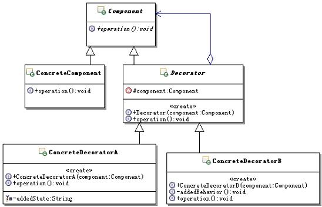

# 22.1 Java 设计模式系列教程（二二）装饰器模式之原理

[Java 设计模式系列教程目录](https://github.com/binarylei/java/blob/master/%E8%AE%BE%E8%AE%A1%E6%A8%A1%E5%BC%8F/01.%22Java%22%E8%AE%BE%E8%AE%A1%E6%A8%A1%E5%BC%8F%E7%B3%BB%E5%88%97%E6%95%99%E7%A8%8B%EF%BC%88%E4%B8%80%EF%BC%89%E7%9B%AE%E5%BD%95.md)

[22.1 Java 设计模式系列教程（二二）装饰器模式之原理](https://github.com/binarylei/java/blob/master/%E8%AE%BE%E8%AE%A1%E6%A8%A1%E5%BC%8F/22.1%20Java%20%E8%AE%BE%E8%AE%A1%E6%A8%A1%E5%BC%8F%E7%B3%BB%E5%88%97%E6%95%99%E7%A8%8B%EF%BC%88%E4%BA%8C%E4%BA%8C%EF%BC%89%E8%A3%85%E9%A5%B0%E6%A8%A1%E5%BC%8F%E4%B9%8B%E5%8E%9F%E7%90%86.md)

[22.2 Java 设计模式系列教程（二二）装饰器模式之场景分析](https://github.com/binarylei/java/blob/master/%E8%AE%BE%E8%AE%A1%E6%A8%A1%E5%BC%8F/22.2%20Java%20%E8%AE%BE%E8%AE%A1%E6%A8%A1%E5%BC%8F%E7%B3%BB%E5%88%97%E6%95%99%E7%A8%8B%EF%BC%88%E4%BA%8C%E4%BA%8C%EF%BC%89%E8%A3%85%E9%A5%B0%E6%A8%A1%E5%BC%8F%E4%B9%8B%E5%9C%BA%E6%99%AF%E5%88%86%E6%9E%90.md)

[22.3 Java 设计模式系列教程（二二）装饰器模式之扩展](https://github.com/binarylei/java/blob/master/%E8%AE%BE%E8%AE%A1%E6%A8%A1%E5%BC%8F/22.3%20Java%20%E8%AE%BE%E8%AE%A1%E6%A8%A1%E5%BC%8F%E7%B3%BB%E5%88%97%E6%95%99%E7%A8%8B%EF%BC%88%E4%BA%8C%E4%BA%8C%EF%BC%89%E8%A3%85%E9%A5%B0%E6%A8%A1%E5%BC%8F%E4%B9%8B%E6%89%A9%E5%B1%95.md)

> 动态地给一个对象添加一些额外的职责。就增加功能来说装饰模式比生成子类更为灵活。[decorator](https://github.com/binarylei/demo/tree/master/demo-design/src/main/java/com/github/binarylei/design/decorator)

## 22.1.1 装饰器模式结构



* `Component`：组件对象的接口，可以给这些对象动态的添加职责。

* `ConcreteComponent`：具体的组件对象，实现组件对象接口，通常就是被装饰器装饰的原始对象，也就是可以给这个对象添加职责。

* `Decorator`：所有装饰器的抽象父类，需要定义一个与组件接口一致的接口，并持有一个Component对象，其实就是持有一个被装饰的对象。

    注意这个被装饰的对象不一定是最原始的那个对象了，也可能是被其它装饰器装饰过后的对象，反正都是实现的同一个接口，也就是同一类型。


* `ConcreteDecorator`：实际的装饰器对象，实现具体要向被装饰对象添加的功能。

## 22.1.2 装饰器模式参考实现 [demo1](https://github.com/binarylei/demo/tree/master/demo-design/src/main/java/com/github/binarylei/design/decorator/demo1)

（1）先来看看组件对象的接口定义，示例代码如下：

```java
/**
 * 组件对象的接口，可以给这些对象动态的添加职责
 */
public abstract class Component {
    /**
     * 示例方法
     */
    public abstract void operation();
}
```

（2）定义了接口，那就看看具体组件实现对象示意吧，示例代码如下：

```java
/**
 * 具体实现组件对象接口的对象
 */
public class ConcreteComponent extends Component {

    public void operation() {
        //相应的功能处理
    }
}

```

（3）接下来看看抽象的装饰器对象，示例代码如下：

```java
/**
 * 装饰器接口，维持一个指向组件对象的接口对象，
 * 并定义一个与组件接口一致的接口
 */
public abstract class Decorator extends Component {
    /**
     * 持有组件对象
     */
    protected Component component;

    /**
     * 构造方法，传入组件对象
     * @param component 组件对象
     */
    public Decorator(Component component) {
        this.component = component;
    }

    public void operation() {
        //转发请求给组件对象，可以在转发前后执行一些附加动作
        component.operation();
    }
}
```

（4）该来看看具体的装饰器实现对象了，这里有两个示意对象，一个示意了添加状态，一个示意了添加职责。先看添加了状态的示意对象吧，示例代码如下：

```java
/**
 * 装饰器的具体实现对象，向组件对象添加职责
 */
public class ConcreteDecoratorA extends Decorator {
    public ConcreteDecoratorA(Component component) {
        super(component);
    }
    /**
     * 添加的状态
     */
    private String addedState;
    
    public String getAddedState() {
        return addedState;
    }

    public void setAddedState(String addedState) {
        this.addedState = addedState;
    }

    public void operation() {
        //调用父类的方法，可以在调用前后执行一些附加动作
        //在这里进行处理的时候，可以使用添加的状态
        super.operation();
    }
}
```

## 22.1.3 进一步认识装饰器模式

#### （1）模式功能

装饰模式能够实现动态的为对象添加功能，是从一个对象外部来给对象增加功能，相当于是改变了对象的外观。当装饰过后，从外部使用系统的角度看，就不再是使用原始的那个对象了，而是使用被一系列的装饰器装饰过后的对象。

这样就能够灵活的改变一个对象的功能，只要动态组合的装饰器发生了改变，那么最终所得到的对象的功能也就发生了改变。

变相的还得到了另外一个好处，那就是装饰器功能的复用，可以给一个对象多次增加同一个装饰器，也可以用同一个装饰器装饰不同的对象。

#### （2）对象组合

前面已经讲到了，一个类的功能的扩展方式，可以是继承，也可以是功能更强大、更灵活的对象组合的方式。

其实，现在在面向对象设计中，有一条很基本的规则就是“尽量使用对象组合，而不是对象继承”来扩展和复用功能。装饰模式的思考起点就是这个规则，可能有些朋友还不太熟悉什么是“对象组合”，下面介绍一下“对象组合”。

什么是对象组合

直接举例来说吧，假若有一个对象A，实现了一个a1的方法，而C1对象想要来扩展A的功能，给它增加一个c11的方法，那么一个方案是继承，A对象示例代码如下：

```java
public class A {
    public void a1(){
        System.out.println("now in A.a1");
    }
}

public class C1 extends A{
    public void c11(){
        System.out.println("now in C1.c11");
    }
}
```

另外一个方案就是使用对象组合，怎么组合呢？就是在C1对象里面不再继承A对象了，而是去组合使用A对象的实例，通过转调A对象的功能来实现A对象已有的功能，写个新的对象C2来示范，示例代码如下：

```java
public class C2 {
    /**
     * 创建A对象的实例
     */
    private A a = new A();

    public void a1(){
        //转调A对象的功能
        a.a1();
    }
    public void c11(){
        System.out.println("now in C2.c11");
    }
}
```

同时拥有A对象功能，B对象的功能，还有自己实现的功能的C3对象示例代码如下：

```java
public class C3 {
    private A a = new A();
    private B b = new B();

    public void a1(){
        //转调A对象的功能
        a.a1();
    }
    public void b1(){
        //转调B对象的功能
        b.b1();
    }

    public void c11(){
        System.out.println("now in C3.c11");
    }
}
```

最后再说一点，就是关于对象组合中，何时创建被组合对象的实例：

```java
public class C4 {
    //示例直接在属性上创建需要组合的对象
    private A a = new A();
    //示例通过外部传入需要组合的对象
    private B b = null;
    public void setB(B b){
        this.b = b;
    }
    public void a1(){
        //转调A对象的功能
        a.a1();
    }
    public void b1(){
        //转调B对象的功能
        b.b1();
    }
    public void c11(){
        System.out.println("now in C4.c11");
    }
}
```

#### （3）装饰器

装饰器实现了对被装饰对象的某些装饰功能，可以在装饰器里面调用被装饰对象的功能，获取相应的值，这其实是一种递归调用。

在装饰器里不仅仅是可以给被装饰对象增加功能，还可以根据需要选择是否调用被装饰对象的功能，如果不调用被装饰对象的功能，那就变成完全重新实现了，相当于动态修改了被装饰对象的功能。

另外一点，各个装饰器之间最好是完全独立的功能，不要有依赖，这样在进行装饰组合的时候，才没有先后顺序的限制，也就是先装饰谁和后装饰谁都应该是一样的，否则会大大降低装饰器组合的灵活性。

#### （4）装饰器和组件类的关系

装饰器是用来装饰组件的，装饰器一定要实现和组件类一致的接口，保证它们是同一个类型，并具有同一个外观，这样组合完成的装饰才能够递归的调用下去。

组件类是不知道装饰器的存在的，装饰器给组件添加功能是一种透明的包装，组件类毫不知情。需要改变的是外部使用组件类的地方，现在需要使用包装后的类，接口是一样的，但是具体的实现类发生了改变。

#### （5）退化形式

如果仅仅只是想要添加一个功能，就没有必要再设计装饰器的抽象类了，直接在装饰器里面实现跟组件一样的接口，然后实现相应的装饰功能就可以了。但是建议最好还是设计上装饰器的抽象类，这样有利于程序的扩展。

## 22.1.4 总结

### 装饰器模式的本质

装饰器模式的本质： **动态组合** 。

动态是手段，组合才是目的。这里的组合有两个意思，一个是动态功能的组合，也就是动态进行装饰器的组合；另外一个是指对象组合，通过对象组合来实现为被装饰对象透明的增加功能。

但是要注意，装饰模式不仅仅可以增加功能，也可以控制功能的访问，可以完全实现新的功能，还可以控制装饰的功能是在被装饰功能之前还是之后来运行等。

总之，装饰模式是通过把复杂功能简单化，分散化，然后在运行期间，根据需要来动态组合的这么一个模式。

### 何时选用装饰器模式

**建议在如下情况中，选用装饰器模式：**

1. 如果需要在不影响其它对象的情况下，以动态、透明的方式给对象添加职责，可以使用装饰模式，这几乎就是装饰模式的主要功能

2. 如果不合适使用子类来进行扩展的时候，可以考虑使用装饰模式，因为装饰模式是使用的“对象组合”的方式。所谓不适合用子类扩展的方式，比如：扩展功能需要的子类太多，造成子类数目呈爆炸性增长。

### 装饰器模式的优缺点

* 比继承更灵活

    从为对象添加功能的角度来看，装饰模式比继承来得更灵活。继承是静态的，而且一旦继承是所有子类都有一样的功能。而装饰模式采用把功能分离到每个装饰器当中，然后通过对象组合的方式，在运行时动态的组合功能，每个被装饰的对象，最终有哪些功能，是由运行期动态组合的功能来决定的。

* 更容易复用功能

    装饰模式把一系列复杂的功能，分散到每个装饰器当中，一般一个装饰器只实现一个功能，这样实现装饰器变得简单，更重要的是这样有利于装饰器功能的复用，可以给一个对象增加多个同样的装饰器，也可以把一个装饰器用来装饰不同的对象，从而复用装饰器的功能。

* 简化高层定义

    装饰模式可以通过组合装饰器的方式，给对象增添任意多的功能，因此在进行高层定义的时候，不用把所有的功能都定义出来，而是定义最基本的就可以了，可以在使用需要的时候，组合相应的装饰器来完成需要的功能。

* 会产生很多细粒度对象

    前面说了，装饰模式是把一系列复杂的功能，分散到每个装饰器当中，一般一个装饰器只实现一个功能，这样会产生很多细粒度的对象，而且功能越复杂，需要的细粒度对象越多。