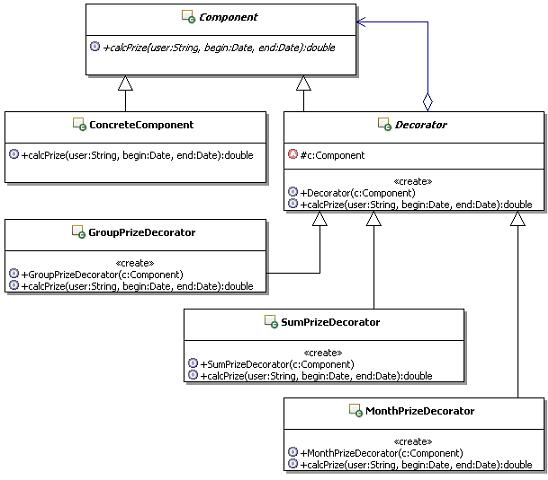

# 22.2 Java 设计模式系列教程（二二）装饰器模式之场景分析

[Java 设计模式系列教程目录](https://github.com/binarylei/java/blob/master/%E8%AE%BE%E8%AE%A1%E6%A8%A1%E5%BC%8F/01.%22Java%22%E8%AE%BE%E8%AE%A1%E6%A8%A1%E5%BC%8F%E7%B3%BB%E5%88%97%E6%95%99%E7%A8%8B%EF%BC%88%E4%B8%80%EF%BC%89%E7%9B%AE%E5%BD%95.md)

[22.1 Java 设计模式系列教程（二二）装饰器模式之原理](22.1%22Java%22%E8%AE%BE%E8%AE%A1%E6%A8%A1%E5%BC%8F%E7%B3%BB%E5%88%97%E6%95%99%E7%A8%8B%EF%BC%88%E4%BA%8C%E5%8D%81%EF%BC%89%E4%BA%AB%E5%85%83%E6%A8%A1%E5%BC%8F%E4%B9%8B%E5%8E%9F%E7%90%86.md)

[22.2 Java 设计模式系列教程（二二）装饰器模式之场景分析](22.2%22Java%22%E8%AE%BE%E8%AE%A1%E6%A8%A1%E5%BC%8F%E7%B3%BB%E5%88%97%E6%95%99%E7%A8%8B%EF%BC%88%E4%BA%8C%E5%8D%81%EF%BC%89%E4%BA%AB%E5%85%83%E6%A8%A1%E5%BC%8F%E4%B9%8B%E5%9C%BA%E6%99%AF%E5%88%86%E6%9E%90.md)

[22.3 Java 设计模式系列教程（二二）装饰器模式之扩展](22.3%22Java%22%E8%AE%BE%E8%AE%A1%E6%A8%A1%E5%BC%8F%E7%B3%BB%E5%88%97%E6%95%99%E7%A8%8B%EF%BC%88%E4%BA%8C%E5%8D%81%EF%BC%89%E4%BA%AB%E5%85%83%E6%A8%A1%E5%BC%8F%E4%B9%8B%E6%89%A9%E5%B1%95.md)

## 22.2.1 使用场景

考虑这样一个实际应用：就是如何实现灵活的奖金计算。简化一下，演示用的奖金计算体系如下：

1. 每个人当月业务奖金 = 当月销售额 X  3%
2. 每个人累计奖金 = 总的回款额 X  0.1%
3. 团队奖金 = 团队总销售额 X 1%

## 22.2.2 不用模式的实现

### 代码实现 [demo2](https://github.com/binarylei/demo/tree/master/demo-design/src/main/java/com/github/binarylei/design/decorator/demo2)

一个人的奖金分成很多个部分，要实现奖金计算，主要就是要按照各个奖金计算的规则，把这个人可以获取的每部分奖金计算出来，然后计算一个总和，这就是这个人可以得到的奖金。

（1）为了演示，先准备点测试数据，在内存中模拟数据库，示例代码如下：

```java
/**
 * 在内存中模拟数据库，准备点测试数据，好计算奖金
 */
public class TempDB {
    private TempDB(){}
    /**
     * 记录每个人的月度销售额，只用了人员，月份没有用
     */
    public static Map<String,Double> mapMonthSaleMoney = new HashMap<String,Double>();
    
    static{
        //填充测试数据
        mapMonthSaleMoney.put("张三", 10000.0);
        mapMonthSaleMoney.put("李四", 20000.0);
        mapMonthSaleMoney.put("王五", 30000.0);
    }
}
```

（2）按照奖金计算的规则，实现奖金计算，示例代码如下：

```java
/**
 * 计算奖金的对象
 */
public class Prize {
    /**
     * 计算某人在某段时间内的奖金，有些参数在演示中并不会使用，
     * 但是在实际业务实现上是会用的，为了表示这是个具体的业务方法，
     * 因此这些参数被保留了
     * @param user 被计算奖金的人员
     * @param begin 计算奖金的开始时间
     * @param end 计算奖金的结束时间
     * @return 某人在某段时间内的奖金
     */
    public  double calcPrize(String user,Date begin,Date end){
        double prize = 0.0;
        
        //计算当月业务奖金，所有人都会计算
        prize = this.monthPrize(user, begin, end);
        //计算累计奖金
        prize += this.sumPrize(user, begin, end);
        
        //需要判断该人员是普通人员还是业务经理，团队奖金只有业务经理才有
        if(this.isManager(user)){
            prize += this.groupPrize(user, begin, end);
        }
        
        return prize;
    }

    /**
     * 计算某人的当月业务奖金，参数重复，就不再注释了
     */
    private double monthPrize(String user, Date begin, Date end) {
        //计算当月业务奖金,按照人员去获取当月的业务额，然后再乘以3%
        double prize = TempDB.mapMonthSaleMoney.get(user) * 0.03;
        System.out.println(user+"当月业务奖金"+prize);
        return prize;
    }

    /**
     * 计算某人的累计奖金，参数重复，就不再注释了
     */
    public double sumPrize(String user, Date begin, Date end) {
        //计算累计奖金,其实这里应该按照人员去获取累计的业务额，然后再乘以0.1%
        //简单演示一下，假定大家的累计业务额都是1000000元
        double prize = 1000000 * 0.001;
        System.out.println(user+"累计奖金"+prize);
        return prize;
    }

    /**
     * 判断人员是普通人员还是业务经理
     * @param user 被判断的人员
     * @return true表示是业务经理,false表示是普通人员
     */
    private boolean isManager(String user){
        //应该从数据库中获取人员对应的职务
        //为了演示，简单点判断，只有王五是经理
        if("王五".equals(user)){
            return true;            
        }
        return false;
    }

    /**
     * 计算当月团队业务奖，参数重复，就不再注释了
     */
    public double groupPrize(String user, Date begin, Date end) {
        //计算当月团队业务奖金，先计算出团队总的业务额，然后再乘以1%，假设都是一个团队的
        double group = 0.0;
        for(double d : TempDB.mapMonthSaleMoney.values()){
            group += d;
        }
        double prize = group * 0.01;
        System.out.println(user+"当月团队业务奖金"+prize);
        return prize;
    }
}
```

（3）写个客户端来测试一下，看看是否能正确地计算奖金，示例代码如下：

```java
public class Client {
    public static void main(String[] args) {
        //先创建计算奖金的对象
        Prize p = new Prize();
        
        //日期对象都没有用上，所以传null就可以了
        double zs = p.calcPrize("张三",null,null);        
        System.out.println("==========张三应得奖金："+zs);
        double ls = p.calcPrize("李四",null,null);
        System.out.println("==========李四应得奖金："+ls);     
        double ww = p.calcPrize("王五",null,null);
        System.out.println("==========王经理应得奖金："+ww);
    }
}

```

运行结果如下：

```
张三当月业务奖金300.0
张三累计奖金1000.0
==========张三应得奖金：1300.0
李四当月业务奖金600.0
李四累计奖金1000.0
==========李四应得奖金：1600.0
王五当月业务奖金900.0
王五累计奖金1000.0
王五当月团队业务奖金600.0
==========王经理应得奖金：2500.0
```

### 问题出来了

 总结一下，奖金计算面临如下问题：

1. 计算逻辑复杂
2. 要有足够灵活性，可以方便的增加或者减少功能
3. 要能动态的组合计算方式，不同的人参与的计算不同

上面描述的奖金计算的问题，绝对没有任何夸大成分，相反已经简化不少了，还有更多麻烦没有写上来，毕竟我们的重点在设计模式，而不是业务。

把上面的问题抽象一下，设若有一个计算奖金的对象，现在需要能够灵活的给它增加和减少功能，还需要能够动态的组合功能，每个功能就相当于在计算奖金的某个部分。

现在的问题就是：如何才能够透明的给一个对象增加功能，并实现功能的动态组合呢？

## 22.2.3 解决方案

### 应用装饰器模式的解决思路

要透明的给一个对象增加功能，并实现功能的动态组合。

所谓透明的给一个对象增加功能，换句话说就是要给一个对象增加功能，但是不能让这个对象知道，也就是不能去改动这个对象。而实现了能够给一个对象透明的增加功能，自然就能够实现功能的动态组合，比如原来的对象有A功能，现在透明的给它增加了一个B功能，是不是就相当于动态组合了A和B功能呢。

要想实现透明的给一个对象增加功能，也就是要扩展对象的功能了，使用继承啊，有人马上提出了一个方案，但很快就被否决了，那要减少或者修改功能呢？事实上继承是非常不灵活的复用方式。那就用“对象组合”嘛，又有人提出新的方案来了，这个方案得到了大家的赞同。

在装饰模式的实现中，为了能够和原来使用被装饰对象的代码实现无缝结合，是通过定义一个抽象类，让这个类实现与被装饰对象相同的接口，然后在具体实现类里面，转调被装饰的对象，在转调的前后添加新的功能，这就实现了给被装饰对象增加功能，这个思路跟“对象组合”非常类似。

在转调的时候，如果觉得被装饰的对象的功能不再需要了，还可以直接替换掉，也就是不再转调，而是在装饰对象里面完全全新的实现。

先看看现在示例的整体结构，好整体理解和把握示例，如图22.2所示：



### 代码实现 [demo3](https://github.com/binarylei/demo/tree/master/demo-design/src/main/java/com/github/binarylei/design/state/demo3)

（1）计算奖金的组件接口和基本的实现对象

在计算奖金的组件接口中，需要定义原本的业务方法，也就是实现奖金计算的方法，示例代码如下：

```java
/**
 * 计算奖金的组件接口
 */
public abstract class Component {
    /**
     * 计算某人在某段时间内的奖金，有些参数在演示中并不会使用，
     * 但是在实际业务实现上是会用的，为了表示这是个具体的业务方法，
     * 因此这些参数被保留了
     * @param user 被计算奖金的人员
     * @param begin 计算奖金的开始时间
     * @param end 计算奖金的结束时间
     * @return 某人在某段时间内的奖金
     */
    public abstract double calcPrize(String user,Date begin,Date end);
}
```

为这个业务接口提供一个基本的实现，示例代码如下：

```java
/**
 * 基本的实现计算奖金的类，也是被装饰器装饰的对象
 */
public class ConcreteComponent extends Component{
    
    public double calcPrize(String user, Date begin, Date end) {
        //只是一个默认的实现，默认没有奖金
        return 0;
    }
}
```

（2）定义抽象的装饰器

在进一步定义装饰器之前，先定义出各个装饰器公共的父类，在这里定义所有装饰器对象需要实现的方法。这个父类应该实现组件的接口，这样才能保证装饰后的对象仍然可以继续被装饰。示例代码如下：

```java
/**
 * 装饰器的接口，需要跟被装饰的对象实现同样的接口
 */
public abstract class Decorator extends Component{
    /**
     * 持有被装饰的组件对象
     */
    protected Component c;

    /**
     * 通过构造方法传入被装饰的对象
     * @param c 被装饰的对象
     */
    public Decorator(Component c){
        this.c = c;
    }

    public double calcPrize(String user, Date begin, Date end) {
        //转调组件对象的方法
        return c.calcPrize(user, begin, end);
    }
}
```

（3）定义一系列的装饰器对象

用一个具体的装饰器对象，来实现一条计算奖金的规则，现在有三条计算奖金的规则，那就对应有三个装饰器对象来实现，依次来看看它们的实现。

这些装饰器涉及到的TempDB跟以前一样，这里就不去赘述了，示例代码如下：

```java
/**
 * 装饰器对象，计算当月团队业务奖金
 */
public class GroupPrizeDecorator extends Decorator{
    public GroupPrizeDecorator(Component c){
        super(c);
    }
    
    public double calcPrize(String user, Date begin, Date end) {
        //1：先获取前面运算出来的奖金
        double money = super.calcPrize(user, begin, end);
        //2：然后计算当月团队业务奖金，先计算出团队总的业务额，然后再乘以1%
        //假设都是一个团队的
        double group = 0.0;
        for(double d : TempDB.mapMonthSaleMoney.values()){
            group += d;
        }
        double prize = group * 0.01;
        System.out.println(user+"当月团队业务奖金"+prize);
        return money + prize;
    }
}

/**
 * 装饰器对象，计算当月业务奖金
 */
public class MonthPrizeDecorator extends Decorator{
    public MonthPrizeDecorator(Component c){
        super(c);
    }
    
    public double calcPrize(String user, Date begin, Date end) {
        //1：先获取前面运算出来的奖金
        double money = super.calcPrize(user, begin, end);
        //2：然后计算当月业务奖金,按照人员和时间去获取当月的业务额，然后再乘以3%
        double prize = TempDB.mapMonthSaleMoney.get(user) * 0.03;
        System.out.println(user+"当月业务奖金"+prize);
        return money + prize;
    }
}
```

（4）使用装饰器的客户端

```java
/**
 * 使用装饰模式的客户端
 */
public class Client {
    public static void main(String[] args) {
        //先创建计算基本奖金的类，这也是被装饰的对象
        Component c1 = new ConcreteComponent();
        
        //然后对计算的基本奖金进行装饰，这里要组合各个装饰
        //说明，各个装饰者之间最好是不要有先后顺序的限制，也就是先装饰谁和后装饰谁都应该是一样的
        
        //先组合普通业务人员的奖金计算
        Decorator d1 = new MonthPrizeDecorator(c1);
        Decorator d2 = new SumPrizeDecorator(d1);   
        
        //注意：这里只需要使用最后组合好的对象调用业务方法即可，会依次调用回去
        //日期对象都没有用上，所以传null就可以了
        double zs = d2.calcPrize("张三",null,null);       
        System.out.println("==========张三应得奖金："+zs);
        double ls = d2.calcPrize("李四",null,null);
        System.out.println("==========李四应得奖金："+ls);
        
        //如果是业务经理，还需要一个计算团队的奖金计算
        Decorator d3 = new GroupPrizeDecorator(d2);
        double ww = d3.calcPrize("王五",null,null);
        System.out.println("==========王经理应得奖金："+ww);
        
    }
}
```