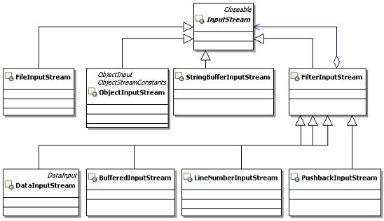

# 22.3 Java 设计模式系列教程（二二）装饰器模式之扩展

[Java 设计模式系列教程目录](https://github.com/binarylei/java/blob/master/%E8%AE%BE%E8%AE%A1%E6%A8%A1%E5%BC%8F/01.%22Java%22%E8%AE%BE%E8%AE%A1%E6%A8%A1%E5%BC%8F%E7%B3%BB%E5%88%97%E6%95%99%E7%A8%8B%EF%BC%88%E4%B8%80%EF%BC%89%E7%9B%AE%E5%BD%95.md)

[22.1 Java 设计模式系列教程（二二）装饰器模式之原理](22.1%22Java%22%E8%AE%BE%E8%AE%A1%E6%A8%A1%E5%BC%8F%E7%B3%BB%E5%88%97%E6%95%99%E7%A8%8B%EF%BC%88%E4%BA%8C%E5%8D%81%EF%BC%89%E4%BA%AB%E5%85%83%E6%A8%A1%E5%BC%8F%E4%B9%8B%E5%8E%9F%E7%90%86.md)

[22.2 Java 设计模式系列教程（二二）装饰器模式之场景分析](22.2%22Java%22%E8%AE%BE%E8%AE%A1%E6%A8%A1%E5%BC%8F%E7%B3%BB%E5%88%97%E6%95%99%E7%A8%8B%EF%BC%88%E4%BA%8C%E5%8D%81%EF%BC%89%E4%BA%AB%E5%85%83%E6%A8%A1%E5%BC%8F%E4%B9%8B%E5%9C%BA%E6%99%AF%E5%88%86%E6%9E%90.md)

[22.3 Java 设计模式系列教程（二二）装饰器模式之扩展](22.3%22Java%22%E8%AE%BE%E8%AE%A1%E6%A8%A1%E5%BC%8F%E7%B3%BB%E5%88%97%E6%95%99%E7%A8%8B%EF%BC%88%E4%BA%8C%E5%8D%81%EF%BC%89%E4%BA%AB%E5%85%83%E6%A8%A1%E5%BC%8F%E4%B9%8B%E6%89%A9%E5%B1%95.md)

## 22.3.1 不需要共享的享元实现

可能有些朋友看到这个标题会很疑惑，享元不就是要共享的对象吗？不共享，叫什么享元啊？

确实有不需要共享的享元实现，这种情况多出现在组合结构中，对于使用已经缓存的享元组合出来的对象，就没有必要再缓存了，也就是把已经缓存的享元当做叶子结点，组合出来的组合对象就不需要再被缓存了。也把这种享元称为复合享元。

比如上面的权限描述，如果出现组合权限描述，在这个组合对象里面包含很多个共享的权限描述，那么这个组合对象就不用缓存了，这个组合对象的存在只是为了在授权的时候更加方便。

具体点说吧，比如要给某人分配“薪资数据”这个安全实体的“修改”权限，那么一定会把“薪资数据”的“查看权限”也分配给这个人，如果按照前面的做法，这就需要分配两个对象，为了方便，干脆把这两个描述组合起来，打包成一个对象，命名成为“操作薪资数据”，那么分配权限的时候，可以这么描述：

```
把  “操作薪资数据”  分配给   张三
```

这句话的意思就相当于

```
把  “薪资数据” 的  “查看”权限   分配给   张三
把  “薪资数据” 的  “修改”权限   分配给   张三
```

这样一来，“操作薪资数据”就相当于是一个不需要共享的享元，它实际由享元“薪资数据 的 查看 权限”，和享元“薪资数据 的 修改 权限”这两个享元组合而成，因此“操作薪资数据”本身也就不需要再共享了。

这样分配权限的时候就会简单一点。

但是这种组合对象，在权限系统中一般不用于验证，也就是说验证的时候还是一个一个进行判断，因为在存储授权信息的时候是一条一条存储的。但也不排除有些时候始终要检查多个权限，干脆把这些权限打包，然后直接验证是否有这个组合权限，只是这种情况应用得比较少而已。

还是用示例来说明吧，在上面已经实现的系统里面添加不需要共享的享元实现。此时系统结构如图22.4所示：



### 代码实现 [demo4](https://github.com/binarylei/demo/tree/master/demo-design/src/main/java/com/github/binarylei/design/decorator/demo4)

（1）首先要在享元接口上添加上对组合对象的操作，主要是要添加向组合对象中加入子对象的方法，示例代码如下：

```java
/***
 * 描述授权数据的享元接口
 */
public interface decorator {
    /**
     * 判断传入的安全实体和权限，是否和享元对象内部状态匹配
     * @param securityEntity 安全实体
     * @param permit 权限
     * @return true表示匹配，false表示不匹配
     */
    public boolean match(String securityEntity, String permit);

    /**
     * 为decorator添加子decorator对象
     * @param f 被添加的子decorator对象
     */
    public void add(decorator f);   
}
```

（2）享元接口改变了，那么原来共享的享元对象也需要实现这个方法，这个方法主要是针对组合对象的，因此在叶子对象里面抛出不支持的例外就好了，示例代码如下：

```java
/**
 * 封装授权数据中重复出现部分的享元对象
 */
public class Authorizationdecorator implements decorator{
    /**
     * 内部状态，安全实体
     */
    private String securityEntity;
    /**
     * 内部状态，权限
     */
    private String permit;
    /**
     * 构造方法，传入状态数据
     * @param state 状态数据，包含安全实体和权限的数据，用","分隔
     */
    public Authorizationdecorator(String state){
        String ss[] = state.split(",");
        securityEntity = ss[0];
        permit = ss[1];
    }
    
    public String getSecurityEntity() {
        return securityEntity;
    }
    public String getPermit() {
        return permit;
    }

    public boolean match(String securityEntity, String permit) {
        return this.securityEntity.equals(securityEntity)
                && this.permit.equals(permit);
    }

    public void add(decorator f) {
        throw new UnsupportedOperationException("对象不支持这个功能");
    }
}
```

（3）接下来实现新的不需要共享的享元对象，其实就是组合共享享元对象的对象，这个组合对象中，需要保存所有的子对象，另外它在实现match方法的时候，是通过递归的方式，在整个组合结构中进行匹配。示例代码如下：

```java
/**
 * 不需要共享的享元对象的实现，也是组合模式中的组合对象
 */
public class UnsharedConcretedecorator implements decorator{
    /**
     * 记录每个组合对象所包含的子组件
     */
    private List<decorator> list = new ArrayList<decorator>();
    
    public void add(decorator f) {
        list.add(f);
    }
    
    public boolean match(String securityEntity, String permit) {
        for(decorator f : list){
            //递归调用
            if(f.match(securityEntity, permit)){
                return true;
            }
        }
        return false;
    }
}
```

（4）在继续实现之前，先来准备测试数据，也就是TestDB，需要有一些改变。

1. 首先是授权数据要区分是单条的授权，还是组合的授权，这个在每条授权数据后面添加一个标识来描述
2。 然后增加一个描述组合数据的记录，使用一个Map来存放

具体的示例代码如下：

```java
/**
 * 供测试用，在内存中模拟数据库中的值
 */
public class TestDB {
    /**
     * 用来存放单独授权数据的值
     */
    public static Collection<String> colDB = new ArrayList<String>();
    /**
     * 用来存放组合授权数据的值，key为组合数据的id，value为该组合包含的多条授权数据的值
     */
    public static Map<String,String[]> mapDB = new HashMap<String,String[]>();
    
    static{
        //通过静态块来填充模拟的数据，增加一个标识来表明是否组合授权数据
        colDB.add("张三,人员列表,查看,1");
        colDB.add("李四,人员列表,查看,1");
        colDB.add("李四,操作薪资数据,,2");
        
        mapDB.put("操作薪资数据",new String[]{"薪资数据,查看","薪资数据,修改"});
        
        //增加更多的授权数据
        for(int i=0;i<3;i++){
            colDB.add("张三"+i+",人员列表,查看,1");
        }
    }   
}
```

（5）享元工厂不需要变化，这里就不去赘述了

（6）接下来该实现安全管理的类了，这个类相当于装饰器模式的Client角色，这次在这个类里面，不单纯使用共享的享元对象，它还会使用不需要共享的享元对象。

主要的变化集中在queryByUser方法里面，原本只是通过享元工厂来获取共享的享元对象即可，但是这次还需要在这里创建不需要共享的享元对象。示例代码如下：

```java
/**
 * 安全管理，实现成单例
 */
public class SecurityMgr {
    private static SecurityMgr securityMgr = new SecurityMgr();
    private SecurityMgr(){
    }
    public static SecurityMgr getInstance(){
        return securityMgr;
    }

    /**
     * 在运行期间，用来存放登录人员对应的权限，
     * 在Web应用中，这些数据通常会存放到session中
     */
    private Map<String,Collection<decorator>> map =
            new HashMap<String,Collection<decorator>>();

    /**
     * 模拟登录的功能
     * @param user 登录的用户
     */
    public void login(String user){
        //登录的时候就需要把该用户所拥有的权限，从数据库中取出来，放到缓存中去
        Collection<decorator> col = queryByUser(user);
        map.put(user, col);
    }

    /**
     * 判断某用户对某个安全实体是否拥有某权限
     * @param user 被检测权限的用户
     * @param securityEntity 安全实体
     * @param permit 权限
     * @return true表示拥有相应权限，false表示没有相应权限
     */
    public boolean hasPermit(String user,String securityEntity,String permit){
        Collection<decorator> col = map.get(user);
        System.out.println("现在测试"+securityEntity+"的"+permit+"权限，map.size="+map.size());
        if(col==null || col.size()==0){
            System.out.println(user+"没有登录或是没有被分配任何权限");
            return false;
        }
        for(decorator fm : col){
            //输出当前实例，看看是否同一个实例对象
            System.out.println("fm=="+fm);
            if(fm.match(securityEntity, permit)){
                return true;
            }
        }
        return false;
    }

    /**
     * 从数据库中获取某人所拥有的权限
     * @param user 需要获取所拥有的权限的人员
     * @return 某人所拥有的权限
     */
    private Collection<decorator> queryByUser(String user){
        Collection<decorator> col = new ArrayList<decorator>();

        for(String s : TestDB.colDB){
            String ss[] = s.split(",");
            if(ss[0].equals(user)){
                decorator fm = null;
                if(ss[3].equals("2")){
                    //表示是组合
                    fm = new UnsharedConcretedecorator();
                    //获取需要组合的数据
                    String tempSs[] = TestDB.mapDB.get(ss[1]);
                    for(String tempS : tempSs){
                        decorator tempFm = decoratorFactory.getInstance().getdecorator(tempS);
                        //把这个对象加入到组合对象中
                        fm.add(tempFm);
                    }
                }else{
                    fm = decoratorFactory.getInstance().getdecorator(ss[1]+","+ss[2]);
                }

                col.add(fm);
            }
        }
        return col;
    }
}
```

（7）客户端测试没有太大的变化，增加一条测试“李四对薪资数据的修改权限”，示例代码如下：

```java
public class Client {
    public static void main(String[] args) throws Exception{
        //需要先登录，然后再判断是否有权限
        SecurityMgr mgr = SecurityMgr.getInstance();
        mgr.login("张三");
        mgr.login("李四");        
        boolean f1 = mgr.hasPermit("张三", "薪资数据", "查看");
        boolean f2 = mgr.hasPermit("李四", "薪资数据", "查看");
        boolean f3 = mgr.hasPermit("李四", "薪资数据", "修改");
        
        System.out.println("f1 == " + f1);
        System.out.println("f2 == " + f2);
        System.out.println("f3 == " + f3);
        
        for(int i=0;i<3;i++){
            mgr.login("张三" + i);
            mgr.hasPermit("张三" + i, "薪资数据", "查看");
        }
    }
}
```

可以运行测试一下，看看效果，结果示例如下：

```
现在测试薪资数据的查看权限，map.size=2
fm==com.github.binarylei.design.decorator.demo4.Authorizationdecorator@1453f44
现在测试薪资数据的查看权限，map.size=2
fm==com.github.binarylei.design.decorator.demo4.Authorizationdecorator@1453f44
fm==com.github.binarylei.design.decorator.demo4.UnsharedConcretedecorator@ad8086
现在测试薪资数据的修改权限，map.size=2
fm==com.github.binarylei.design.decorator.demo4.Authorizationdecorator@1453f44
fm==com.github.binarylei.design.decorator.demo4.UnsharedConcretedecorator@ad8086
f1 == false
f2 == true
f3 == true
现在测试薪资数据的查看权限，map.size=3
fm==com.github.binarylei.design.decorator.demo4.Authorizationdecorator@1453f44
现在测试薪资数据的查看权限，map.size=4
fm==com.github.binarylei.design.decorator.demo4.Authorizationdecorator@1453f44
现在测试薪资数据的查看权限，map.size=5
fm==com.github.binarylei.design.decorator.demo4.Authorizationdecorator@1453f44
```

## 22.3.2 对享元对象的管理

虽然装饰器模式对于共享的享元对象实例的管理要求，没有实例池对实例管理的要求那么高，但是也还是有很多自身的特点功能，比如：引用计数、垃圾清除等。所谓垃圾，就是在缓存中存在，但是不再需要被使用的缓存中的对象。

所谓引用计数，就是享元工厂能够记录每个享元被使用的次数；而垃圾清除，则是大多数缓存管理都有的功能，缓存不能只往里面放数据，在不需要这些数据的时候，应该把这些数据从缓存中清除，释放相应的内存空间，以节省资源。

在前面的示例中，共享的享元对象是很多人共享的，基本上可以一直存在于系统中，不用清除。但是垃圾清除是享元对象管理的一个很常见功能，还是通过示例给大家讲一下，看看如何实现这些常见的功能。

1. 实现引用计数的基本思路

    要实现引用计数，就在享元工厂里面定义一个Map，它的key值跟缓存享元对象的key是一样的，而value就是被引用的次数，这样当外部每次获取该享元的时候，就把对应的引用计数取出来加上1，然后再记录回去。

2. 实现垃圾回收的基本思路

    要实现垃圾回收就比较麻烦点，首先要能确定哪些是垃圾？其次是何时回收？还有由谁来回收？如何回收？解决了这些问题，也就能实现垃圾回收了。

    为了确定哪些是垃圾，一个简单的方案是这样的，定义一个缓存对象的配置对象，在这个对象中描述了缓存的开始时间和最长不被使用的时间，这个时候判断是垃圾的计算公式如下：当前的时间 - 缓存的开始时间 >= 最长不被使用的时间。当然，每次这个对象被使用的时候，就把那个缓存开始的时间更新为使用时的当前时间，也就是说如果一直有人用的话，这个对象是不会被判断为垃圾的。

    何时回收的问题，当然是判断出来是垃圾了就可以回收了。

    关键是谁来判断垃圾，还有谁来回收垃圾的问题。一个简单的方案是定义一个内部的线程，这个线程在享元工厂被创建的时候就启动运行。由这个线程每隔一定的时间来循环缓存中所有对象的缓存配置，看看是否是垃圾，如果是垃圾，那就可以启动回收了。

    怎么回收呢？这个比较简单，就是直接从缓存的map对象中删除掉相应的对象，让这些对象没有引用的地方，那么这些对象就可以等着被虚拟机的垃圾回收来回收掉了。

### 代码实现 [demo5](https://github.com/binarylei/demo/tree/master/demo-design/src/main/java/com/github/binarylei/design/decorator/demo5)

（1）分析了这么多，还是看代码示例会比较清楚，先看缓存配置对象，示例代码如下：

```java
/**
 * 描述享元对象缓存的配置对象
 */
public class CacheConfModel{
    /**
     * 缓存开始计时的开始时间
     */
    private long beginTime;
    /**
     * 缓存对象存放的持续时间，其实是最长不被使用的时间
     */
    private double durableTime;
    /**
     * 缓存对象需要被永久存储，也就是不需要从缓存中删除
     */
    private boolean forever;
    public boolean isForever() {
        return forever;
    }
    public void setForever(boolean forever) {
        this.forever = forever;
    }
    public long getBeginTime() {
        return beginTime;
    }
    public void setBeginTime(long beginTime) {
        this.beginTime = beginTime;
    }
    public double getDurableTime() {
        return durableTime;
    }
    public void setDurableTime(double durableTime) {
        this.durableTime = durableTime;
    }
}
```

（2）对享元对象的管理的工作，是由享元工厂来完成的，因此上面的功能，也集中在享元工厂里面来实现，在上一个例子的基础之上，来实现这些功能，改进后的享元工厂相对而言稍复杂一点，大致有如下改变：

1. 添加一个Map，来缓存被共享对象的缓存配置的数据
2. 添加一个Map，来记录缓存对象被引用的次数
3. 为了测试方便，定义了一个常量来描述缓存的持续时间
4. 提供获取某个享元被使用的次数的方法
5. 在获取享元的对象里面，就要设置相应的引用计数和缓存设置了，示例采用的是内部默认设置一个缓存设置，其实也可以改造一下获取享元的方法，从外部传入缓存设置的数据
6. 提供一个清除缓存的线程，实现判断缓存数据是否已经是垃圾了，如果是，那就把它从缓存中清除掉

基本上重新实现了享元工厂，示例代码如下：

```java
/**
 * 享元工厂，通常实现成为单例
 * 加入实现垃圾回收和引用计数的功能
 */
public class decoratorFactory {
    private static decoratorFactory factory = new decoratorFactory();
    private decoratorFactory(){
        //启动清除缓存值的线程
        Thread t = new ClearCache();
        t.start();
    }
    public static decoratorFactory getInstance(){
        return factory;
    }
    /**
     * 缓存多个decorator对象
     */
    private Map<String,decorator> fsMap = new HashMap<String,decorator>();
    /**
     * 用来缓存被共享对象的缓存配置，key值和上面map的一样
     */
    private  Map<String,CacheConfModel> cacheConfMap = new HashMap<String,CacheConfModel>();
    /**
     * 用来记录缓存对象被引用的次数，key值和上面map的一样
     */
    private  Map<String,Integer> countMap = new HashMap<String,Integer>();
    /**
     * 默认保存6秒钟，主要为了测试方便，这个时间可以根据应用的要求设置，比如30分钟
     */
    private final  long DURABLE_TIME = 6*1000L; 
    
    /**
     * 获取某个享元被使用的次数
     * @param key 享元的key
     * @return 被使用的次数
     */
    public synchronized int getUseTimes(String key){
        Integer count = countMap.get(key);
        if(count==null){
            count = 0;
        }
        return count;
    }
    
    /**
     * 获取key对应的享元对象
     * @param key 获取享元对象的key
     * @return key对应的享元对象
     */
    public synchronized decorator getdecorator(String key) {
        decorator f = fsMap.get(key);
        //换一个更简单点的写法
        if(f==null){
            f = new Authorizationdecorator(key);
            fsMap.put(key,f);
            //同时设置引用计数
            countMap.put(key, 1);
            //同时设置缓存配置数据
            CacheConfModel cm = new CacheConfModel();
            cm.setBeginTime(System.currentTimeMillis());
            cm.setForever(false);
            cm.setDurableTime(DURABLE_TIME);
            
            cacheConfMap.put(key, cm);
        }else{
            //表示还在使用，那么应该重新设置缓存配置
            CacheConfModel cm = cacheConfMap.get(key);
            cm.setBeginTime(System.currentTimeMillis());
            //设置回去
            this.cacheConfMap.put(key, cm);
            //同时计数加1
            Integer count = countMap.get(key);
            count++;
            countMap.put(key, count);
        }
        return f;
    }
    
    /**
     * 删除key对应的享元对象，连带清除对应的缓存配置和引用次数的记录，不对外
     * @param key 要删除的享元对象的key
     */
    private synchronized void removedecorator(String key){
        this.fsMap.remove(key);
        this.cacheConfMap.remove(key);
        this.countMap.remove(key);
    }

    /**
     * 维护清除缓存的线程，内部使用
     */
    private  class ClearCache extends Thread{
        public void run(){
            while(true){
                Set<String> tempSet = new HashSet<String>();
                Set<String> set = cacheConfMap.keySet();
                for(String key : set){
                    CacheConfModel ccm = cacheConfMap.get(key);
                    //比较是否需要清除
                    if((System.currentTimeMillis() - ccm.getBeginTime()) >= ccm.getDurableTime()){
                        //可以清除，先记录下来
                        tempSet.add(key);
                    }
                }
                //真正清除
                for(String key : tempSet){
                    decoratorFactory.getInstance().removedecorator(key);                    
                }
                System.out.println("now thread="+fsMap.size()+",fsMap=="+fsMap.keySet());
                //休息1秒再重新判断
                try {
                    Thread.sleep(1000L);
                } catch (InterruptedException e) {
                    e.printStackTrace();
                }
            }
        }
    }
}
```

注意：getUseTimes、removedecorator和getdecorator这几个方法是加了同步的，原因是在多线程环境下使用它们，容易出现并发错误，比如一个线程在获取享元对象，而另一个线程在删除这个缓存对象。

（3）要想看出引用计数的效果来，SecurityMgr需要进行一点修改，至少不要再缓存数据了，要直接从享元工厂中获取数据，否则就没有办法准确引用计数了，大致改变如下：

1. 去掉了放置登录人员对应权限数据的缓存
2. 不需要实现登录功能，在这个示意程序里面，登录方法已经不用实现任何功能，因此直接去掉
3. 原来通过map获取值的地方，直接通过queryByUser获取就好了

示例代码如下：

```java
/**
 * 安全管理，实现成单例
 */
public class SecurityMgr {
    private static SecurityMgr securityMgr = new SecurityMgr();
    private SecurityMgr(){      
    }
    public static SecurityMgr getInstance(){
        return securityMgr;
    }
    
    /**
     * 判断某用户对某个安全实体是否拥有某权限
     * @param user 被检测权限的用户 
     * @param securityEntity 安全实体
     * @param permit 权限
     * @return true表示拥有相应权限，false表示没有相应权限
     */
    public boolean hasPermit(String user,String securityEntity,String permit){
        Collection<decorator> col = this.queryByUser(user);
        if(col==null || col.size()==0){
            System.out.println(user+"没有登录或是没有被分配任何权限");
            return false;
        }
        for(decorator fm : col){
            if(fm.match(securityEntity, permit)){
                return true;
            }
        }
        return false;
    }

    /**
     * 从数据库中获取某人所拥有的权限
     * @param user 需要获取所拥有的权限的人员
     * @return 某人所拥有的权限
     */
    private Collection<decorator> queryByUser(String user){
        Collection<decorator> col = new ArrayList<decorator>();
        
        for(String s : TestDB.colDB){
            String ss[] = s.split(",");
            if(ss[0].equals(user)){
                decorator fm = null;
                if(ss[3].equals("2")){
                    //表示是组合
                    fm = new UnsharedConcretedecorator();
                    //获取需要组合的数据
                    String tempSs[] = TestDB.mapDB.get(ss[1]);
                    for(String tempS : tempSs){
                        decorator tempFm = decoratorFactory.getInstance().getdecorator(tempS);
                        //把这个对象加入到组合对象中
                        fm.add(tempFm);
                    }
                }else{
                    fm = decoratorFactory.getInstance().getdecorator(ss[1]+","+ss[2]);
                }
                
                col.add(fm);
            }
        }
        return col;
    }   
}
```

（4）还是写个客户端来试试看，上面的享元工厂能否实现对享元对象的管理，尤其是对于垃圾回收和计数方面的功能，对于垃圾回收的功能不需要新加任何的测试代码，而对于引用计数的功能，需要写代码来调用才能看到效果，示例代码如下：

```java
public class Client {
    public static void main(String[] args) throws Exception{
        SecurityMgr mgr = SecurityMgr.getInstance();
        boolean f1 = mgr.hasPermit("张三","薪资数据","查看");
        boolean f2 = mgr.hasPermit("李四","薪资数据","查看");
        boolean f3 = mgr.hasPermit("李四","薪资数据","修改");

        //Thread.sleep(4000);
        for(int i=0;i<3;i++){
            mgr.hasPermit("张三"+i,"薪资数据","查看");
        }   
        
        //特别提醒：这里查看的引用次数，不是指测试使用的次数
        //指的是SecurityMgr的queryByUser方法通过享元工厂去获取享元对象的次数
        System.out.println("薪资数据,查看 被引用了"+decoratorFactory.getInstance().getUseTimes("薪资数据,查看")+"次");
        System.out.println("薪资数据,修改 被引用了"+decoratorFactory.getInstance().getUseTimes("薪资数据,修改")+"次");
        System.out.println("人员列表,查看 被引用了"+decoratorFactory.getInstance().getUseTimes("人员列表,查看")+"次");
    }
}
```

进行缓存的垃圾回收功能的是个线程在运行，所以你不终止该线程运行，程序会一直运行下去，运行部分结果如下：

```
薪资数据,查看 被引用了2次
薪资数据,修改 被引用了2次
人员列表,查看 被引用了6次
now thread=3,fsMap==[人员列表,查看, 薪资数据,修改, 薪资数据,查看]
now thread=3,fsMap==[人员列表,查看, 薪资数据,修改, 薪资数据,查看]
now thread=3,fsMap==[人员列表,查看, 薪资数据,修改, 薪资数据,查看]
now thread=3,fsMap==[人员列表,查看, 薪资数据,修改, 薪资数据,查看]
now thread=3,fsMap==[人员列表,查看, 薪资数据,修改, 薪资数据,查看]
now thread=3,fsMap==[人员列表,查看, 薪资数据,修改, 薪资数据,查看]
now thread=0,fsMap==[]
now thread=0,fsMap==[]
```

## 22.3.3  相关模式

* 装饰器模式与单例模式

    这两个模式可以组合使用。

    通常情况下，装饰器模式中的享元工厂可以实现成为单例。另外，享元工厂里面缓存的享元对象，都是单实例的，可以看成是单例模式的一种变形控制，在享元工厂里面来单例享元对象。

* 装饰器模式与组合模式

    这两个模式可以组合使用。

    在装饰器模式里面，存在不需要共享的享元实现，这些不需要共享的享元通常是对共享的享元对象的组合对象，也就是说，装饰器模式通常会和组合模式组合使用，来实现更复杂的对象层次结构。

* 装饰器模式与状态模式

    这两个模式可以组合使用。

    可以使用装饰器模式来共享状态模式中的状态对象，通常在状态模式中，会存在数量很大的、细粒度的状态对象，而且它们基本上都是可以重复使用的，都是用来处理某一个固定的状态的，它们需要的数据通常都是由上下文传入，也就是变化部分都分离出去了，所以可以用装饰器模式来实现这些状态对象。

* 装饰器模式与策略模式

    这两个模式可以组合使用。

    可以使用装饰器模式来实现策略模式中的策略对象，跟状态模式一样，在策略模式中也存在大量细粒度的策略对象，它们需要的数据同样是从上下文传入的，所以可以使用装饰器模式来实现这些策略对象