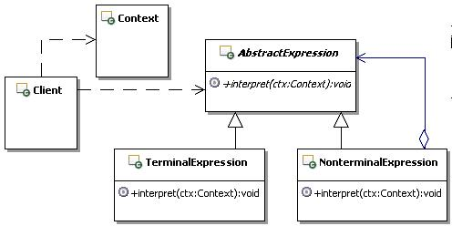

# 21.1 Java 设计模式系列教程（二一）解释器模式之原理

[Java 设计模式系列教程目录](https://github.com/binarylei/java/blob/master/%E8%AE%BE%E8%AE%A1%E6%A8%A1%E5%BC%8F/01.%21Java%21%E8%AE%BE%E8%AE%A1%E6%A8%A1%E5%BC%8F%E7%B3%BB%E5%88%97%E6%95%99%E7%A8%8B%EF%BC%88%E4%B8%80%EF%BC%89%E7%9B%AE%E5%BD%95.md)

[21.1 Java 设计模式系列教程（二一）解释器模式之原理](21.1%21Java%21%E8%AE%BE%E8%AE%A1%E6%A8%A1%E5%BC%8F%E7%B3%BB%E5%88%97%E6%95%99%E7%A8%8B%EF%BC%88%E4%BA%8C%E5%8D%81%EF%BC%89%E4%BA%AB%E5%85%83%E6%A8%A1%E5%BC%8F%E4%B9%8B%E5%8E%9F%E7%90%86.md)

[21.2 Java 设计模式系列教程（二一）解释器模式之场景分析](21.2%21Java%21%E8%AE%BE%E8%AE%A1%E6%A8%A1%E5%BC%8F%E7%B3%BB%E5%88%97%E6%95%99%E7%A8%8B%EF%BC%88%E4%BA%8C%E5%8D%81%EF%BC%89%E4%BA%AB%E5%85%83%E6%A8%A1%E5%BC%8F%E4%B9%8B%E5%9C%BA%E6%99%AF%E5%88%86%E6%9E%90.md)

[21.3 Java 设计模式系列教程（二一）解释器模式之扩展](21.3%21Java%21%E8%AE%BE%E8%AE%A1%E6%A8%A1%E5%BC%8F%E7%B3%BB%E5%88%97%E6%95%99%E7%A8%8B%EF%BC%88%E4%BA%8C%E5%8D%81%EF%BC%89%E4%BA%AB%E5%85%83%E6%A8%A1%E5%BC%8F%E4%B9%8B%E6%89%A9%E5%B1%95.md)

> 给定一个语言，定义它的文法的一种表示，并定义一个解释器，这个解释器使用该表示来解释语言中的句子。[interpreter](https://github.com/binarylei/demo/tree/master/demo-design/src/main/java/com/github/binarylei/design/interpreter)

## 21.1.1 解释器模式结构



* `interpreter：`：享元接口，通过这个接口interpreter可以接受并作用于外部状态。通过这个接口传入外部的状态，在享元对象的方法处理中可能会使用这些外部的数据。

* `Concreteinterpreter：`：具体的享元实现对象，必须是可共享的，需要封装interpreter的内部状态。

* `UnsharedConcreteinterpreter`：非共享的享元实现对象，并不是所有的interpreter实现对象都需要共享。非共享的享元实现对象通常是对共享享元对象的组合对象。

* `interpreterFactory`：享元工厂，主要用来创建并管理共享的享元对象，并对外提供访问共享享元的接口。

* `Client`：享元客户端，主要的工作是维持一个对interpreter的引用，计算或存储享元对象的外部状态，当然这里可以访问共享和不共享的interpreter对象。

## 21.1.2 解释器模式参考实现 [demo1](https://github.com/binarylei/demo/tree/master/demo-design/src/main/java/com/github/binarylei/design/interpreter/demo1)

（1）先看享元的接口定义，通过这个接口interpreter可以接受并作用于外部状态，示例代码如下：

```java
/***
 * 享元接口，通过这个接口享元可以接受并作用于外部状态
 */
public interface interpreter {
    /**
     * 示例操作，传入外部状态
     * @param extrinsicState 示例参数，外部状态
     */
    public void operation(String extrinsicState);
}
```

（2）接下来看看具体的享元接口的实现，先看共享享元的实现，封装interpreter的内部状态，当然也可以提供功能方法，示例代码如下：

```java
/**
 * 享元对象
 */
public class Concreteinterpreter implements interpreter{
    /**
     * 示例，描述内部状态
     */
    private String intrinsicState;

    /**
     * 构造方法，传入享元对象的内部状态的数据
     * @param state 享元对象的内部状态的数据
     */
    public Concreteinterpreter(String state){
        this.intrinsicState = state;
    }

    public void operation(String extrinsicState) {
        //具体的功能处理，可能会用到享元内部、外部的状态
    }
}
```

再看看不需要共享的享元对象的实现，并不是所有的interpreter对象都需要共享，interpreter接口使共享成为可能，但并不强制共享。示例代码如下：

```java
/**
 * 不需要共享的interpreter对象，
 * 通常是将被共享的享元对象作为子节点，组合出来的对象
 */
public class UnsharedConcreteinterpreter implements interpreter{
    /**
     * 示例，描述对象的状态
     */
    private String allState;

    public void operation(String extrinsicState) {
        // 具体的功能处理
    }
}
```

（3）在解释器模式中，客户端不能直接创建共享的享元对象实例，必须通过享元工厂来创建。接下来看看享元工厂的实现，示例代码如下：

```java
/**
 * 享元工厂，说白了就是一个缓存
 */
public class interpreterFactory {
    /**
     * 缓存多个interpreter对象，这里只是示意一下
     */
    private Map<String,interpreter> fsMap = new HashMap<String,interpreter>();

    /**
     * 获取key对应的享元对象
     * @param key 获取享元对象的key，只是示意
     * @return key对应的享元对象
     */
    public interpreter getinterpreter(String key) {
        //这个方法里面基本的实现步骤如下：
        //1：先从缓存里面查找，是否存在key对应的interpreter对象
        interpreter f = fsMap.get(key);

        //2：如果存在，就返回相对应的interpreter对象
        if(f==null){
            //3：如果不存在
            //3.1：创建一个新的interpreter对象
            f = new Concreteinterpreter(key);
            //3.2：把这个新的interpreter对象添加到缓存里面
            fsMap.put(key,f);
            //3.3：然后返回这个新的interpreter对象
        }
        return f;
    }
}
```

（4）最后来看看客户端的实现，客户端通常会维持一个对interpreter的引用，计算或存储一个或多个interpreter的外部状态。示例代码如下：

```java
/**
 * Client对象，通常会维持一个对interpreter的引用，
 * 计算或存储一个或多个interpreter的外部状态
 */
public class Client {
    //具体的功能处理
}
```

## 21.1.3 进一步认识解释器模式

#### （1）变与不变

解释器模式设计的重点就在于 **分离变与不变** ，把一个对象的状态分成内部状态和外部状态，内部状态是不变的，外部状态是可变的。然后通过共享不变的部分，达到减少对象数量、并节约内存的目的。在享元对象需要的时候，可以从外部传入外部状态给共享的对象，共享对象会在功能处理的时候，使用自己内部的状态和这些外部的状态。

事实上，分离变与不变是软件设计上最基本的方式之一，比如预留接口，为什么在这个地方要预留接口，一个常见的原因就是这里存在变化，可能在今后需要扩展、或者是改变已有的实现，因此预留接口做为“可插入性的保证”。

#### （2）共享与不共享

在解释器模式中，享元对象又有共享与不共享之分，这种情况通常出现在跟组合模式合用的情况，通常共享的是叶子对象，一般不共享的部分是由共享部分组合而成的，由于所有细粒度的叶子对象都已经缓存了，那么缓存组合对象就没有什么意义了。这个在后面给大家一个示例。

#### （3）内部状态和外部状态

解释器模式的内部状态，通常指的是包含在享元对象内部的、对象本身的状态，通常是独立于使用享元的场景的信息，一般创建过后就不再变化的状态，因此可以共享。

外部状态指的是享元对象之外的状态，取决于使用享元的场景，会根据使用场景而变化，因此不可共享。如果享元对象需要这些外部状态的话，可以从外部传递到享元对象里面，比如通过方法的参数来传递。

也就是说解释器模式真正缓存和共享的数据是享元的内部状态，而外部状态是不应该被缓存共享的。

另外一点，内部状态和外部状态是独立的，外部状态的变化不应该影响到内部状态。

#### （4）实例池

在解释器模式中，为了创建和管理共享的享元部分，引入了享元工厂，享元工厂中一般都包含有享元对象的实例池，享元对象就是缓存在这个实例池中的。

简单介绍一点实例池的知识， **所谓实例池，指的是缓存和管理对象实例的程序，通常实例池会提供对象实例的运行环境，并控制对象实例的生命周期。**

工业级的实例池实现上有两个最基本的难点，**一个就是动态控制实例数量，一个就是动态分配实例来提供给外部使用。** 这些都是需要算法来做保证的。

假如实例池里面已有了3个实例，但是客户端请求非常多，有些忙不过来，那么实例池的管理程序就应该判断出来，到底几个实例才能满足现在的客户需求，理想状况是刚刚好，就是既能够满足应用的需要，又不会造成对象实例的浪费，假如经过判断5个实例正好，那么实例池的管理程序就应该能动态的创建2个新的实例。

这样运行了一段时间，客户端的请求减少了，这个时候实例池的管理程序又应该动态的判断，究竟几个实例是最好的，多了明显浪费资源，假如经过判断只需要1个实例就可以了，那么实例池的管理程序应该销毁掉多余的4个实例，以释放资源。这就是动态控制实例数量。

对于动态分配实例，也说明一下吧，假如实例池里面有3个实例，这个时候来了一个新的请求，到底调度哪一个实例去执行客户的请求呢，如果有空闲实例，那就是它了，要是没有空闲实例呢，是新建一个实例，还是等待运行中的实例，等它运行完了就来处理这个请求呢？具体如何调度，也是需要算法来保障的。

回到解释器模式中来，享元工厂中的实例池可没有这么复杂，因为共享的享元对象基本上都是一个实例，一般不会出现同一个享元对象有多个实例的情况，这样就不用去考虑动态创建和销毁享元对象实例的功能；另外只有一个实例，也就不存在动态调度的麻烦，反正就是它了。

这也主要是因为享元对象封装的多半是对象的内部状态，这些状态通常是不变的，有一个实例就够了，不需要动态控制生命周期，也不需要动态调度，它只需要做一个缓存而已，没有上升到真正的实例池那么个高度。

#### （5）解释器模式的调用顺序示意图

解释器模式的使用上，有两种情况，一种是没有“不需要共享”的享元对象，就如同前面的示例那样，只有共享享元对象的情况；还有一种是既有共享享元对象，又有不需要共享的享元对象的情况，这种情况后面再示例。

这里看看只有共享享元对象的情况下，解释器模式的调用顺序，如图21.2所示：


#### （6）谁来初始化共享对象

在解释器模式中，通常是在第一次向享元工厂请求获取共享对象的时候，进行共享对象的初始化，而且多半都是在享元工厂内部实现，不会从外部传入共享对象。当然可以从外部传入一些创建共享对象需要的值，享元工厂可以按照这些值去初始化需要共享的对象，然后就把创建好的共享对象的实例放入享元工厂内部的缓存中，以后再请求这个共享对象的时候就不用再创建了。

## 21.1.4 总结

### 解释器模式的本质

解释器模式的本质： **分离与共享** 。

分离的是对象状态中变与不变的部分，共享的是对象中不变的部分。解释器模式的关键之处就在于分离变与不变，把不变的部分作为享元对象的内部状态，而变化部分就作为外部状态，由外部来维护，这样享元对象就能够被共享，从而减少对象数量，并节省大量的内存空间。

理解了这个本质后，在使用解释器模式的时候，就会去考虑，哪些状态需要分离？如何分离？分离后如何处理？哪些需要共享？如何管理共享的对象？外部如何使用共享的享元对象？是否需要不共享的对象？等等问题。

把这些问题都思考清楚，找到相应的解决方法，那么解释器模式也就应用起来了，可能是标准的应用，也可能是变形的应用，但万变不离其宗。

### 何时选用解释器模式

**建议在如下情况中，选用解释器模式：**

1. 如果一个应用程序使用了大量的细粒度对象，可以使用解释器模式来减少对象数量

2. 如果由于使用大量的对象，造成很大的存储开销，可以使用解释器模式来减少对象数量，并节约内存

3. 如果对象的大多数状态都可以转变为外部状态，比如通过计算得到，或是从外部传入等，可以使用解释器模式来实现内部状态和外部状态的分离

4. 如果不考虑对象的外部状态，可以用相对较少的共享对象取代很多组合对象，可以使用解释器模式来共享对象，然后组合对象来使用这些共享对象

### 解释器模式的优缺点

* 减少对象数量，节省内存空间

    可能有的朋友认为共享对象会浪费空间，但是如果这些对象频繁使用，那么其实是节省空间的。因为占用空间的大小等于每个对象实例占用的大小再乘以数量，对于享元对象来讲，基本上就只有一个实例，大大减少了享元对象的数量，并节省不少的内存空间。
    
    节省的空间取决于以下几个因素：因为共享而减少的实例数目、每个实例本身所占用的空间。假如每个对象实例占用2个字节，如果不共享数量是100个，而共享过后就只有一个了，那么节省的空间约等于：(100-1) X 2 字节。

* 维护共享对象，需要额外开销

    如同前面演示的享元工厂，在维护共享对象的时候，如果功能复杂，会有很多额外的开销，比如有一个线程来维护垃圾回收。